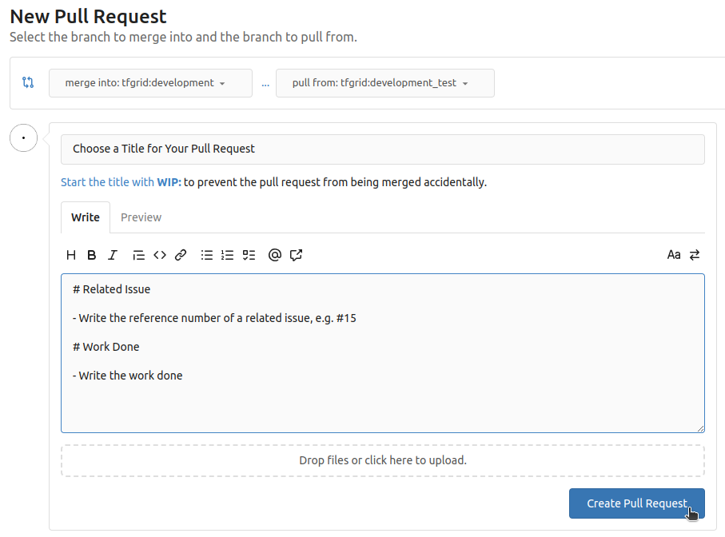
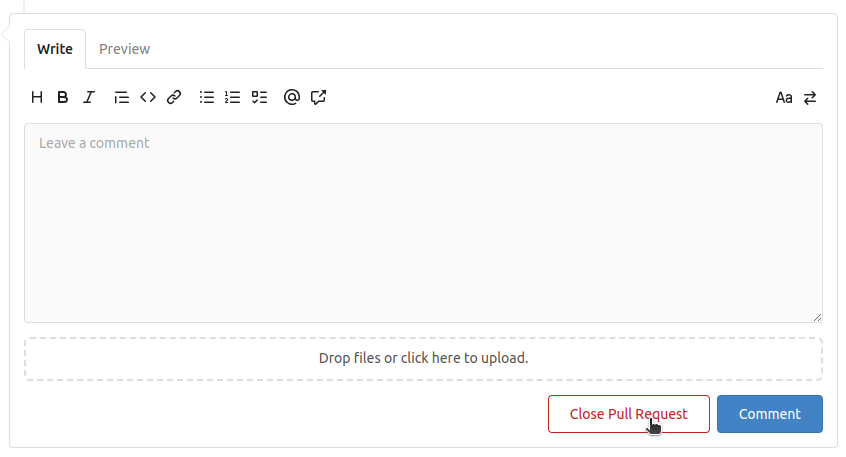

<h1>Gitea Basics</h1>

<h2>Table of Contents</h2>

- [Introduction](#introduction)
- [Prerequisites](#prerequisites)
- [Register](#register)
- [Sign In](#sign-in)
- [Clone a Repository](#clone-a-repository)
- [Create and Push a New Branch](#create-and-push-a-new-branch)
  - [On the Browser and Git](#on-the-browser-and-git)
  - [Only With Git](#only-with-git)
- [Create a Pull Request](#create-a-pull-request)
- [Useful Commands](#useful-commands)

---

## Introduction

We present a basic guide for Gitea, a forge software package for hosting software development version control using Git as well as other collaborative features like bug tracking, code review, continuous integration, kanban boards, tickets, and wikis.

ThreeFold hosts its own git server on [Gitea OurWorld](https://git.ourworld.tf). We will be using OurWorld's Gitea instance for this guide.

## Prerequisites

You should have git installed on your computer to work easily with Gitea.

- Install [git](./git_github_basics.md#install-git)
- Use [VSCodium](./git_github_basics.md#vs-codium) to edit your files (Optional)

## Register

- Go to the main gitea URL, e.g. [https://git.ourworld.tf](https://git.ourworld.tf)
- On the top right click on `Register`
- Set your credentials
  - Enter a `Username`
  - Enter your `Email Address`
  - Enter and confirm a `Password`
- Click on `Register Account`

## Sign In

- Go to the main Gitea URL, e.g. [https://git.ourworld.tf](https://git.ourworld.tf)
- On the top right click on `Sign In`
- Set your credentials
  - Enter your `Username` or your `Email Address`
  - Enter your `Password`
- Click on `Sign In`

## Clone a Repository

- Clone a repository and change directory
```
git clone <repository_url>
cd <repository_url>
```

## Create and Push a New Branch

### On the Browser and Git

- On the repo of the Gitea instance, click on the ̀`Branch` icon (e.g. `development`)
- Write a branch name with the `development_branch_name` convention
- Click `Create branch`


```
git checkout development
git fetch
git pull
```
- Make changes in the files
- When changes are done, make a new branch, add the new files, commit and push to the remote server
```
git add .
git commit -m "Commit message for new branch"
git push
```

### Only With Git

- Start by working on the latest development release
```
git checkout development
git fetch
git pull
```
- Make changes in the files
- When changes are done, make a new branch, add the new files, commit and push to the remote server
```
git checkout -b development_new_branch
git add .
git commit -m "Commit message for new branch"
git push --set-upstream origin development_new_branch
```

## Create a Pull Request

- Go to the repo of the Gitea instance
- Click on `Pull Request` then `New Pull Request`


- Choose the branch you want to merge into development for `pull from` then click `New Pull Request`
  - At ThreeFold, we protect the master/main and development branches and always make Pull Request from `development_branch_name` to `development`


- On the next page, choose a `Title` and a `Description`, then click `Create Pull Request`
  - Usually, we write at least any related issue and a brief description of the work done



- At any time you can close your own Pull Request



## Useful Commands

- See current branch
```
git branch
```
- See all branches locally
```
git branch -r
```
- See the git status
```
git status
```