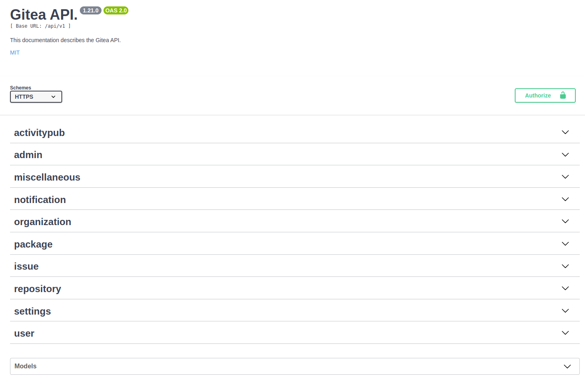
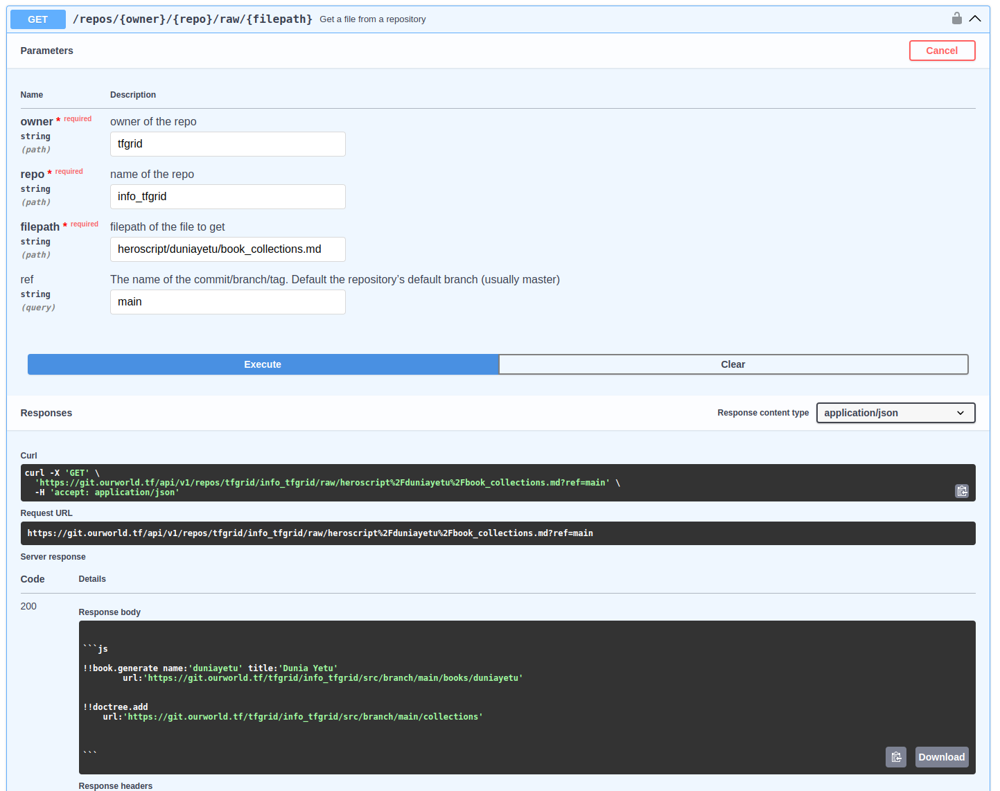

<h1>Gitea API</h1>

<h2>Table of Contents</h2>

- [Introduction](#introduction)
- [Swagger](#swagger)
- [CLI](#cli)
- [References](#references)

---

## Introduction

We show how to use the Gitea API with both Swagger and CLI.

## Swagger

The Gitea API is available with the slugs `/api/swagger#` after your Gitea domain URL.

- For ThreeFold, we use the following Gitea API:
```
https://git.ourworld.tf/api/swagger#/
```

You can access different levels of the Gitea instance:



You can use the Swagger for different queries. Parameters are expained for each example so it is a fairly intuitive use.

For example, to get the raw content of a file, you can use the following:

- Go to repository

- In this example, we query tfgrid organization and its repository `info_tfgrid` for the branch `main`. We write the path of the file



Once you tried a query on the API, you can take the curl command example to query the same information from the CLI. We check this in the next section.

## CLI

To use the API with a command line interface, you can use curl.

For example, we take the raw content of a file:

```
curl -X 'GET' \
  'https://git.ourworld.tf/api/v1/repos/tfgrid/info_tfgrid/raw/heroscript%2Fduniayetu%2Fbook_collections.md?ref=main' \
  -H 'accept: application/json'
```

We can save this in a file by adding `> filename.txt` after the line above:

```
curl -X 'GET' \
  'https://git.ourworld.tf/api/v1/repos/tfgrid/info_tfgrid/raw/heroscript%2Fduniayetu%2Fbook_collections.md?ref=main' \
  -H 'accept: application/json' > filename.txt
```

## References

You can learn more by reading the [Gitea API documentation](https://docs.gitea.com/development/api-usage).