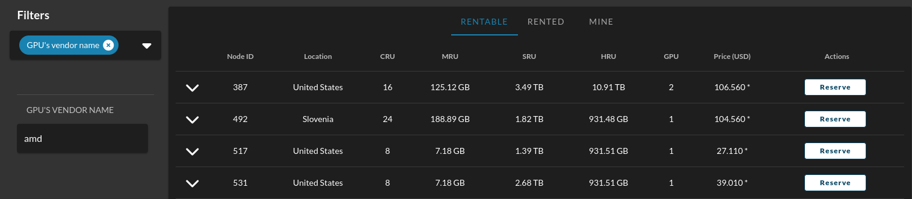
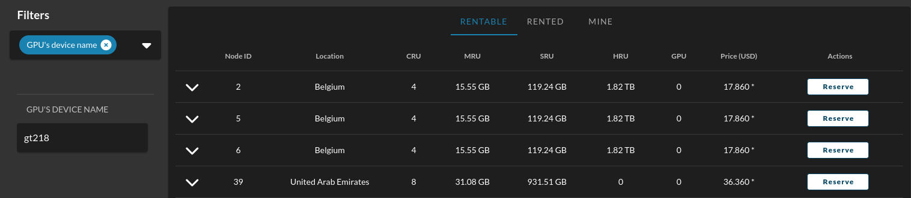
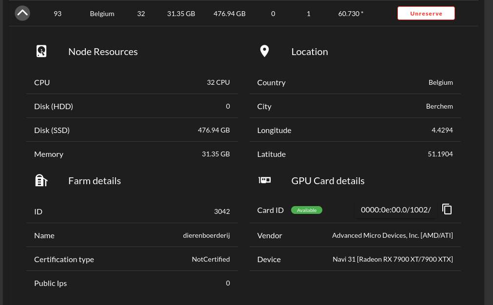
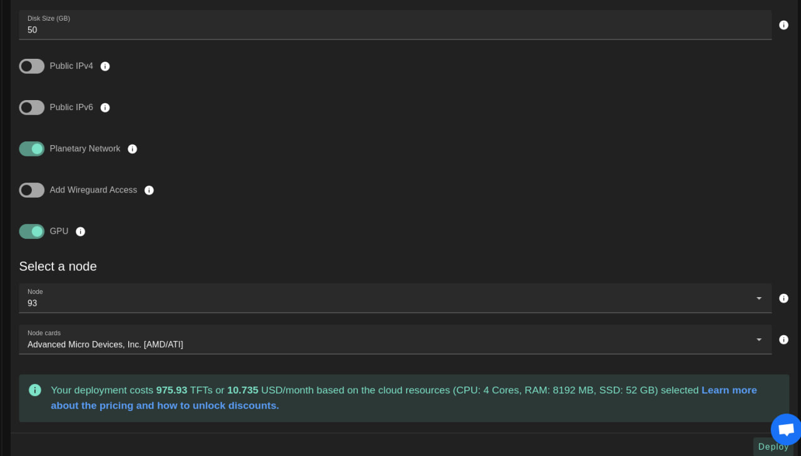
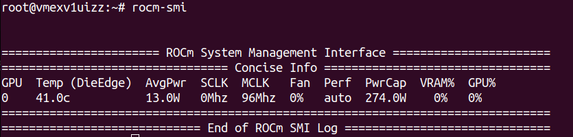
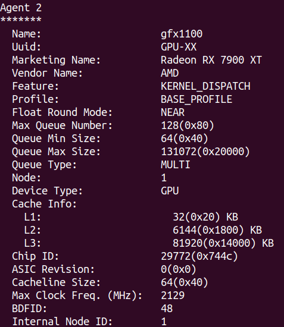
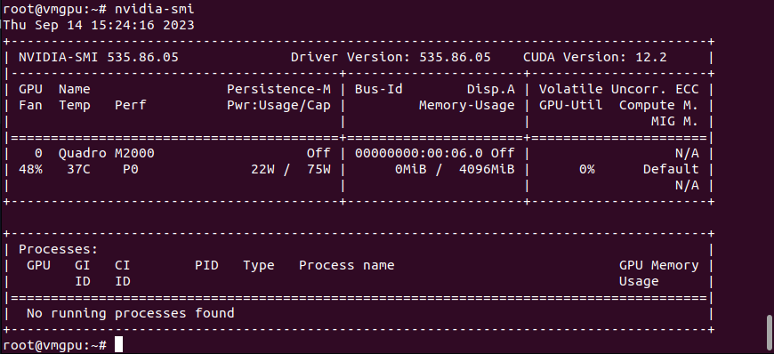

<h1> GPU Support </h1>

<h2> Table of Contents </h2>

- [Introduction](#introduction)
- [Filter and Reserve a GPU Node](#filter-and-reserve-a-gpu-node)
  - [Filter Nodes](#filter-nodes)
  - [Reserve a Node](#reserve-a-node)
- [Deploy a VM with GPU](#deploy-a-vm-with-gpu)
- [Install the GPU Driver](#install-the-gpu-driver)
  - [AMD Driver](#amd-driver)
  - [Nvidia Driver](#nvidia-driver)
  - [With an AI Model](#with-an-ai-model)
- [Troubleshooting](#troubleshooting)
- [GPU Support Links](#gpu-support-links)

***

## Introduction

This section covers the essential information to deploy a node with a GPU. We also provide links to other parts of the manual covering GPU support.

To use a GPU on the TFGrid, users need to rent a dedicated node. Once they have rented a dedicated node equipped with a GPU, users can deploy workloads on their dedicated GPU node. 


## Filter and Reserve a GPU Node

You can filter and reserve a GPU node using the [Dedicated Nodes section](../../dashboard/deploy/dedicated_machines.md) of the **ThreeFold Dashboard**.

### Filter Nodes

* Filter nodes using the vendor name
  * In **Filters**, select **GPU's vendor name**
  * A new window will appear below named **GPU'S VENDOR NAME**
    * Write the name of the vendor desired (e.g. **nvidia**, **amd**)



* Filter nodes using the device name
  * In **Filters**, select **GPU's device name**
  * A new window will appear below named **GPU'S DEVICE NAME**
    * Write the name of the device desired (e.g. **GT218**)



### Reserve a Node

When you have decided which node to reserve, click on **Reserve** under the column **Actions**. Once you've rented a dedicated node that has a GPU, you can deploy GPU workloads.



  
## Deploy a VM with GPU

Now that you've reserverd a dedicated GPU node, it's time to deploy a VM to make use of the GPU! There are many ways to proceed. You can use the [Dashboard](../../dashboard/solutions/fullVm.md), [Go](../../developers/go/grid3_go_gpu.md), [Terraform](../terraform/terraform_gpu_support.md), etc.

For example, deploying a VM with GPU on the Dashboard is easy. Simply set the GPU option and make sure to select your dedicated node, as show here:


## Install the GPU Driver

Once you've deployed a VM with GPU, you want to SSH into the VM and install the GPU driver.

- SSH to the VM and get your system updated
```bash
dpkg --add-architecture i386
apt-get update
apt-get dist-upgrade
reboot
```
- Find your Driver installer
  - [AMD driver](https://www.amd.com/en/support/linux-drivers)
  - [Nvidia driver](https://www.nvidia.com/download/index.aspx)

- You can see the node card details on the ThreeFold Dashboard or by using the following command lines:
```bash
lspci | grep VGA
lshw -c video
```

### AMD Driver

- Download the GPU driver using `wget`
  - For example: `wget https://repo.radeon.com/amdgpu-install/23.30.2/ubuntu/focal/amdgpu-install_5.7.50702-1_all.deb`
- Install the GPU driver using `apt-get`. Make sure to update `<VERSION>`.
```bash
apt-get install ./amdgpu-install_<VERSION>.deb
amdgpu-install --usecase="dkms,graphics,opencl,hip,rocm,rocmdev,opencl,hiplibsdk,mllib,mlsdk" --opencl=rocr --vulkan=pro --opengl=mesa
```
- To verify that the GPU is properly installed, use the following command lines:
```bash
rocm-smi
rocminfo
```
- You should something like this:


 
### Nvidia Driver

For Nvidia, you can follow [those steps](https://linuxize.com/post/how-to-nvidia-drivers-on-ubuntu-20-04/#installing-the-nvidia-drivers-using-the-command-line).
- To verify that the GPU is properly installed, you can use `nvidia-smi`. You should something like this:

 
 
### With an AI Model

You can also try this [AI model](https://github.com/invoke-ai/InvokeAI#getting-started-with-invokeai) to install your driver. 
 
## Troubleshooting

Here are some useful links to troubleshoot your GPU installation.

- [Steps to install the driver](https://amdgpu-install.readthedocs.io/en/latest/index.html)
- Changing kernel version
  - [Link 1](https://linux.how2shout.com/how-to-change-default-kernel-in-ubuntu-22-04-20-04-lts/)
  - [Link 2](https://gist.github.com/chaiyujin/c08e59752c3e238ff3b1a5098322b363)

> Note: It is recommended to use Ubuntu 22.04.2 LTS (GNU/Linux 5.18.13-051813-generic x86_64)

## GPU Support Links

You can consult the [GPU Table of Contents](./gpu_toc.md) to see all available GPU support links on the ThreeFold Manual.