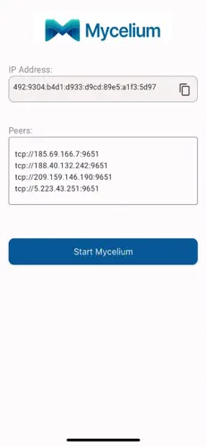
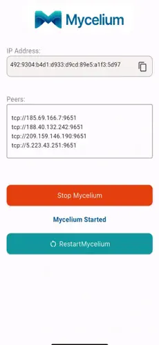
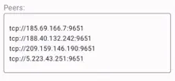

# Mycelium App

The Mycelium app is available on Android and iOS.

## Download Links

You can download the Mycelium app with the following links:

- [Android](https://play.google.com/store/apps/details?id=tech.threefold.mycelium)
- [iOS](https://apps.apple.com/app/id6504277565)

## Start Mycelium

To start Mycelium, simply open the app and click on `Start`.



## Stop or Restart Mycelium

To stop or restart Mycelium, click on the appropriate button.



## Add Peers

You can add different Mycelium peers in the `Peers` window.

Simply add peers and then either start or restart the app.



You can consult the [Mycelium hosted public nodes](./information.md#hosted-public-nodes) to find more peers.

For example, if you want to add the node with the IPv4 address `5.78.122.16` with the tcp port `9651`, simply add the following line then start or restart the app.

```
tcp://5.78.122.16:9651
```

## Mycelium Address

When you use the Mycelium app, you are assigned a unique Mycelium address.

To copy the Mycelium address, click on the button on the right of the address.

