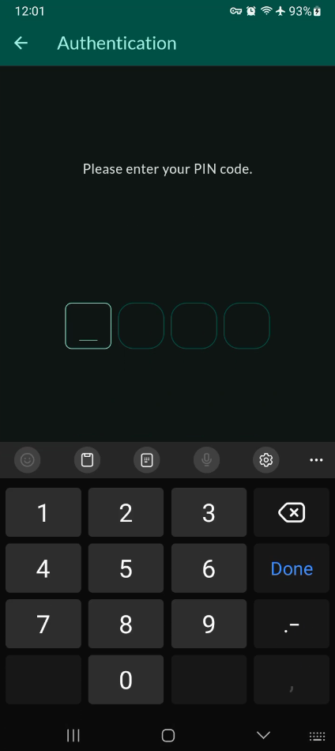
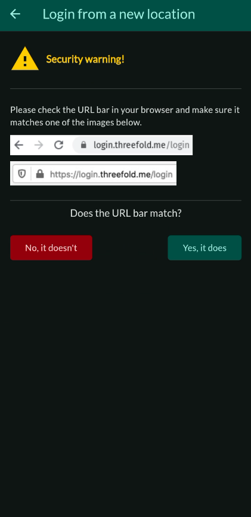
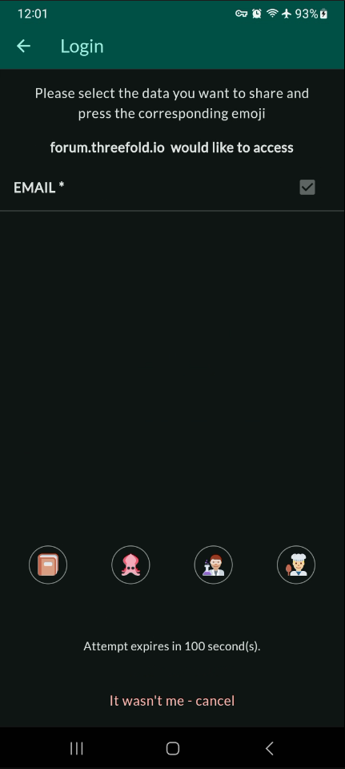
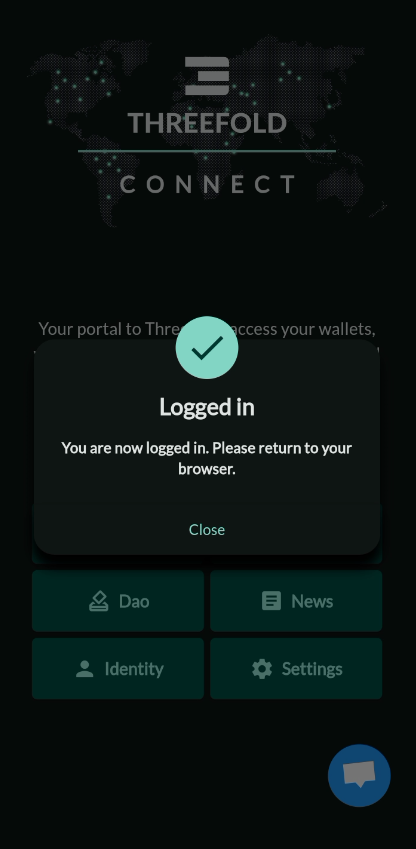

<h1> ThreeFold Connect Authenticator</h1>

## Introduction

We present how to use the ThreeFold Authenticator. 

The ThreeFold Connect two-factor authenticator enables you access to ThreeFold Grid tools and solutions. Not a single person in the world will be able to log in to your account, not even us.

## Connect with the Authenticator

Follow the steps below to connect with the authenticator.

- Make sure your ThreeFold Connect app is open before sending the login request.

- Write your ThreeFold ID.

- Click `SIGN IN`.

- Take note of the icon shown on your screen.

- On your phone, open TFConnect and enter your password.

- Verify the URL.

- Click on the icon you saw on the browser screen.

- You will see a confirmation screen.

You are now logged in.