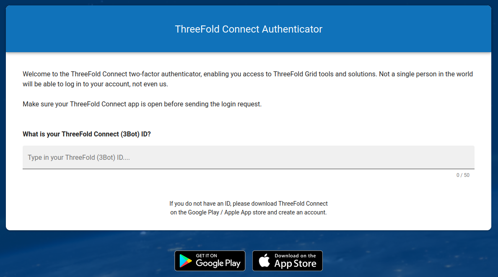
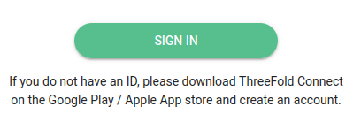
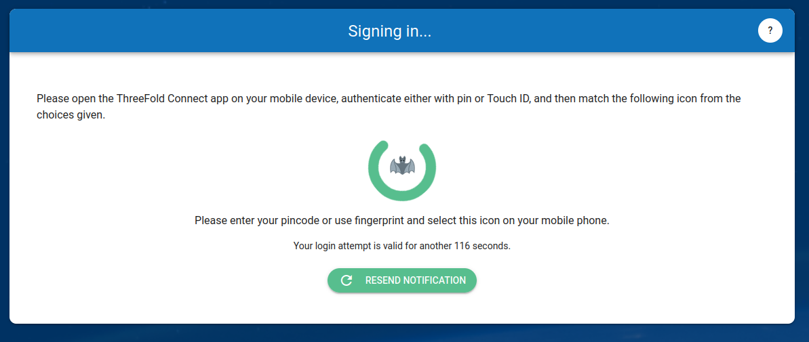
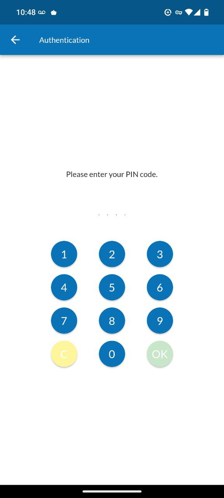
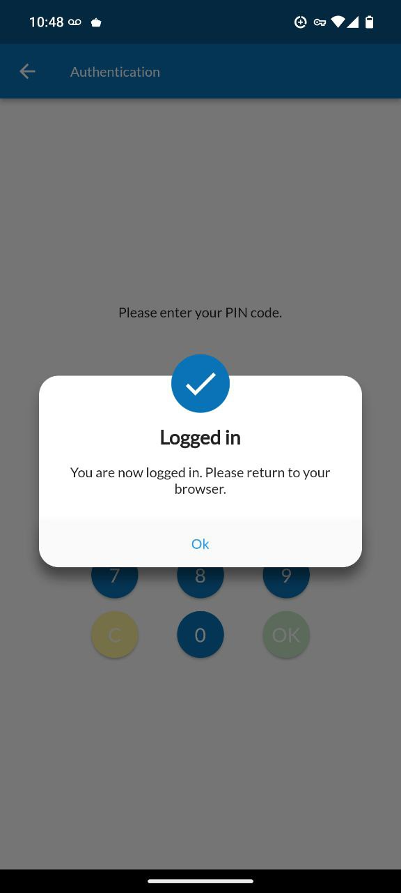

<h1> ThreeFold Connect Authenticator</h1>

<h2>Table of Contents</h2>

- [Introduction](#introduction)
- [Connect with the Authenticator](#connect-with-the-authenticator)
---

## Introduction

We present how to use the ThreeFold Authenticator. 

The ThreeFold Connect two-factor authenticator enables you access to ThreeFold Grid tools and solutions. Not a single person in the world will be able to log in to your account, not even us.

## Connect with the Authenticator

To connect with the authenticator:

- Make sure your ThreeFold Connect app is open before sending the login request.

- Write your ThreeFold ID

- Click `SIGN IN`

- Take note of the icon shown on your screen

- On your phone, open TFConnect and enter your password

- Click on the icon you saw on the browser screen

- You will see a confirmation screen

You should now be logged in.