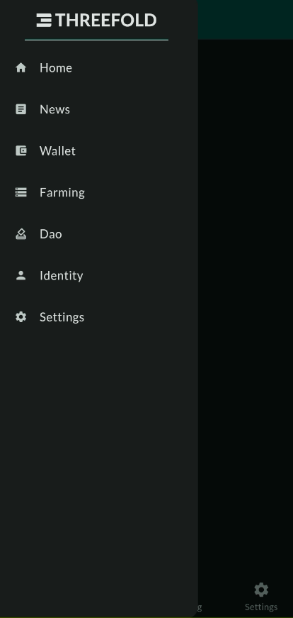
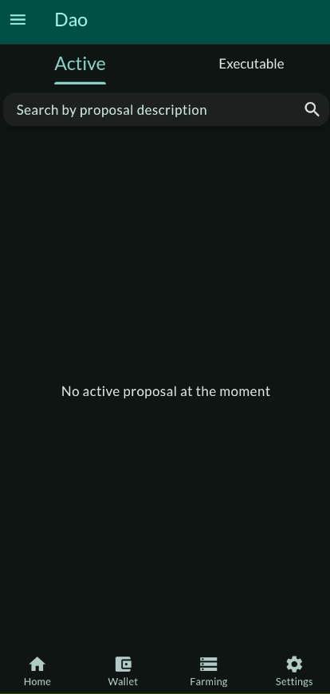

# ThreeFold Connect DAO

The ThreeFold Connect app featuers a DAO section where you can vote on grid enhancement proposals for the ThreeFold Grid.

On the Home page, click on `Dao` or select `Dao` from the dropdown menu.

The DAO section contains two subsections `Active` and `Executable`.

When there are ongoing DAO vote, you will be able to cast your vote in the section `Active`.

