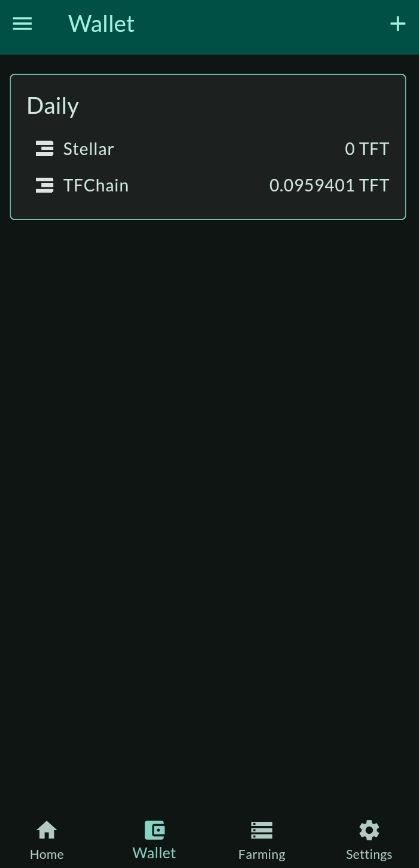
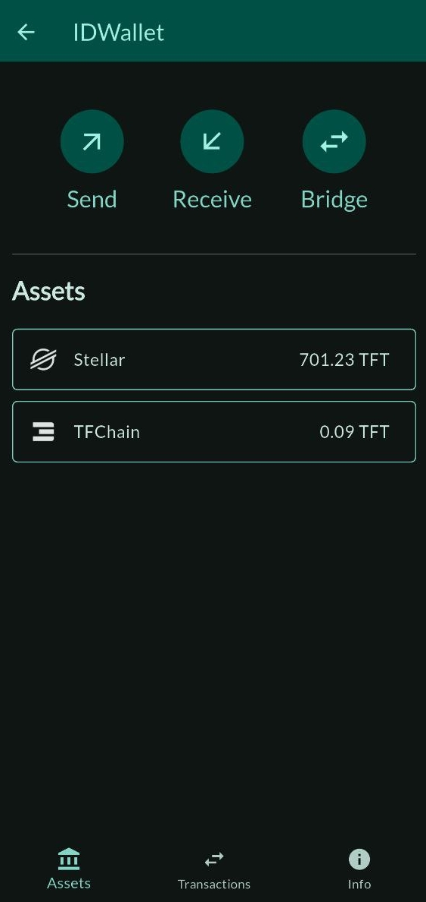
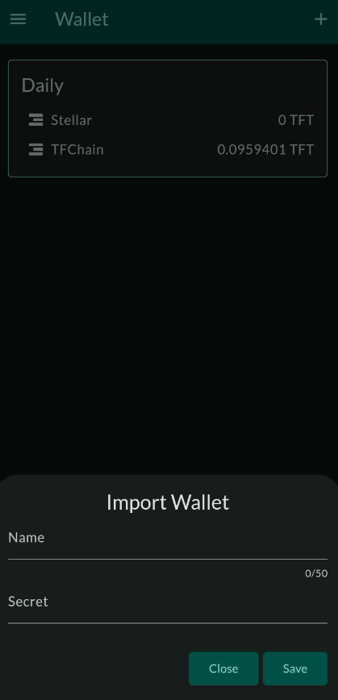
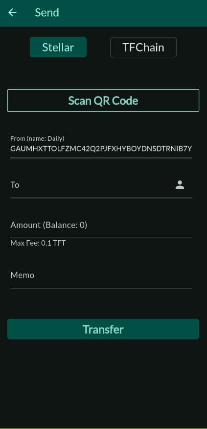
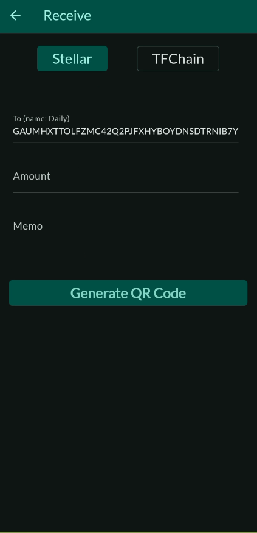
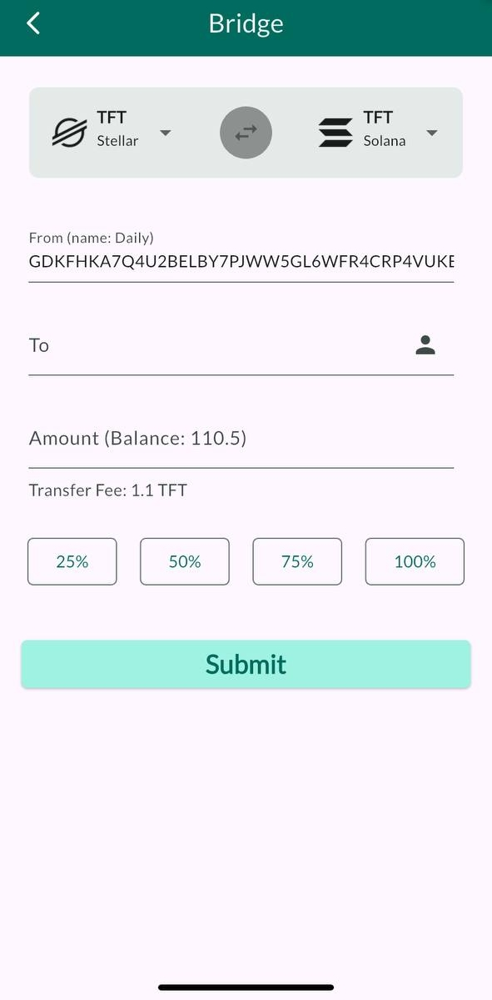
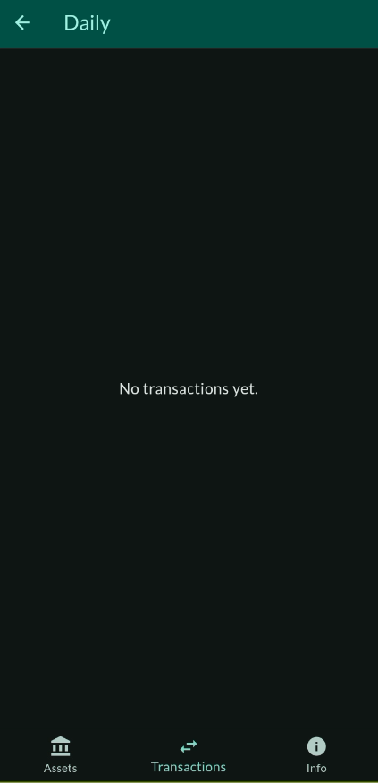
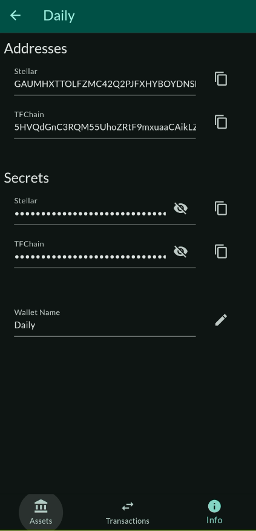

# ThreeFold Connect Wallet

## Introduction

We cover the wallet features of the ThreeFold Connect app.

## Access Your Wallet

By default, the app will generate a wallet associated with your account.

- To access your wallet, click on `Wallet` at the bottom of the app screen, then click on your wallet. By default, the wallet is named `Daily`.

- The wallet main page is the following:

## Import a Wallet

To import a wallet, click on the `+` button at the top right of the Wallet section. Choose a name for your wallet, write the secret associated with the wallet and click `Save`.

## Wallet Features

Once inside your wallet, you can access the wallet features.

- Assets
- Transactions
- Info

### Wallet Assets

The section Wallet assets allows you to send and receive token.

#### Send Assets

You can send assets from Stellar or TFChain.

To send TFT, you can scan the QR code of the address you wish to send tokens to. This will enter automatically the necessary information. Make sure to double check that the information is correct to avoid any complications. Otherwise, you can simply enter the correct address in the section *To*. Choose the amount you want to send. Then click on *SEND TOKENS*. For Stellar, Make sure to write the memo if it applies.

Note that, for such transactions, there is a maximum fee of 0.1 TFT on the Stellar blockchain, and a maximum fee of 0.01 TFT on the TFChain. This amount is taken from the amount you are sending. It is not taken directly in your wallet. 

**Send TFT to Hardware Wallet on Stellar Blockchain**

Before sending TFT to a hardware wallet, make sure the hardware wallet has a TFT trustline on the Stellar Blockchain. For more information, read [this section](../threefold_token/storing_tft/hardware_wallet.md).

#### Receive Assets

You can receive assets from Stellar or TFChain.

To receive TFT, you can generate a QR code to share to the person waiting to send you tokens. Otherwise, the sender can simply use your Stellar or TFChain address and send you TFT.

To generate the QR Code, select the chain you want to use, Stellar or TFChain, enter the amount and the message if needed and click on *GENERATE QR CODE*. This will generate a QR Code that can be scanned by other devices.

> Note: The memo option is only available for Stellar, not for TFChain. 

#### Bridge Assets (TFChain)

You can bridge TFT between TFChain and Stellar chain.

To bridge TFT, follow the steps below:

- Set the direction of the bridge
  - TFChain to Stellar
  - Stellar to TFChain
- **To**: Enter the address of the receiver
  - Optional: Click on the icon on the right to set a wallet or favorite address 
- **Amount**: Enter the amount to send
- Click `Submit` to submit the bridge transfer
- Click `Confirm` to finalize the transaction

#### Bridge Assets (Solana)

You can bridge TFT from Stellar to Solana. 

> Note: You cannot bridge from Solana to Stellar.

To bridge TFT, follow the steps below:

- **To**: Enter the address of the receiver
  - Optional: Click on the icon on the right to set a wallet or favorite address 
- **Amount**: Enter the amount to send
- Click `Submit` to submit the bridge transfer
- Click `Confirm` to finalize the transaction

### Wallet Transactions

To see your transactions, simply click `Transactions` at the bottom of the screen.

If there are no transactions yet on your wallet, you will see `No transaction`.

### Wallet Info

To access your wallet info, click `Info` at the bottom of the screen.

In this section, you can access the TFChain and Stellar addresses associated with your wallet, as well as their corresponding secrets. To see your secrets, simply click on the eye buttons.

You can also change the wallet name by clicking on the button next to the wallet name.

