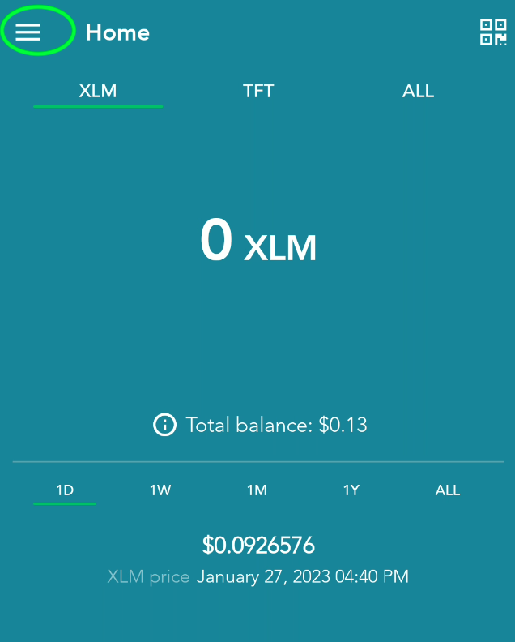
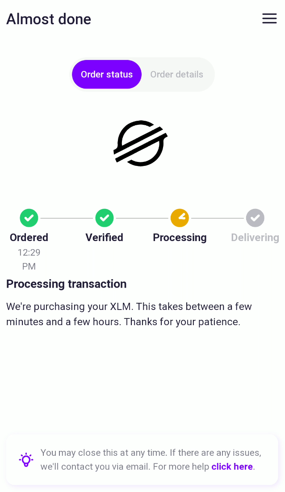
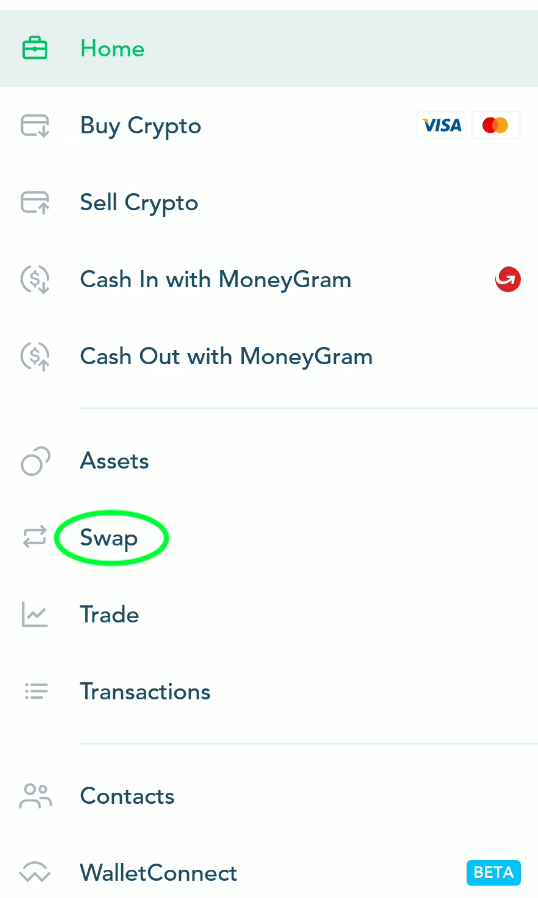

<h1>Get TFT: Quick Start (Stellar)</h1>

<h2>Table of Contents</h2>

- [Introduction](#introduction)
- [Install Lobstr](#install-lobstr)
- [Create Wallet](#create-wallet)
- [Buy XLM](#buy-xlm)
- [Swap XLM for TFT](#swap-xlm-for-tft)
- [Disclaimer](#disclaimer)

***

## Introduction

In this guide, we show how to buy and sell ThreeFold Tokens with [Lobstr wallet](https://lobstr.co/) using a credit or a debit card. This is a simple method that works well for small to medium purchases. You can buy TFT on Lobstr with your smartphone (Android and iOS) and your computer.

Lobstr is an app for managing digital assets like TFT on the Stellar blockchain. In this case, we'll first obtain Stellar's native currency, Lumens (XLM) and swap them for TFT.

> [Moonpay](https://www.moonpay.com/) is the service integrated in Lobstr to enable users to buy digital assets like XLM with fiat currencies like US Dollars and Euros. Moonpay is available in most regions, but there are some [exceptions](https://support.moonpay.com/hc/en-gb/articles/6557330712721-What-are-our-non-supported-countries-states-and-territories-for-on-ramp-product). If your country or state isn't supported by Moonpay, you will need to find another cryptocurrency exchange or on ramp to obtain XLM. From there, you can follow the rest of this guide.

## Install Lobstr

To get Lobstr, just head to [lobstr.co](https://lobstr.co/) where you'll find buttons to download the app for both Android and iOS. Once the app is installed, open it to continue. To use Lobstr directly on your browser, simply click on **Get Started** in the top menu of the Lobstr website. This allows you to use Lobstr on your computer instead of your smartphone.

Hit the **Create Account** button and proceed to create an account by entering your email address and choosing a password. Verify your email address and then sign in.

## Create Wallet

After you sign in to Lobstr for the first time, you'll be prompted to create or connect a Stellar wallet. If you already have the TF Connect App, follow the instructions at [this link](./tft_lobstr_complete_guide.html#connect-your-tf-connect-app-wallet) to import your existing wallet into Lobstr. Otherwise, just press the **Create Stellar Wallet** button.

Lobstr will then present you with 12 words to write down and store safely. Keep in mind that anyone who can access these words can also access any funds in your account. They can also be used to recover your account later. Be sure not to lose them.

## Buy XLM

In this step, we'll buy XLM with a credit or debit card (actually a few forms of bank transfer and other payment methods are [supported](https://support.moonpay.com/customers/docs/moonpays-supported-payment-methods-1) too).

On the Lobstr app, click on the hamburger menu button:

Then click on **Buy Crypto**:

By default XLM is selected to buy, which is what we want. Above you can choose how much to buy in the currency of your choosing. Press **ALL** to see a full list of available currencies.

Once you've entered the amount you want to buy, hit **Continue** and proceed through the checkout process with Moonpay. On the final screen, you'll see a message that it can take some time to complete the order:

Usually this happens quickly and you'll receive a notification if notifications are enabled for the Lobstr app. 

## Swap XLM for TFT

Once you have the XLM, use the hamburger menu again and this time select **Swap**:

Enter TFT in the search bar and select the entry that includes **threefold.io**.

> Be careful at this step! There are fake scam coins using the ThreeFold logo. We can't remove these tokens from Stellar, unfortunately, so you will need to be sure to choose the right one.

On the next screen, XLM will be automatically selected as the currency to trade for TFT. The amount that's available to trade will be shown in blue. You can just tap this amount to trade the maximum amount. A couple XLM will be reserved to keep your account open and pay for future Stellar transaction fees.

Hit the green button at the bottom to complete the trade. There will be a few more prompts and potentially some warnings about scam tokens (again, look for **threefold.io**).

When you're finished you'll see a screen that says **Swap completed**. Congrats, you just bought TFT!

## Disclaimer

> The information provided in this tutorial or any related discussion is not intended as investment advice. The purpose is to provide educational and informational content only. Investing in cryptocurrencies or any other assets carries inherent risks, and it is crucial to conduct your own research and exercise caution before making any investment decisions. 
> 
> **The ThreeFold Token (TFT)** is not to be considered as a traditional investment instrument. The value of cryptocurrencies can be volatile, and there are no guarantees of profits or returns. Always be aware of the risks involved and make informed choices based on your own assessment and understanding. We strongly encourage you to read our [full disclaimer](../../../../knowledge_base/legal/definitions_legal.md) and seek advice from a qualified financial professional if needed.