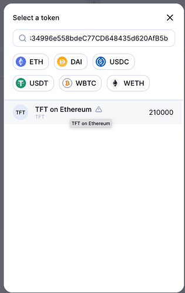

<h1>Get TFT: MetaMask (BSC & ETH)</h2>

<h2>Table of Contents</h2>

- [Introduction](#introduction)
- [TFT Addresses](#tft-addresses)
  - [Ethereum Chain Address](#ethereum-chain-address)
  - [BSC Address](#bsc-address)
- [Add TFT to Metamask](#add-tft-to-metamask)
- [Buy TFT on Metamask](#buy-tft-on-metamask)
- [Disclaimer](#disclaimer)

***

## Introduction

In this guide, we present how to buy and sell ThreeFold Tokens on BNB Smart Chain and Ethereum using [Metamask](https://metamask.io/).

**BNB Smart Chain** and **Ethereum** chain are blockchain networks that enable the execution of smart contracts and decentralized applications, while **MetaMask** is a software cryptocurrency wallet used to interact with Ethereum and BNB Smart Chain.

## TFT Addresses

With MetaMask, you can buy and sell TFT on both BNB Smart Chain and the Ethereum chain. Make sure to use the correct TFT address when doing transactions.

### Ethereum Chain Address

The ThreeFold Token (TFT) is available on Ethereum.
It is implemented as a wrapped asset with the following token address:

```
0x395E925834996e558bdeC77CD648435d620AfB5b
```

### BSC Address

The ThreeFold Token (TFT) is available on BSC.
It is implemented as a wrapped asset with the following token address:

```
0x8f0FB159380176D324542b3a7933F0C2Fd0c2bbf
```

## Add TFT to Metamask

We present the steps on Ethereum chain. Make sure to switch to BSC and to use the TFT BSC address if you want to proceed on BSC.

Open Metamask and import the ThreeFold Token. First click on `import tokens`:

 

Then, choose `Custom Token`:

 

To add the ThreeFold Token, paste its Ethereum address in the field `Token contract address field`. The address is the following:

```
0x395E925834996e558bdeC77CD648435d620AfB5b
```

Once you paste the TFT contract address, the parameter `Token symbol` should automatically be filled with `TFT`. 

Click on the button `Add Custom Token`.

 

To confirm, click on the button `Import tokens`:

 

TFT is now added to Metamask.


## Buy TFT on Metamask

Liquidity is present on Ethereum  so you can use the "Swap" functionality from Metamask directly or go to [Uniswap](https://app.uniswap.org/#/swap) to swap Ethereum, or any other token, to TFT.

When using Uniswap, paste the TFT token address in the field `Select a token` to select TFT on Ethereum. The TFT token address is the following:

```
0x395E925834996e558bdeC77CD648435d620AfB5b
```

 


## Disclaimer

> The information provided in this tutorial or any related discussion is not intended as investment advice. The purpose is to provide educational and informational content only. Investing in cryptocurrencies or any other assets carries inherent risks, and it is crucial to conduct your own research and exercise caution before making any investment decisions. 
> 
> **The ThreeFold Token (TFT)** is not to be considered as a traditional investment instrument. The value of cryptocurrencies can be volatile, and there are no guarantees of profits or returns. Always be aware of the risks involved and make informed choices based on your own assessment and understanding. We strongly encourage you to read our [full disclaimer](../../../../knowledge_base/legal/disclaimer.md) and seek advice from a qualified financial professional if needed.