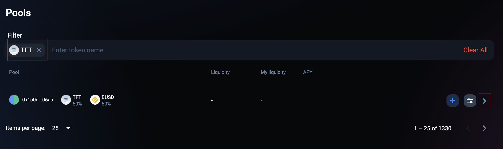
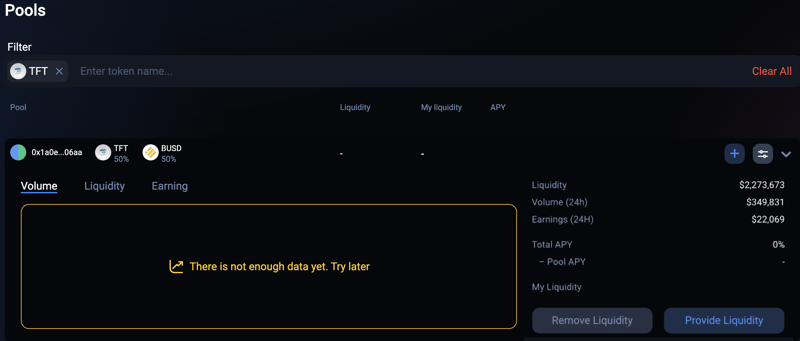
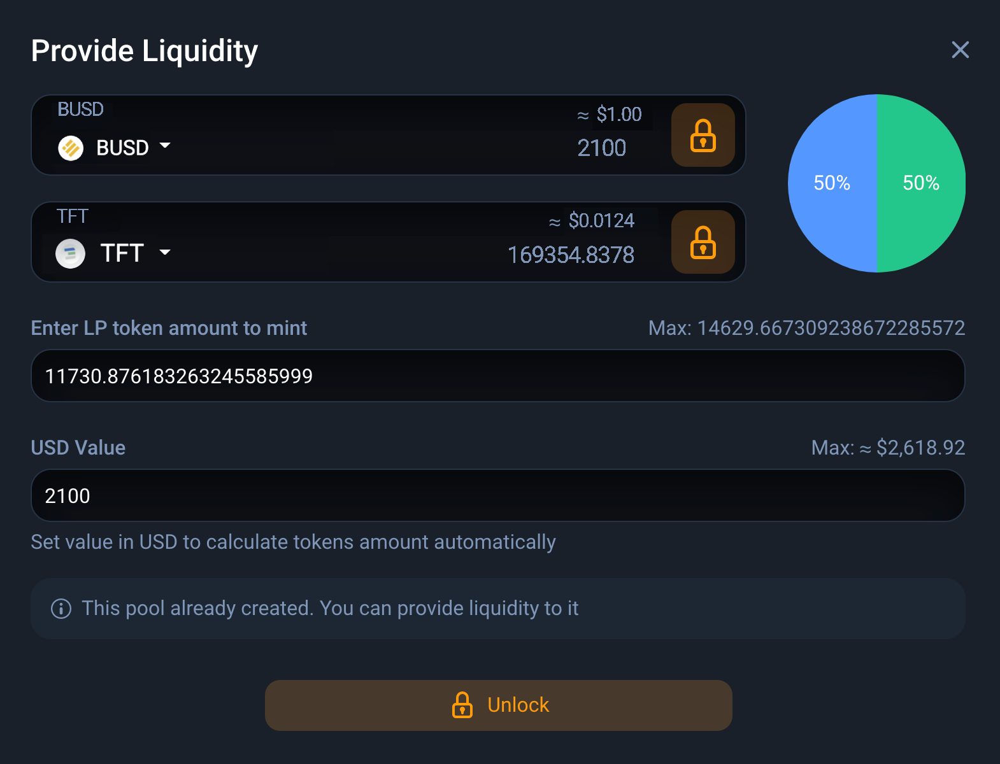
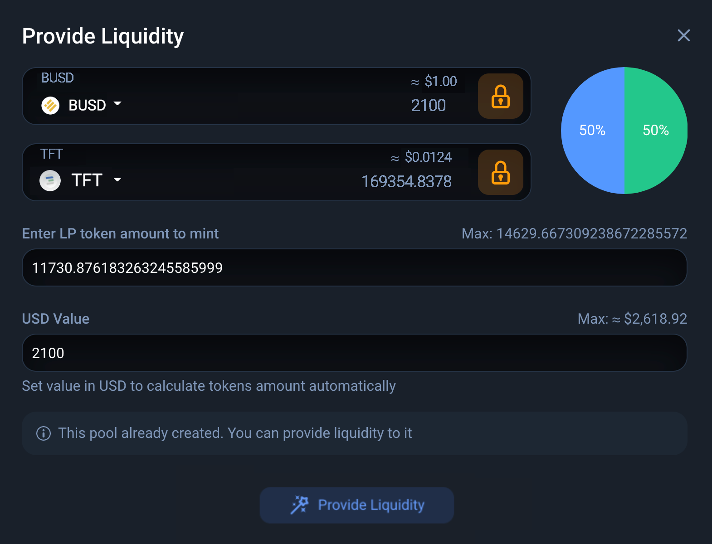
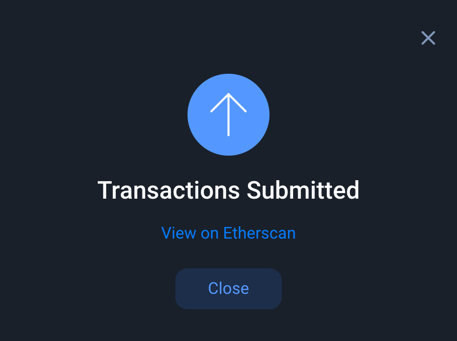
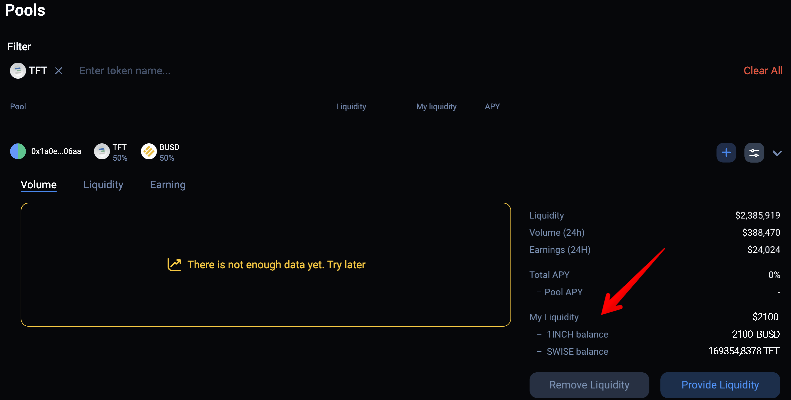

<h1> Provide TFT (BSC) Liquidity on Pancake Swap </h1>

<h2>Table of Contents</h2>

- [Introduction](#introduction)
- [Prerequisites](#prerequisites)
- [Become a TFT LP on 1inch.io](#become-a-tft-lp-on-1inchio)
- [Important Notice](#important-notice)
- [Disclaimer](#disclaimer)

***

## Introduction

In the case of TFT on Binance Smart Chain (BSC) and [1inch.io](https://1inch.io/), becoming a liquidity provider involves providing TFT(BSC) and another token (such as BUSD) to the TFT- BSC liquidity pool on 1inch.io. 

By adding liquidity to this pool, the LP helps to ensure that there is a consistent and sufficient supply of TFT available for trading on the BSC network. This contributes to the overall liquidity of the TFT token on 1inch.io, making it easier for users to buy and sell TFT(BSC) without experiencing significant price slippage.

By participating in the liquidity provision process, you actively contribute to the growth and adoption of the TFT token. As more users trade TFT(BSC) on 1inch.io, the liquidity and trading volume increase, which can attract more traders and investors to the token. This increased activity can lead to a broader awareness of TFT and potentially drive its value and market presence.

## Prerequisites

BBefore you can buy TFT on 1inch.io, there are a few prerequisites you need to fulfill. Here's what you'll need:

- **BSC Wallet**: To interact with the Binance Smart Chain and 1inch.io, you'll need a BSC-compatible wallet. [MetaMask](https://metamask.io/) is a popular option that supports BSC. Make sure to set up and secure your wallet before proceeding. On this tutorial, we will use Metamask as our connecting wallet.

> [Set up a Metamask Wallet](../storing_tft/metamask.md)

- **Get BNB Tokens**: As the native cryptocurrency of Binance Smart Chain, BNB is required to pay for transaction fees on the network. You will need to have Ensure you have some BNB tokens in your BSC wallet to cover these fees when buying TFT on 1inch.io. Read [this tutorial](https://fortunly.com/articles/how-to-buy-bnb/) to know where you can buy BNB and transfer them to your BSC Wallet.

> [Get BNB Tokens](https://docs.pancakeswap.finance/readme/get-started/bep20-guide)

## Become a TFT LP on 1inch.io

Anyone who fullfill the prerequisites can create a TFT(BSC) liquidity pool on 1inch.io. Currently as June 2023 on 1inch.io there is one existing BUSD - TFT(BSC) liquidity pool available where you can participate in providing liquidity into on address:

[**https://app.1inch.io/#/56/earn/pools?filter=TFT**](https://app.1inch.io/#/56/earn/pools?filter=TFT). 

Click on the arrow as shown below to see the details of the BUSD - TFT pool.

Next, click on the '**Provide Liquidity**' button in the lower right corner. A new window will open as shown below. Click on 'Provide Liquidity' icon to start the transaction process.

A new window will open that will ask you to enter the amount of BUSD tokens or the amount of TFT(BSC) tokens you want to provide. As you can see in the screenshot below, before you can proceed, you have to unlock the tokens. This is required and will allow 1inch to execute smart contract transactions on your behalf. Unlocking tokens costs a small amount of BNB fees.
To unlock, click on the "Unlock" button and follow the instructions given by 1inch. You will have to confirm the transaction on your wallet.

Once the tokens are unlocked, you can provide liquidity. To do so, enter the amount of BUSD tokens or the amount TFT(BSC) tokens you want to provide. The amount of the other token will adjust accordingly. 

To make the process a bit easier to understand, you can also enter the USD$ value in the corresponding field and it will adjust the token amounts automatically, according to the amount you specify. You can also click on the "Max:" link to provide the maximum amount you have available. 

On below screenshot example, we are providing $2100 into the pool, which means roughly 169354,8378 TFT(BSC) tokens, which also means we have to provide around 2100 BUSD tokens (note that these numbers will be different when you do this as prices fluctuate). 
Once you have dialed in the number of tokens you want to provide to the pool, click on the "**Provide liquidity**" button.

In the next step, you will have to confirm the transaction with your wallet. Once confirmed, you will get this screen as shown below. Make sure you bookmark the link to the Etherscan transaction, you will need it to confirm everything went according to plan. Once the transaction is confirmed on chain (see Etherscan), you are basically done.

Once done, you can go back to the TFT pool section on 1inch.io Pools page on [**https://app.1inch.io/#/56/earn/pools?filter=TFT**](https://app.1inch.io/#/56/earn/pools?filter=TFT).  and expand the BUSD-TFT pool entry. There you can see your liquidity in the pool.

Note that the number of TFT and BUSD tokens will change constantly and will not be the same as you initially provided. This is because of the way liquidity pools work and is absolutely normal.

## Important Notice

It's important to note that being a liquidity provider involves certain risks, such as impermanent loss, which occurs when the value of the tokens in the liquidity pool fluctuates. However, if you believe in the potential of TFT and want to actively contribute to the liquidity ecosystem on 1inch.io, becoming a liquidity provider can be a rewarding opportunity to earn fees and support the growth of the platform.

## Disclaimer

> The information provided in this tutorial or any related discussion is not intended as investment advice. The purpose is to provide educational and informational content only. Investing in cryptocurrencies or any other assets carries inherent risks, and it is crucial to conduct your own research and exercise caution before making any investment decisions. 
> 
> **The ThreeFold Token (TFT)** is not to be considered as a traditional investment instrument. The value of cryptocurrencies can be volatile, and there are no guarantees of profits or returns. Always be aware of the risks involved and make informed choices based on your own assessment and understanding. We strongly encourage you to read our [full disclaimer](../../../knowledge_base/legal/disclaimer.md) and seek advice from a qualified financial professional if needed.
