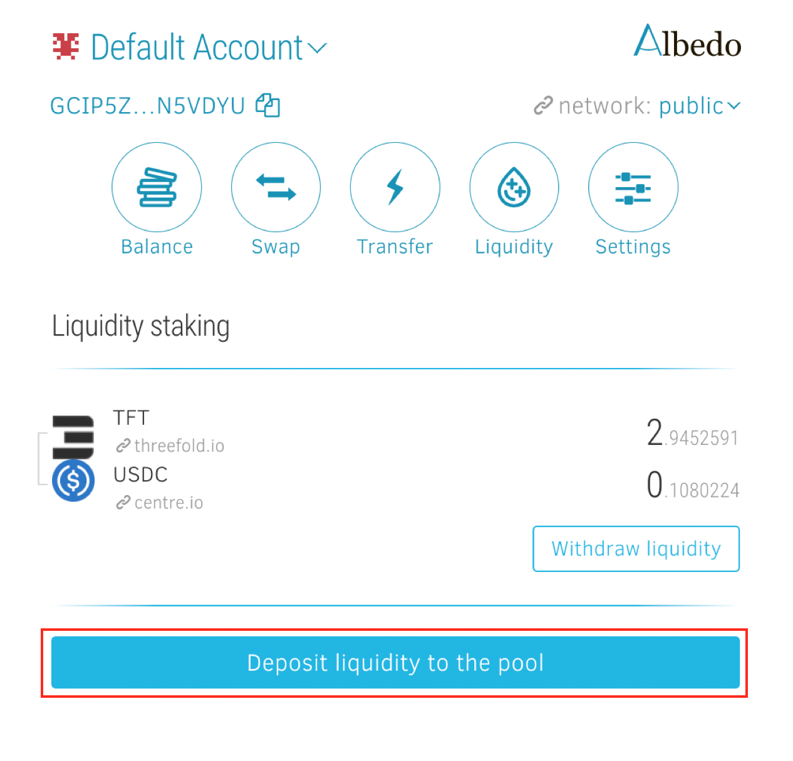

<h1> Provide TFT (Stellar) Liquidity on Albedo Wallet </h1>

<h2>Table of Contents</h2>

- [Introduction](#introduction)
- [Prerequisites](#prerequisites)
- [Get Started](#get-started)
  - [Provide Liquidity](#provide-liquidity)
- [Important Notice](#important-notice)
- [Disclaimer](#disclaimer)

***

## Introduction

Becoming a TFT liquidity provider on the Albedo wallet allows you to actively participate in the ecosystem by contributing to the liquidity of TFT tokens. As a liquidity provider, you play a crucial role in facilitating efficient trading and swapping of TFT tokens for other assets. By providing liquidity, you can earn rewards in the form of transaction fees and other incentives. This tutorial will guide you through the process of becoming a TFT liquidity provider on the Albedo wallet, enabling you to contribute to the vibrant TFT ecosystem while potentially earning additional benefits for your participation.

## Prerequisites

To become a liquidity provider on Albedo and join Stellar DEX Liquidity Pools, you'll need the following prerequisites:

- **Albedo Wallet and TFT asset setup**: Set up an Albedo wallet and add the TFT (ThreeFold Token) asset to your Albedo wallet.

- **XLM for Transactions**: Have a sufficient amount of XLM (Stellar Lumens) in your Albedo wallet to cover transaction fees. XLM is required to execute transactions and interact with the Stellar network.

- **Sufficient TFT**: To become a liquidity provider on Albedo, you will need a sufficient amount of TFT (Stellar) tokens. You can acquire these tokens by either depositing them from another wallet into your Albedo wallet or swapping other tokens within your Albedo wallet to obtain TFT. Additionally, you'll need an equivalent value of another token that you want to contribute to the desired liquidity pool. TFT tokens represent your share in the liquidity pool and allow you to earn a portion of the trading fees.

## Get Started

Anyone who fullfill the prerequisites can create a liquidity pool on Albedo wallet. In this guide, we will focus on depositing TFT and USDC to provide liquidity for the pool as an example. 

After creating and activating your account on Albedo, the next step is to activate both the TFT and USDC assets within your Albedo wallet. Ensure that you have an adequate balance of both assets for the liquidity provision. Once you have activated and balanced your assets, you are ready to add liquidity to the TFT <> USDC pool on Albedo.

### Provide Liquidity

You can become an LP by signing into your [Albedo wallet homepage](https://albedo.link/) and click on **Liquidity** button on the navbar as shown. Please Make sure you're on **Public** network. select the two assets you’d like to provide liquidity to, in this case, TFT & USDC. 

Set the amount of TFT and USDC you would like to provide to this pool. 

Click '**Deposit Liquidity to the Pool**' button to confirm the transaction.

Congrats, you’ve just added liquidity to the TFT <> USDC pool on Albedo Wallet.

## Important Notice

It's important to note that being a liquidity provider involves certain risks, such as impermanent loss, which occurs when the value of the tokens in the liquidity pool fluctuates. However, if you believe in the potential of TFT and want to actively contribute to the liquidity ecosystem on PancakeSwap, becoming a liquidity provider can be a rewarding opportunity to earn fees and support the growth of the platform.

## Disclaimer

> The information provided in this tutorial or any related discussion is not intended as investment advice. The purpose is to provide educational and informational content only. Investing in cryptocurrencies or any other assets carries inherent risks, and it is crucial to conduct your own research and exercise caution before making any investment decisions. 
> 
> **The ThreeFold Token (TFT)** is not to be considered as a traditional investment instrument. The value of cryptocurrencies can be volatile, and there are no guarantees of profits or returns. Always be aware of the risks involved and make informed choices based on your own assessment and understanding. We strongly encourage you to read our [full disclaimer](../../../knowledge_base/legal/disclaimer.md) and seek advice from a qualified financial professional if needed.

