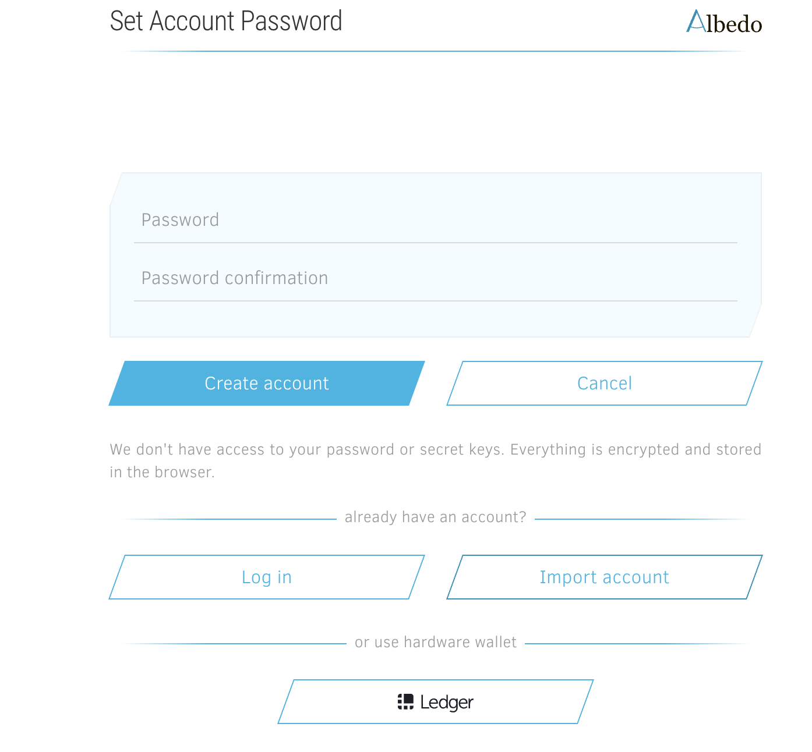
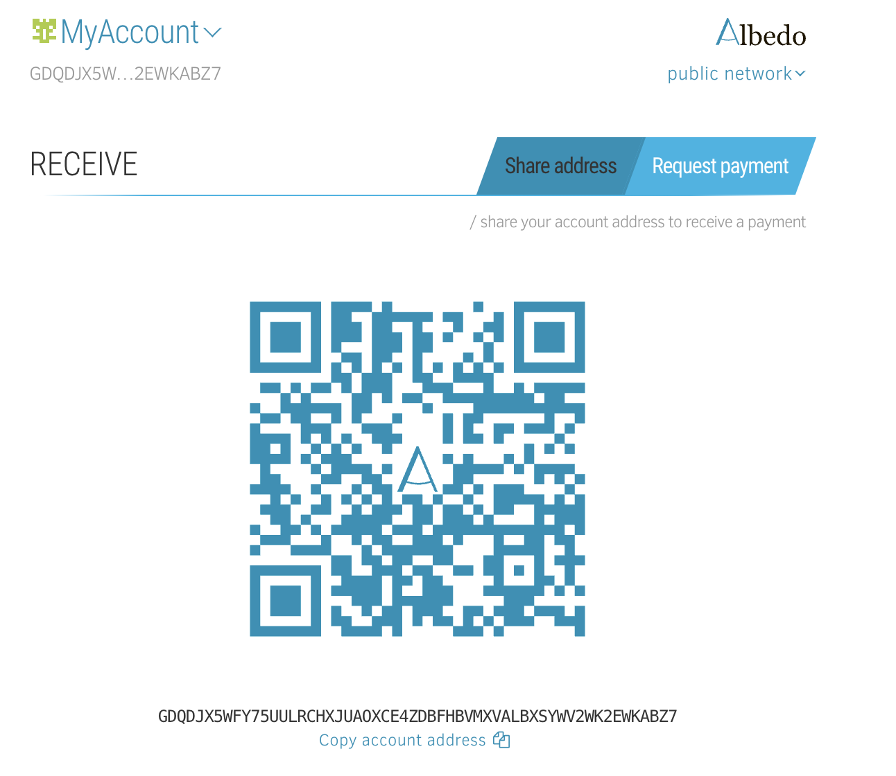
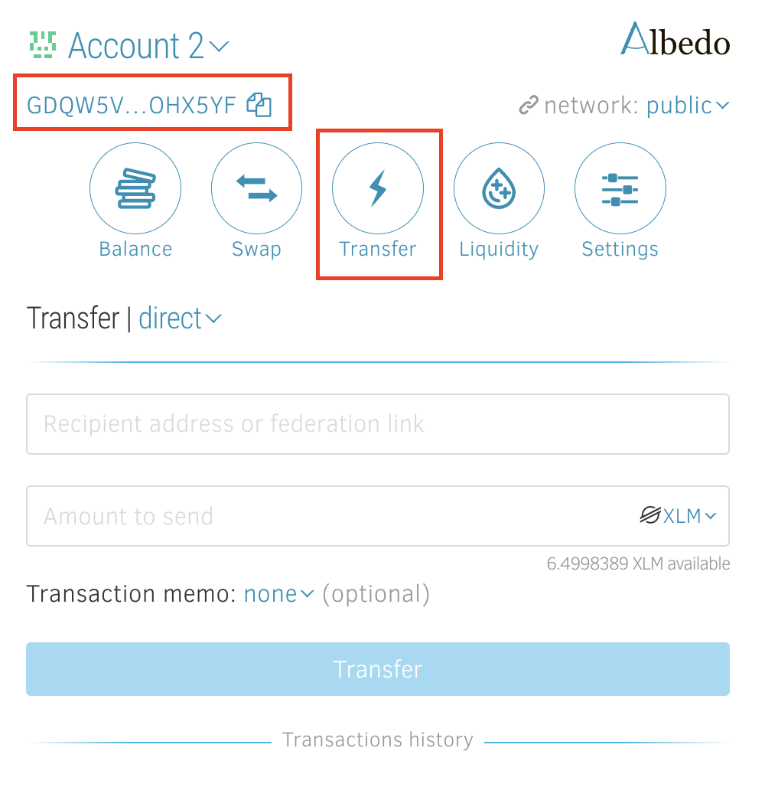

<h1> Store TFT (Stellar) on Albedo Wallet </h1>

<h2>Table of Contents</h2>

- [Introduction](#introduction)
- [Prerequisites](#prerequisites)
- [Get Started](#get-started)
  - [Create and Fund Albedo Wallet](#create-and-fund-albedo-wallet)
  - [Add TFT asset to Albedo Wallet](#add-tft-asset-to-albedo-wallet)
  - [Storing / Receiving and Sending TFT](#storing--receiving-and-sending-tft)
- [Important Notice](#important-notice)
- [Disclaimer](#disclaimer)
***
## Introduction

Welcome to our guide on how to store TFT tokens (Stellar) via the [Albedo wallet](https://albedo.link/)! 

Albedo is a secure and trustworthy keystore web app and browser extension designed for Stellar token accounts. With Albedo, you can safely manage and transact with your Stellar account without having to share your secret key with any third parties.
Developed by the creators of stellar.expert explorer, Albedo offers a range of features, including storage, swaps, and participation in liquidity pools. It is an open-source solution that can be accessed directly from your browser or installed as a browser add-on, currently available for Chrome and Firefox.

In this tutorial, we will walk you through the process of storing Stellar TFT tokens using the Albedo wallet.
***
## Prerequisites

- **XLM**: When storing TFT tokens using the Albedo wallet, a certain amount of XLM funding is required to facilitate the sending and receiving of assets on the Stellar network.

There are multiple ways to acquire XLM and send it to your wallet. One option is to utilize XLM-supported exchanges, which provide a convenient platform for purchasing XLM. Click [here](https://www.coinlore.com/coin/stellar/exchanges) to access a comprehensive list of exchanges that support XLM.

As an example, we have created a tutorial specifically focusing on how to buy XLM on Coinbase, one of the popular cryptocurrency exchanges. This tutorial provides step-by-step instructions on the process of purchasing XLM on **Coinbase Exchange**. You can find the tutorial [**here**](../buy_sell_tft/coinbase_xlm.md).
***
## Get Started

### Create and Fund Albedo Wallet

Go to [https://albedo.link/signup](https://albedo.link/signup) to start your sign up process.

Ensure you save your 24-word recovery passphrase. This is very important!
Click “**I saved recovery phrase**” (Again, it is critical that you save this recovery phrase somewhere, and do so securely). This key is the only way you could recover your account if you ever lose access to it.

Congrats! You just created an Albedo wallet. To get started swapping tokens into TFT, firstly we would need to fund your wallet with XLM by clicking '**fund it**' on the homepage.

Send some XLM for a third party wallets or stellar exchanger of your choice to your Albedo XLM wallet. 

Once you sent the XLM, you will see the balance added to the homepage. now we are ready to do some token transactions!

### Add TFT asset to Albedo Wallet

To store TFT in our Albedo Wallet, we will need to have a TFT wallet added into our account. This is done by  creating a trustline for TFT. Creating a trustline means granting permission for your Albedo wallet to recognize and interact with TFT tokens on the Stellar network. It allows you to view your TFT balance, send and receive TFT tokens, and engage in swapping or trading activities involving TFT within the Albedo wallet.

To add a trustline, go to the “**Balance**” section, and click “**Add trustline**” button.

A popup window will appear presenting Albedo's asset list. In the search field that appears, type in '**TFT**' as the asset you want to add.

**It is important to ensure that you also see the name "threefold.io" next to the logo** , as this verifies that you are selecting the genuine TFT asset associated with ThreeFold. **Beware of imposters or fraudulent assets that may attempt to mimic TFT.** ThreeFold cannot assume responsibility for any errors or mistakes made during the trustline creation process done by users. If you have any uncertainties or doubts, it is always recommended to seek assistance from official support channels or trusted sources to ensure the accuracy of the trustline configuration.

Confirm the selected asset by pressing “**Add trustline**”.

Congrats! You have now successfully added TFT as an asset to your Albedo wallet. 

### Storing / Receiving and Sending TFT

You can now store TFT by depositing it from another wallet by copying your public Albedo wallet address and sending it to the withdrawer.

You can also transfer TFT to another stellar wallet by clicking the '**Transfer**' icon on your wallet navbar and specify the amount of TFT and the receipient's wallet address and memo (if any), and click 'Transfer' button to finish the transaction.

***
## Important Notice

If you are looking for ways to get / purchase TFT (Stellar) on Albedo, you will find the according information [here](../buy_sell_tft/albedo_buy.md).
***
## Disclaimer

The information provided in this tutorial or any related discussion is not intended as investment advice. The purpose is to provide educational and informational content only. Investing in cryptocurrencies or any other assets carries inherent risks, and it is crucial to conduct your own research and exercise caution before making any investment decisions. 

**The ThreeFold Token (TFT)** is not to be considered as a traditional investment instrument. The value of cryptocurrencies can be volatile, and there are no guarantees of profits or returns. Always be aware of the risks involved and make informed choices based on your own assessment and understanding. We strongly encourage you to read our [full disclaimer](https://library.threefold.me/info/legal/#/legal__disclaimer) and seek advice from a qualified financial professional if needed.

