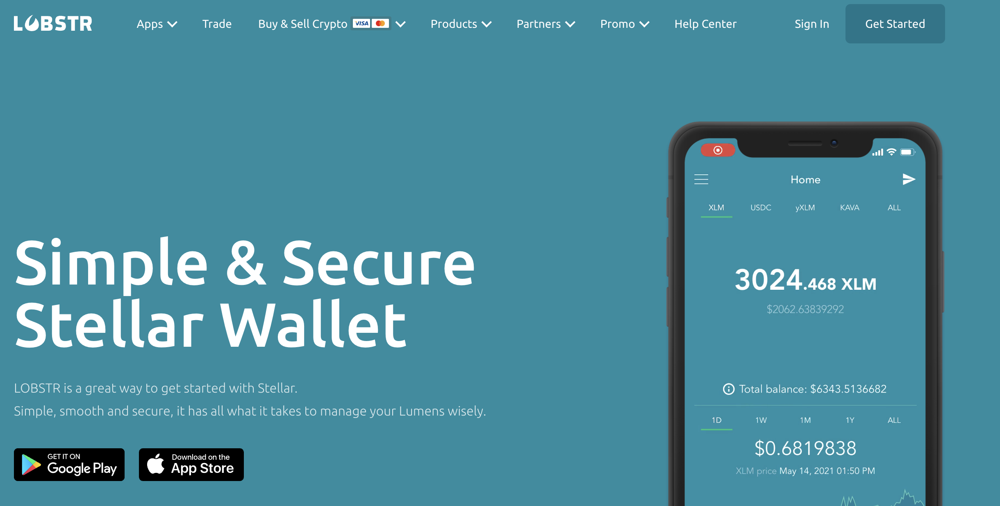
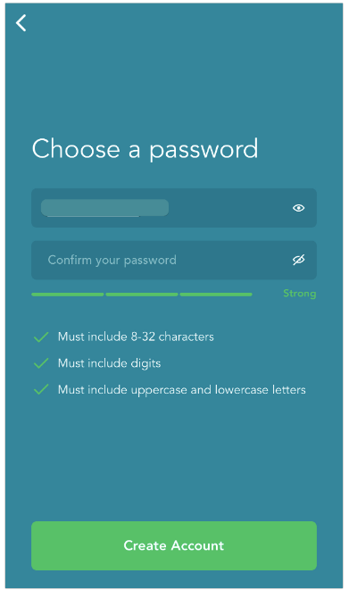
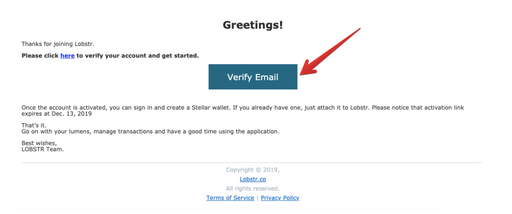
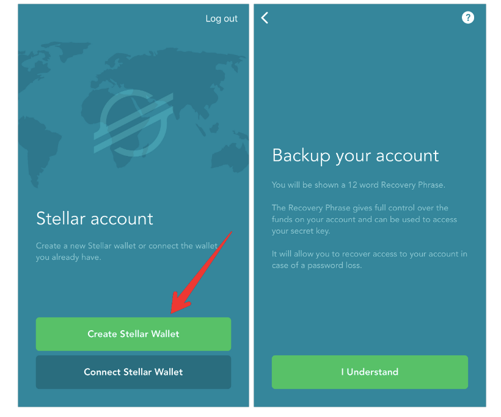
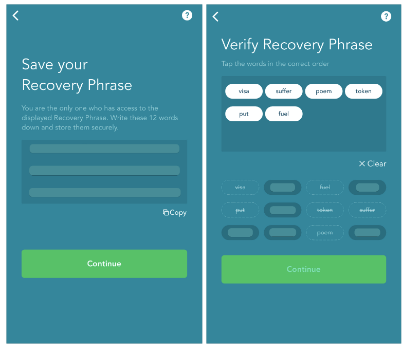
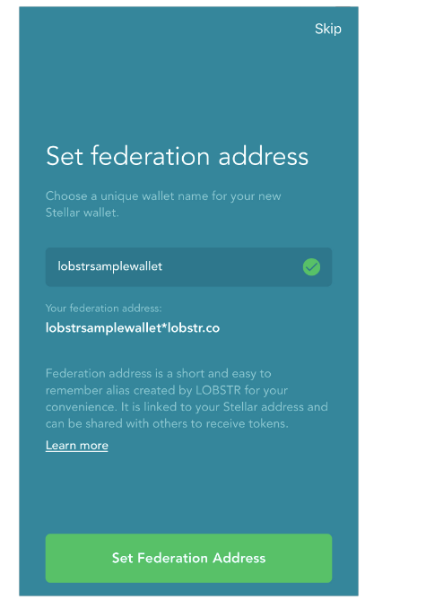
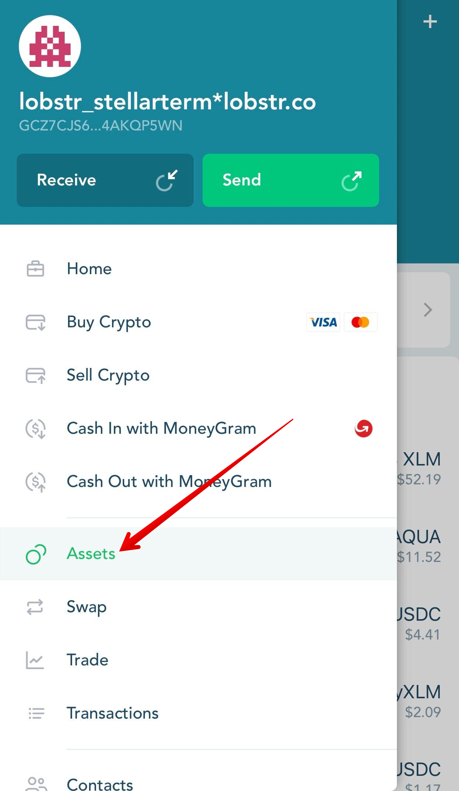
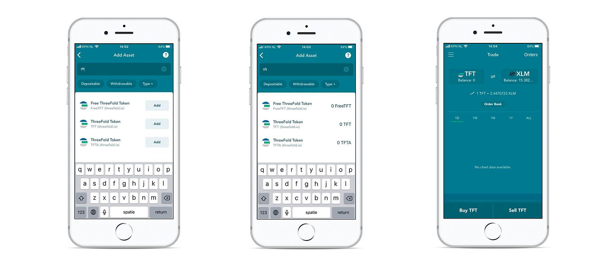

<h1> Lobstr Wallet </h1>

<h2> Table of Contents </h2>

- [Introduction](#introduction)
- [Prerequisites](#prerequisites)
- [Get Started](#get-started)
  - [Create a New Lobstr Wallet](#create-a-new-lobstr-wallet)
  - [Fund XLM to Wallet](#fund-xlm-to-wallet)
  - [Adding TFT Asset to Lobstr Wallet](#adding-tft-asset-to-lobstr-wallet)
- [Important Notice](#important-notice)
- [Disclaimer](#disclaimer)

***

## Introduction

Welcome to our guide on how to store TFT tokens (Stellar) via the [**Lobstr Wallet**](https://lobstr.co/)! 

Lobster Wallet is a secure and user-friendly wallet designed specifically for the Stellar blockchain. It allows you to store, manage, and transact with your Stellar-based assets, including TFT (ThreeFold Token). In this tutorial, we will guide you through the process of setting up Lobster Wallet and storing your TFT (Stellar) tokens. By following the steps outlined in this guide, you will be able to access and manage your TFT assets with ease and confidence using the Lobster Wallet platform.

## Prerequisites

- **XLM**: When storing TFT tokens using Lobstr wallet, a certain amount of XLM funding is required to facilitate the sending and receiving of assets on the Stellar network. 

If you already have some XLMs stored in another Stellar wallet or exchange, you could simply withdraw them to your new Lobstr wallet account after you complete the signup process. If not, there are multiple ways to acquire XLM and send it to your wallet. One option is to utilize XLM-supported exchanges, which provide a convenient platform for purchasing XLM. Click [**here**](https://www.coinlore.com/coin/stellar/exchanges) to access a comprehensive list of exchanges that support XLM.

You could also purchase some XLMs directly inside yor new Lobstr wallet account by using Fiat currency payment like credit and debit cards.

## Get Started

### Create a New Lobstr Wallet

For this guide, we will focus on creating the mobile app version of Lobstr Wallet. Go to [https://lobstr.co/](https://lobstr.co/) from your mobile app and download the Lobstr Wallet App to your mobile phone.

You can also create and use the web version of Lobstr wallet by signing up on the official website at [hhttps://lobstr.co/](https://lobstr.co/). Go to [Lobstr's knowledge base](https://lobstr.freshdesk.com/support/solutions/articles/151000001052-how-to-create-an-account-in-lobstr-) for the web sign up tutorial.

Insert your email address and choose a strong and unique password.

Verify your account by clicking on the '**Verify Email**' button in the message sent to your email address. 

Press the '**Create Wallet**' button if you'd like to create a new Stellar wallet. 

Write down your Recovery Phrase, which is needed to recover access to your account in case of a password loss or if your phone is lost or stolen. The word order is very important.  

Note: It is essential to save your secret key securely during the process of creating a new account or importing an existing one. The secret key is a critical component that grants access to your wallet and funds. Make sure to store it in a safe and offline location, such as a password manager or a physical backup, to prevent unauthorized access. Do not share your secret key with anyone and exercise caution to protect your assets.

(Optional) Set a federation address, which is the unique name of your new Stellar wallet that can be shared with others to receive funds and click '**Save**'.

Congratulations! You just created a new Lobstr wallet account.

### Fund XLM to Wallet

To initiate the process of storing TFT in Solar, the first step is to fund your wallet with XLM (Stellar Lumens). Transfer at least 1 XLM to your wallet to activate it.

To purchase Stellar lumens with Lobstr using credit / debit card, you can use the ‘[**Buy Lumens**](https://lobstr.co/buy-xlm/)’ option on the LOBSTR web and mobile apps. 

Note: Services relating to credit card payments are provided by[Moonpay](https://www.moonpay.com/), which is a separate platform owned by a third party. Click [here](https://lobstr.freshdesk.com/support/solutions/articles/151000001053-buying-crypto-with-lobstr-wallet) to read the full tutorial.

Once XLM is successfuly sent, it will appear on your Lobstr wallet homepage.

### Adding TFT Asset to Lobstr Wallet

To store TFT in your Lobstr Wallet, we will need to have a TFT wallet added into our account. This is done by  adding TFT Asset. This will allow you to view your TFT balance, send and receive TFT tokens, and engage in trading activities involving TFT within the Solar wallet.

To add the TFT (ThreeFold Token) asset to your Solar Wallet account, follow these steps:

Open the "Assets" screen from the left side menu

Use the search at the top of the "Assets" screen. From there you can search for TFT and it will show TFT and Click on Add button. 

**IMPORTANT**: It is important to ensure that you also see the name "**threefold.io**" next to the logo , as this verifies that you are selecting the genuine TFT asset associated with ThreeFold. **Beware of imposters or fraudulent assets that may attempt to mimic TFT.** ThreeFold cannot assume responsibility for any errors or mistakes made during the trustline creation process done by users. If you have any uncertainties or doubts, it is always recommended to seek assistance from official support channels or trusted sources to ensure the accuracy of the trustline configuration.

Congratulations! TFT asset has been successfully added to your Lobstr Wallet account. If you've performed the steps above correctly and there are no assets displayed, contact [Lobstr support](https://lobstr.freshdesk.com/support/tickets/new) with the details and the home domain of the asset.

You can now store TFT by depositing it from another wallet on your TFT Asset page.

## Important Notice

If you are looking for ways to get / purchase TFT (Stellar) on Lobstr Wallet by trading or swapping, you will find the according information [here](../buy_sell_tft/tft_lobstr/tft_lobstr_complete_guide.md).

## Disclaimer

> The information provided in this tutorial or any related discussion is not intended as investment advice. The purpose is to provide educational and informational content only. Investing in cryptocurrencies or any other assets carries inherent risks, and it is crucial to conduct your own research and exercise caution before making any investment decisions. 
> 
> **The ThreeFold Token (TFT)** is not to be considered as a traditional investment instrument. The value of cryptocurrencies can be volatile, and there are no guarantees of profits or returns. Always be aware of the risks involved and make informed choices based on your own assessment and understanding. We strongly encourage you to read our [full disclaimer](../../../knowledge_base/legal/disclaimer.md) and seek advice from a qualified financial professional if needed.
