<h1> ThreeFold Connect App Wallet </h1>

<h2> Table of Contents </h2>

- [Introduction](#introduction)
- [ThreeFold Connect Installation](#threefold-connect-installation)
  - [Verify your identity by Email](#verify-your-identity-by-email)
  - [Change email associated with TF account](#change-email-associated-with-tf-account)
- [Create a Wallet](#create-a-wallet)
- [See ThreeFold Connect App and Wallet Transactions](#see-threefold-connect-app-and-wallet-transactions)
- [Connect to the Planetary Network](#connect-to-the-planetary-network)
- [Show Seed Phrase - Remove Account from TF Connect App](#show-seed-phrase---remove-account-from-tf-connect-app)
- [Recover Account on the ThreeFold Connect App](#recover-account-on-the-threefold-connect-app)
- [Import Farm from the TF Connect App to the TF Dashboard](#import-farm-from-the-tf-connect-app-to-the-tf-dashboard)
- [Import TF Dashboard Wallet to the TF Connect App Wallet](#import-tf-dashboard-wallet-to-the-tf-connect-app-wallet)
- [Send and Receive TFT between TF Connect Wallets](#send-and-receive-tft-between-tf-connect-wallets)
  - [Send TFT](#send-tft)
  - [Receive TFT](#receive-tft)
  - [Send TFT to Hardware Wallet on Stellar Blockchain](#send-tft-to-hardware-wallet-on-stellar-blockchain)
- [Disclaimer](#disclaimer)

***

## Introduction

In this section, we cover the basics of the ThreeFold Connect app.

This app is available for [Android](https://play.google.com/store/apps/details?id=org.jimber.threebotlogin&hl=en&gl=US) and [iOS](https://apps.apple.com/us/app/threefold-connect/id1459845885).

- Note that for Android phones, you need at minimum Android Nougat, the 8.0 software version.
- Note that for iOS phones, you need at minimum iOS 14.5. It will be soon available to iOS 13.

## ThreeFold Connect Installation

Either use the links above, or search for the ThreeFold Connect app on the Apple Store or the Google Play store. Then install and open the app. If you want to leave a 5 star review of the app, no one here will stop you!

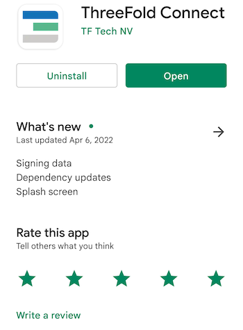

When you try to open the app, if you get an error message such as : "Error in initialization in Flagsmith...", you might need to upgrade your phone to a newer software version (8.0 for Android and 13 for iOS).

Once you are in the application, you will see some introduction pages to help you familiarize with the TF Connect app. You will also be asked to read and accept ThreeFold's Terms and conditions.

You will then be asked to either *SIGN UP* or *RECOVER ACCOUNT*. For now, we will show how to sign up. Later in the guide, we will show you how to recover an account.

You will then be asked to choose a *Threefold Connect Id*. This ID will be used, as well as the seed phrase, when you want to recover an account. Choose wisely. And do not forget it! Here we will use TFExample, as an example.

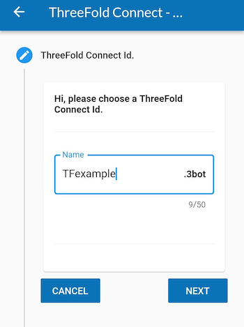

Next, you need to add a valid email address. This will be used as a broad KYC. You will need to access your email and confirm the validation email from ThreeFold to use properly the TF Connect app wallet.

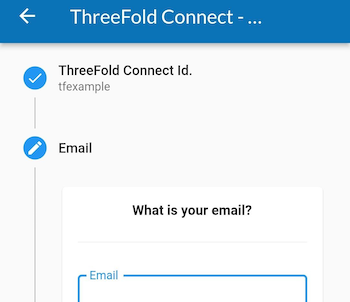

Then, the next step is crucial! Make sure no one is around looking at your screen. You will be shown your seed phrase. Keep this in a secure and offline place. You will need the 3bot ID and the seed phrase to recover your account. This seed phrase is of utmost important. Do not lose it nor give it to anyone.

Once you've hit Next, you will be asked to write down 3 random words of your seed phrase. This is a necessary step to ensure you have taken the time to write down your seed phrase.

Then, you'll be asked to confirm your TF 3bot name and the associated email.

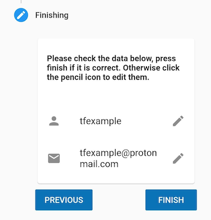

Finally, you will be asked to choose a 4-digit pin. This will be needed to use the ThreeFold Connect app. If you ever forget this 4-digit pin, you will need to recover your account from your 3bot name and your seed phrase. You will need to confirm the new pin in the next step.

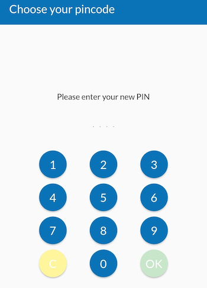

That's it! You've created your ThreeFold Connect account. You can press the hamburger menu on the top left to explore the ThreeFold Connect app.

In the next step, we will create a ThreeFold Connect Wallet. You'll see, it's very simple!

### Verify your identity by Email

Once you've created your account, an email will be sent to the email address you've chosen in the account creation process. 

To verify your email, go on your email account and open the email sent by *info@openkyc.live* with the subject *Verify your email address*. 

In this email, click on the link *Verify my email address*. This will lead you to a *login.threefold.me* link. The process should be automatic. Once this is done, you will receive a confirmation on screen, as well as on your phone.

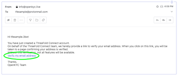

If for some reason, you did not receive the verification email, simply click on *Verify* and another email will be sent.

### Change email associated with TF account

If you want to change your email, simply click on the *pencil* next to your email and write another email. You will need to redo the KYC verification process.

## Create a Wallet

To create a wallet, click on the ThreeFold Connect app menu. This is what you see. Choose *Wallet*.

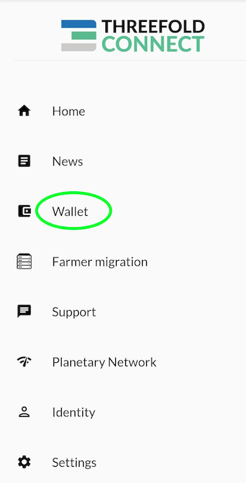

Once you are in the section *Wallet*, click on *Create Initial Wallet*. If it doesn't work the first time, retry some more. If you have trouble creating a wallet, make sure your connection is reliable. You can try a couple of minutes later if it still doesn't work. With a reliable connection, there shouldn't be any problem. Contact TF Support if problems persist.

This is what you see when the TF Grid is initializing your wallet.

Once your wallet is initialized, you will see *No blanace found for this wallet*. You can click on this button to enter the wallet.

Once inside your wallet, this is what you see.

We will now see where the Stellar and the TF Chain Addresses and Secrets are to be found. We will also changing the wallet name. To do so, click on the *circled i* at the bottom right of the screen.

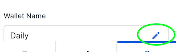

You can choose the name you want for your wallet. Here we use TFWalletExample. Note that you can also use alphanumeric characters.

At the top of the section *Wallet*, we can see that the name has changed.

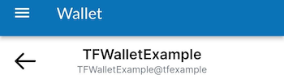

Now, if you want to copy your Stellar Address, simply click on the button presented with the green circle. To access the TF Chain address, click on the button presented with the red circle. When your phone has copied the address, the TF Connect app will give show a confirmation message as shown below.

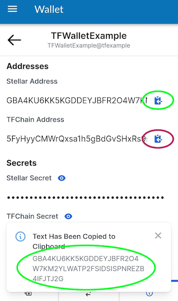

In some situations, you will want to access the Stellar and TF Chain secrets. To do so, simply click on the "eye" button of the desired chain, and then copy the secret.

## See ThreeFold Connect App and Wallet Transactions

To see your transactions, simply click on the two arrows at the bottom of the screen, as shown below.

## Connect to the Planetary Network

To connect to the Planetary Network, click on the Planetary Network on the TF menu as shown below.

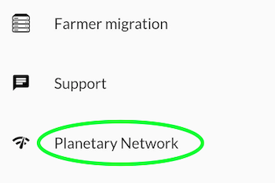

Connecting to the Planetary Network couldn't be easier. Simply click on the connection button and you will see *Connected* on the screen once the connection is settled.

## Show Seed Phrase - Remove Account from TF Connect App

To see your seed phrase or remove your account from the TF Connect app, choose *Settings* in the ThreeFold Connect app menu.

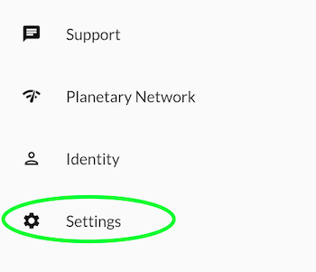

First, to see your seed phrase, click on this button as shown below:

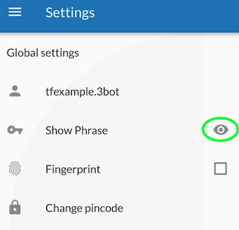

You will then be able to see your seed phrase. You can make sure you have your seed phrase somewhere safe, offline, before removing your account.

Now, we will remove the account from the ThreeFold Connect app. In Settings, click on the arrow circled in green and click on the red button with a white dashed in it. Beware: once done, you can only recover your account with your **3bot ID** and your **seed phrase**.

You will be asked to confirm your action as a security check.

## Recover Account on the ThreeFold Connect App

Once you're removed your account, if you want to recover your account, choose the option *RECOVER ACCOUNT* on the opening screen on the app.

You will be asked to enter your *3bot ID* as well as your *seed phrase*.

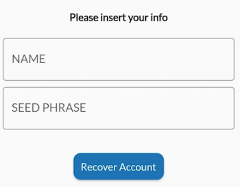

You will then be asked to choose and confirm a new 4-digit pin code. Once this is done, you will receive the following confirmation:

That's it! You've recovered your account.

## Import Farm from the TF Connect App to the TF Dashboard

If you want to import your farm from the ThreeFold Connect app to the ThreeFold Dashboard, follow these steps.  You will need to use the old version of the Dashboard for this ([https://old.dashboard.grid.tf](https://old.dashboard.grid.tf)).

Note that as of now, you cannot import your farm from the TF Dashboard to the ThreeFold Connect app, but it is possible to import your wallet.

First, you want to find the TF Chain Secret, this is, in short, a hex version of the private key. To find the secret, head over to the *Farmer migration* (via the TF Menu).

In the *Farming migration* section, click on the arrow (in green here) of the farm you want to export on the ThreeFold Dashboard.

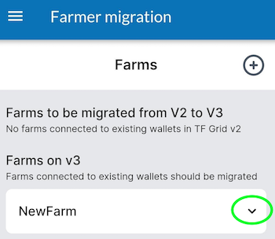

Then, click on the arrow (in green) to see your TF Chain Secret.

Click on the button to copy the Secret. The app will show a confirmation message. 

Now head over to the browser with your polkadot.js extension. For more information on this, check the section [Creating a Polkadot.js account](#1-creating-a-polkadotjs-account).

On your browser, click on the extension button (in green).

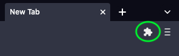

Select the polkadot{.js} extension.

Click on the *plus* button as shown in green.

Choose the option *Import account from pre-existing seed*.

In the box *EXISTING 12 OR 24-WORD MNEMONIC SEED*, paste the TF Chain Secret. Note that this Secret is a HEX version of your seed phrase.

Choose a name for your account. Choose a password.

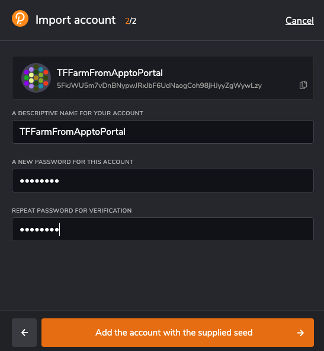

When you go on the [ThreeFold Dashboard](https://old.dashboard.grid.tf), you will now see your newly added account. Click on it.

In the Farm section, you can now see your farm. You have successfully move the farm from the ThreeFold Connect app to the ThreeFold Dashboard.

You can see here that the farming reward address is the same as before.

That's it! You have successfully imported the farm from the ThreeFold Connect app to the ThreeFold Dashboard.

## Import TF Dashboard Wallet to the TF Connect App Wallet

Now that we've seen how to go from the TF Connect app to the ThreeFold Dashboard, we will now show how to go the other way around. This method is very simple. You will need your TF Dashboard seed phrase handy.

Go in the Wallet section of the ThreeFold Connect app and click on import at the bottom right (in green).

Then simply name your wallet and enter the TF Dashboard seed phrase.

Then in the Wallet section, you will now see the wallet.

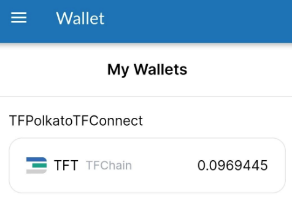

## Send and Receive TFT between TF Connect Wallets

To send and receive TFT between TF Connect Wallet, go into Wallet and select the wallet you want to use.Remember that you must always send and receive TFT on the same chain, so choose either Stellar or TFChain.

### Send TFT

To send tokens, select *Send Coins* in the wallet section. To send TFT, you can scan the QR code of the address you wish to send tokens to. This will enter automatically the necessary information. Make sure to double check that the information is correct to avoid any complications. Otherwise, you can simply enter the correct address in the section *To*. Choose the amount you want to send. Then click on *SEND TOKENS*. 

Note that, for such transactions, there is a maximum fee of 0.10 TFT on the Stellar blockchain, and a maximum fee of 0.01 TFT on the TFChain. This amount is taken from the amount you are sending. It is not taken directly in your wallet. 

### Receive TFT

To receive tokens, select *Receive Coins* in the wallet section. To receive TFT, you can generate a QR code to share to the person waiting to send you tokens. Otherwise, the sender can simply use your Stellar or TFChain address and send you TFT.

To generate the QR Code, select the chain you want to use, Stellar or TFChain, enter the amount and the message if needed and click on *GENERATE QR CODE*. Note that there is no message option for TFChain, only for Stellar. This will generate a QR Code that can be scanned by other devices.

### Send TFT to Hardware Wallet on Stellar Blockchain

Before sending TFT to a hardware wallet, make sure the hardware wallet has a TFT trustline on the Stellar Blockchain. For more information, read [this section](./hardware_wallet.md).

## Disclaimer

> The information provided in this tutorial or any related discussion is not intended as investment advice. The purpose is to provide educational and informational content only. Investing in cryptocurrencies or any other assets carries inherent risks, and it is crucial to conduct your own research and exercise caution before making any investment decisions. 
> 
> **The ThreeFold Token (TFT)** is not to be considered as a traditional investment instrument. The value of cryptocurrencies can be volatile, and there are no guarantees of profits or returns. Always be aware of the risks involved and make informed choices based on your own assessment and understanding. We strongly encourage you to read our [full disclaimer](../../../knowledge_base/legal/disclaimer.md) and seek advice from a qualified financial professional if needed.
