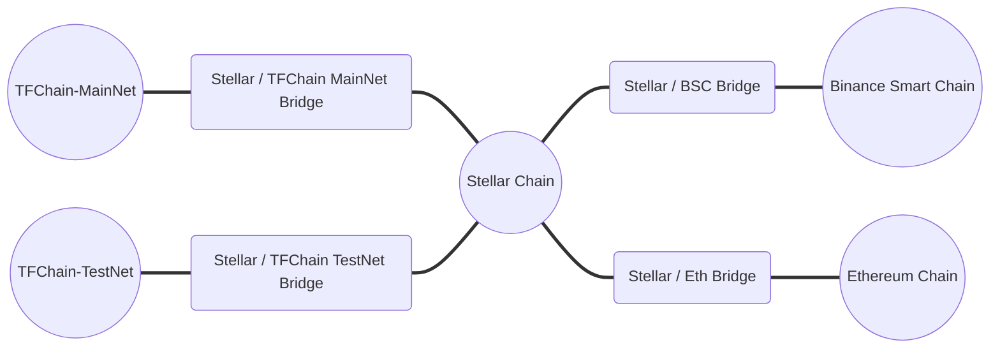

<h1> TFT Bridges </h1>

<h2> Table of Contents </h2>

- [TFChain-Stellar Bridge](./tfchain_stellar_bridge.md)
- [BSC-Stellar Bridge](./bsc_stellar_bridge.md)
  - [BSC-Stellar Bridge Verification](./bsc_stellar_bridge_verification.md)
- [Ethereum-Stellar Bridge](./tft_ethereum/tft_ethereum.md)
- [Bridge Fees](../transaction_fees.md)

***

## Introduction

The ThreeFold Token (TFT) exists on different chains. To transfer TFTs between chains, you can use different TFT Bridges.

The following diagram shows the different bridges and ways to transfer ThreeFold Tokens (TFT) from one chain to another. 

> Note: You can click on a given bridge to access its related guide.

## Links

The links to the bridges for TFT are the following:

* Stellar-Ethereum Bridge
  * This bridge is accessible at the following link: [https://bridge.eth.threefold.io/](https://bridge.eth.threefold.io/)
  * Read [this guide](./tft_ethereum/tft_ethereum.md) for more information
* Stellar-BSC Bridge
  * This bridge is accessible at the following link: [https://bridge.bsc.threefold.io/](https://bridge.bsc.threefold.io/)
  * Read [this guide](./bsc_stellar_bridge.html) for more information
* The TFChain Main net Bridge
  * This bridge is accessible on the ThreeFold Main Net Dashboard: [https://dashboard.grid.tf/](https://dashboard.grid.tf/). 
  * Read [this guide](./tfchain_stellar_bridge.html) for more information
* The TFChain Test net Bridge
  * This bridge is accessible on the ThreeFold Test Net Dashboard: [https://dashboard.test.grid.tf/](https://dashboard.test.grid.tf/).
  * Read [this guide](./tfchain_stellar_bridge.html) for more information

## Chains Functions

The different bridges help you move your TFT and achieve different goals:

* The TFChain-Stellar Bridge is used to go between the Stellar Chain and TF Chain for Main net and Test net.
* The BSC-Stellar Bridge is used to go between the Stellar Chain and Binance Smart Chain (BSC).
* The Stellar-Ethereum Bridge is used to go between the Stellar Chain and the Ethereum blockchain.

As shown in the diagram, to go from BSC to TF Chain, or from TF Chain to BSC, you need to use first the BSC-Stellar bridge, then the Stellar-TFChain bridge. To go from the Ethereum blockchain to TFChain, you need to use the Ethereum-Stellar bridge then the Stellar-TFChain bridge.

BSC, Stellar and Ethereum can be used to sell/buy TFT, while TFChain can be used to deploy Dapps on the [ThreeFold Dashboard](https://dashboard.grid.tf). The TFT minting process happens on Stellar Blockchain.

> Note: You should always start with a small amount the first time you try a bridge.

## Bridge Details

When you bridge TFT from Stellar to another chain, the TFT on Stellar is vaulted. When you bridge TFT back to Stellar, the TFT on the other chain is burned and the vaulted TFT is released.