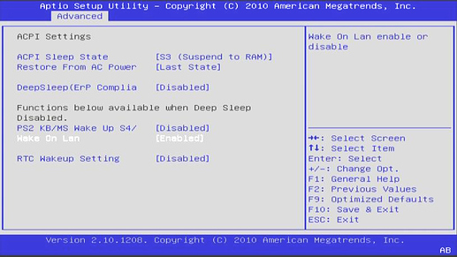
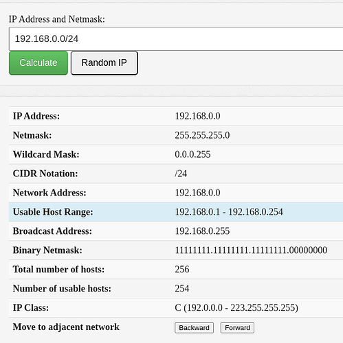

<h1>Farmerbot: Guide for Test Net, Dev Net and QA Net</h1>

<h2>Table of Contents</h2>

- [Introduction](#introduction)
- [Farmerbot: Video Guide](#farmerbot-video-guide)
- [How to Prepare Your Farm for the Farmerbot with WOL](#how-to-prepare-your-farm-for-the-farmerbot-with-wol)
  - [WOL Requirements](#wol-requirements)
    - [Enabling WOL in the BIOS](#enabling-wol-in-the-bios)
    - [ZOS Nodes and NIC](#zos-nodes-and-nic)
    - [NIC Firmware and WOL](#nic-firmware-and-wol)
- [How to Move Your Farm to a Different Network](#how-to-move-your-farm-to-a-different-network)
- [How to Set the Farmerbot](#how-to-set-the-farmerbot)
  - [Requirements](#requirements)
  - [Configuration](#configuration)
    - [Node Configuration](#node-configuration)
    - [Farm Configuration](#farm-configuration)
    - [Power Configuration](#power-configuration)
    - [Example of a Configuration File](#example-of-a-configuration-file)
  - [Deploying the Farmerbot](#deploying-the-farmerbot)
    - [Dev Net](#dev-net)
    - [QA Net](#qa-net)
    - [Test Net](#test-net)
    - [Running the Farmerbot](#running-the-farmerbot)
- [Farmerbot FAQ](#farmerbot-faq)
  - [Why does the farmerbot need to wake nodes up for uptime report, if they are unused and shut down?](#why-does-the-farmerbot-need-to-wake-nodes-up-for-uptime-report-if-they-are-unused-and-shut-down)
  - [Can a farmer opt in for farmerbot but also make exemption for certain nodes to never be shutdown regardless (for v1)?](#can-a-farmer-opt-in-for-farmerbot-but-also-make-exemption-for-certain-nodes-to-never-be-shutdown-regardless-for-v1)
  - [Will this feature require a master node that will never be shut down?](#will-this-feature-require-a-master-node-that-will-never-be-shut-down)
  - [Concerning the turning on of offline nodes, at the end, how does a farmer decide what almost full means? What do we decide?](#concerning-the-turning-on-of-offline-nodes-at-the-end-how-does-a-farmer-decide-what-almost-full-means-what-do-we-decide)
  - [Does the Farmerbot need to run physically in the farm?](#does-the-farmerbot-need-to-run-physically-in-the-farm)
  - [How many Farmerbot can you run per farm?](#how-many-farmerbot-can-you-run-per-farm)
  - [On how many node can the Farmerbot run?](#on-how-many-node-can-the-farmerbot-run)
  - [What is the uptime requirement for the Farmerbot?](#what-is-the-uptime-requirement-for-the-farmerbot)
  - [Can I run the Farmerbot on my farm?](#can-i-run-the-farmerbot-on-my-farm)
  - [Can the Farmerbot be the same node that wakes the other nodes?](#can-the-farmerbot-be-the-same-node-that-wakes-the-other-nodes)
  - [What if I want to have several LANs with different group of 3nodes?](#what-if-i-want-to-have-several-lans-with-different-group-of-3nodes)
  - [Can I turn all my nodes off while the Farmerbot runs? Why do I need at least one node per farm to be powered on?](#can-i-turn-all-my-nodes-off-while-the-farmerbot-runs-why-do-i-need-at-least-one-node-per-farm-to-be-powered-on)
  - [What type of computer can run the Farmerbot?](#what-type-of-computer-can-run-the-farmerbot)
  - [What happened if all the nodes are powered off?](#what-happened-if-all-the-nodes-are-powered-off)
  - [Is there a fail over setup possible for the Farmerbot?](#is-there-a-fail-over-setup-possible-for-the-farmerbot)
  - [How do 3nodes power on and off with the Farmerbot?](#how-do-3nodes-power-on-and-off-with-the-farmerbot)
  - [Can you have only one 3node in your farm with the Farmerbot?](#can-you-have-only-one-3node-in-your-farm-with-the-farmerbot)
  - [Is there a way to access more error checking?](#is-there-a-way-to-access-more-error-checking)
- [Feedback and Questions](#feedback-and-questions)

***

# Introduction

Welcome to the farmerbot. The farmerbot is a service that a farmer can run in order to automatically manage the nodes in his or her farm. 

The key feature of the farmerbot is powermanagement. The farmerbot will automatically shutdown nodes from its farm whenever possible and bring them back on using Wake-on-Lan (WOL) when they are needed. It will try to maximize downtime as much as possible by recommending which nodes to use, this is one of the requests that the farmerbot can handle. All this behavior is customizable through markup definition files. 

There are 3 main steps to run the Farmerbot on your 3node Threefold farm.

* Prepare Your Farm for the Farmerbot with WOL
* Move Your Farm to either Test Net, QA Net or Dev Net
* Set the Farmerbot

The farmerbot is currently available for Dev Net, QA Net and Test Net.

Note that the Dev Net and the QA Net are testing environments and farmers do not receive farming rewards (TFT) when deploying on those networks. To farm TFT, you would need to have your farm and the farmerbot on the Test Net.

***

# Farmerbot: Video Guide

The following video made by Scott from the Threefold team explains how to set up the Farmerbot for your Threefold farm. 

<div class="youtubeVideoWrapper">
<iframe width="560" height="315" src="https://www.youtube.com/embed/8KKqqHmJE1Q" title="YouTube video player" frameborder="0" allow="accelerometer; autoplay; clipboard-write; encrypted-media; gyroscope; picture-in-picture; web-share" allowfullscreen></iframe>
</div>

If you have questions concerning the video, feel free to ask in the Threefold forum. Reading the present guide and the Farmerbot FAQ might also answer your questions.

***

# How to Prepare Your Farm for the Farmerbot with WOL

ZOS can utilize 2 NIC's (Network Interface Card) of a node (server, workstation, desktop, ..). The first NIC on the motherboard will always be what we call the ZOS/dmz NIC, the second one is used for public config's (Gateway, public IP's for workloads, ..). So if you don't have public IP's in your farm, only the first NIC of your ZOS node will be used. This subnet is where the farmerbot operates. If you do have public IP's the same applies.

Wake On LAN (WOL) is used to be able to boot (start) a ZOS node remotely that was shut down by the farmerbot. It works by sending what is called a 'magic packet' to the NIC MAC address of a ZOS node. If that NIC is setup correctly, aka 'listening' for the packet, the node will start up, post and boot ZOS. The farmerbot will keep a list of MAC addresses for nodes under it's management, so it knows where to send the packet if it's required.
***
## WOL Requirements

WOL comes with a few requirements. We list them in the sections that follow.

### Enabling WOL in the BIOS

Enable WOL in the BIOS of your ZOS node.

A ZOS node must be capable of doing WOL. Have a look at your node hardware / BIOS manual. If so make sure to enable it in the BIOS! A bit of research will quickly tell you how to enable for your hardware. Some older motherboards do not support this, sometimes you can be lucky it does after a BIOS upgrade, but that is brand/model specific.

Some examples:

 

 

### ZOS Nodes and NIC

All your ZOS nodes and their first NIC (ZOS/dmz) should be in the same network subnet (also called network segment or broadcast domain).

This requires some basic network knowledge. WOL packets can not be send across different subnets by default, it can but this requires specific configuration on the firewall that connects the two subnets. Though cross-subnet WOL is currently not supported by the farmerbot.

A 'magic' WOL packet is sent only on networking layer 2 (L2 or the 'data link layer') based on MAC address. So not on L3 based on ip address. This is why all nodes that should be brought up via WOL, need to be in the same subnet.

You can check if this is the case like this: if for example one node has the ip 192.168.0.20/24, then all other nodes should have an ip between 192.168.0.1 and 192.168.0.254. You can calculate subnet ranges easely here: https://www.tunnelsup.com/subnet-calculator/

So for the 192.168.0.0/24 example, you can see the range under 'Usable Host Range':

 

### NIC Firmware and WOL

Some NIC's require WOL to be set on the NIC firmware.

This is fully handled by ZOS. Every time ZOS boots it will enable WOL on links if they require it. So if a ZOS node then is added to a farmerbot, it will have WOL enabled on its NIC when it's turned off (by the farmerbot).

Your farmerbot can be run on any system, including on a node. It doesn't have to be on the same network subnet as the nodes from the farm. The nodes of the farm on the other hand have to be in the same LAN. Don't hesitate to ask your technical questions here, we and the community will help you set things up!

***

# How to Move Your Farm to a Different Network

If you are on Main Net and you want to try the farmerbot, you should move your farm to either the Dev Net, the QA Net or the Test Net.

To move your farm to a different network, you need to create a new bootstrap image for the new network instead of your current network. You should also wipe your 3nodes' disks before moving to a different network.

To download the Zero-OS bootstrap image, go to the usual bootstrap link [https://v3.bootstrap.grid.tf/](https://v3.bootstrap.grid.tf/) and select the network you want.

Note that the farmerbot is currently available for Dev Net, QA Net and Test Net.

 

Once you have your new bootstrap image for the new network, [wipe your disks](../TF_Farmer_Guide/TF_Complete_Farmer_Guide/farmer_guide.md#4-wipe-all-the-disks), insert the new bootstrap image and reboot the 3node.

***
# How to Set the Farmerbot

The sections on this page will guide you through the requirements, the required configuration and the steps to run the farmerbot.
***
## Requirements
The farmerbot is shipped inside a docker image so that it is easy to run in a docker environment. Thus, the one and only requirement to run the farmerbot is docker so please [install docker](https://docs.docker.com/engine/install/) on your VM or your system. Next, you'll have to copy the [docker-compose file](https://raw.githubusercontent.com/threefoldtech/farmerbot/development/docker-compose.yaml) that will start the farmerbot for you when executing the command specified in section [Running the farmerbot](#running-the-farmerbot).

Note that you can read [this SSH guide](../getstarted/ssh_guide/ssh_guide.md) to learn how to deploy a Full VM on the Threefold Grid with Linux, Mac or Linux with IPv4 or the Planetary Network. Also note that the farmerbot doesn't need an IPv4 connection. It is thus cheaper to use the Planetary Network. 

With the minimum Ubuntu Full VM requirements, it currently costs 0.25TFT/hour to run with the Planetary Network (Date: 24-03-23). This should suffice to run the farmerbot. This is around 180 TFT/month. Of course, check for yourselves if the costs are correct.

Note: The account that you are using to deploy the farmerbot needs to have some TFT available. Every time the farmerbot has to wakeup a node or shutdown a node it will have to call the chain and thus execute a transaction. The account executing those transactions will be billed (transaction fees).

***
## Configuration
Some configuration is required before running the farmerbot which should happen in a markdown file (*farmerbot.md* for example). This file should be located inside a folder called *config* in the directory of the docker-compose file. The possible configuration will be discussed in this section.

### Node Configuration
The farmerbot can only manage the nodes that you define in the configuration. So, for each node in your farm, fill in these required attributes:
- id: the id of the node
- twinid: the twin id of the node

Next to the required attributes you can provide the following attributes:
- never_shutdown: a value telling the farmerbot whether or not the node should never be shutdown
- cpuoverprovision: a value between 1 and 4 defining how much the cpu can be overprovisioned (2 means the farmerbot will allocate 2 deployments to one cpu)
- public_config: a value telling the farmerbot whether or not the node has a public config
- dedicated: a value telling the farmerbot whether or not the node is dedicated (only allow renting the full node)
- certified: a value telling the farmerbot whether or not the node is certified

The snippet below shows you an example of a node definition in the markdown config file:
```
!!farmerbot.nodemanager.define
    id:20
    twinid:105
    public_config:true
    dedicated:1
    certified:yes
    cpuoverprovision:1
```

### Farm Configuration
Two more settings are required regarding the farm:
- id: the id of the farm
- public_ips: the amount of public ips that the farm has

Here is an example of the farm definition in the markdown config file:
```
!!farmerbot.farmmanager.define
    id:3
    public_ips:2
```

### Power Configuration
Finally, you can add some configuration that will the behavior of the farmerbot regarding the powermanagement of the nodes. The following attributes can be added to the markdown config file:
- wake_up_threshold: a value between 50 and 80 defining the threshold at which nodes will be powered on or off. If the usage percentage (total used resources devided by the total amount of resources) is greater then this threshold a new node will be powered on. In the other case the farmerbot will try to power off nodes if possible.
- periodic_wakeup: nodes have to be woken up once a day, this variable defines the time at which this should happen. The offline nodes will be powered on sequentially with an interval of 5 minutes starting at the time defined by this variable.

An example of the power definition in the markdown config file:
```
!!farmerbot.powermanager.configure
    wake_up_threshold:75
    periodic_wakeup:8:30AM
```

### Example of a Configuration File
Below you will find an example of a markdown config file for a farm with 3 nodes and 2 public ips. The first node has a public config, is dedicated, is certified and has a cpu overprovisioning of 2. The wake up threshold is set to 75% and the periodic wakeup will happen at 8:30AM.
```
My nodes
!!farmerbot.nodemanager.define
    id:20
    twinid:105
    public_config:true
    dedicated:1
    certified:yes
    cpuoverprovision:2

!!farmerbot.nodemanager.define
    id:21
    twinid:106

!!farmerbot.nodemanager.define
    id:22
    twinid:107

Farm configuration
!!farmerbot.farmmanager.define
    id:3
    public_ips:2

Power configuration
!!farmerbot.powermanager.configure
    wake_up_threshold:75
    periodic_wakeup:8:30AM
```
***
## Deploying the Farmerbot
Once the configuration is done you should create a *.env* file (next to the docker-compose file) with the content below. Make sure to change the fields to what is required: you should fill in the mnemonic of your farm, choose the appropriate network and modify the relay and substrate values if need be. 

We give examples for Dev Net, QA Net and Test Net.

### Dev Net

For Dev Net you should modify the NETWORK to dev, the RELAY to wss://relay.dev.grid.tf:443 and SUBSTRATE to wss://tfchain.dev.grid.tf:443:
```
MNEMONIC="THE_MNEMONIC_OF_YOUR_FARM"
NETWORK=dev
RELAY=wss://relay.dev.grid.tf:443
SUBSTRATE=wss://tfchain.dev.grid.tf:443
```

### QA Net

For QA Net you should modify the NETWORK to qa, the RELAY to wss://relay.qa.grid.tf:443 and SUBSTRATE to wss://tfchain.qa.grid.tf:443:
```
MNEMONIC="THE_MNEMONIC_OF_YOUR_FARM"
NETWORK=qa
RELAY=wss://relay.qa.grid.tf:443
SUBSTRATE=wss://tfchain.qa.grid.tf:443
```

### Test Net

For Test Net you should modify the NETWORK to test, the RELAY to wss://relay.test.grid.tf:443 and SUBSTRATE to wss://tfchain.test.grid.tf:443:
```
MNEMONIC="THE_MNEMONIC_OF_YOUR_FARM"
NETWORK=test
RELAY=wss://relay.test.grid.tf:443
SUBSTRATE=wss://tfchain.test.grid.tf:443
```

### Running the Farmerbot

Now to run the the farmerbot, write the following commands:
```
wget https://raw.githubusercontent.com/threefoldtech/farmerbot/development/docker-compose.yaml

docker compose up -d
```

If the farmerbot is already running and you want to run the new version of the farmerbot, write the following commands instead (for more info, click [here](https://forum.threefold.io/t/farmerbot-basic-guide-for-qa-net/3845/14)):

```
wget https://raw.githubusercontent.com/threefoldtech/farmerbot/development/docker-compose.yaml

docker compose rm -f -s

mv config/farmerbot.log config/farmerbot.log.archiverc12

docker compose up -d
```

The farmerbot should be running after a couple of seconds. It will create a log file inside your config folder called *farmerbot.log*. If you wish to restart a running farmerbot you can run the command shown below. It can take a couple of seconds before the farmerbot is completely shutdown. But before doing that it might be good to copy or delete the old log file.
```
docker compose restart
```

If the docker-compose file has changed and you wish to run the new version you will have to copy the new docker-compose file, stop the running farmerbot and start the new farmerbot. Or just run the command (copy or delete the log file first):
```
docker compose rm -f -s && docker compose up -d
```
This again will take a couple of seconds.

***

# Farmerbot FAQ

## Why does the farmerbot need to wake nodes up for uptime report, if they are unused and shut down?

Because we want to know that the node is still available (is still there to be used). A farmer can unplug a node at any time so we can't distinct a node that has been unplugged from a node that is off.

***

## Can a farmer opt in for farmerbot but also make exemption for certain nodes to never be shutdown regardless (for v1)? 

We could do that, but as we are in the testing phase right now, it is not a good idea. But since The farmer is already able to configure the capacity planning rule: the percentage of how much unused resources he/she wants to be available, this deemed to be unnecessary. Whenever that percentage is reached a new node is powered on.

***

## Will this feature require a master node that will never be shut down?

Yes, that is a requirement. Nodes are powered on by other nodes (WOL packet comes from one of the nodes in the farm). So if you want to be able to power them back on you have to have at least one node powered on.

***

## Concerning the turning on of offline nodes, at the end, how does a farmer decide what almost full means? What do we decide?

Nodes are powered on in two cases: when the total resource usage reaches a certain percentage (defined by the farmer) or when there is an incoming find_node request and that the selected node is off.

***

## Does the Farmerbot need to run physically in the farm?

The Farmerbot doesn’t have to run physically in the farm since it instructs nodes over RMB to shut down / power on nodes.

***

## How many Farmerbot can you run per farm?

You can run only one Farmerbot for now.

***

## On how many node can the Farmerbot run?

Currently you can only deploy one Farmerbot for each farm, so the Farmerbot can only run on one node.

***

## What is the uptime requirement for the Farmerbot?

The Farmerbot should be running all the time or not at all (this is up to the farmer)

***

## Can I run the Farmerbot on my farm?

Though you can run the Farmerbot anywhere you want, it doesn’t have to be on a 3node in your farm.

***

## Can the Farmerbot be the same node that wakes the other nodes?

If you want, you can set your Farmerbot on your farm, in the same LAN as all other nodes, and designate this 3node to be the node that wakes up the other nodes.

***

## What if I want to have several LANs with different group of 3nodes?

You can set different farms in different LANs and set one Farmerbot per farm.

***

## Can I turn all my nodes off while the Farmerbot runs? Why do I need at least one node per farm to be powered on?

The farmer bot uses the nodes in the farm to send WOL packets to the node that needs to wakeup. For this reason, you need at least one node per farm to be powered on at all time.

***

## What type of computer can run the Farmerbot?

The Farmerbot can run on any computer/server, it could even run on a laptop so to speak, as long as it has an internet connection, the Farmerbot will be working fine.

***

## What happened if all the nodes are powered off?

If all nodes in a subnet are powered off, there is no way other nodes in other subnets will be able to power them on again so that is an issue.

***

## Is there a fail over setup possible for the Farmerbot?

It should be possible to set (at least) 2 instances of the Farmerbot and have a fail over setup. Stay tuned for more information on this.

***

## How do 3nodes power on and off with the Farmerbot?

Nodes power themselves down by checking TF Chain for a new power target. They power back up by receiving the magic packet from another node in the same LAN.

***

## Can you have only one 3node in your farm with the Farmerbot?

No. Since you need at least one node to power up a second node. you can't test the Farmerbot with just one node. You need at least two 3nodes in your farm with the Farmerbot.

***

## Is there a way to access more error checking?

Yes. In the config-path where you run the docker-compose, you have more logging for error checking. Under the directory where you set up your Farmerbot, you have the directory “config” in there where it creates a *.log file if you start the bot via Docker-Compose. In this directory, you can search for errors if something doesn't work as expected.

***

# Feedback and Questions

If you have any questions, please let us know.

You can ask questions on this [Threefold Forum post](https://forum.threefold.io/t/farmerbot-basic-guide-for-qa-net/3845).