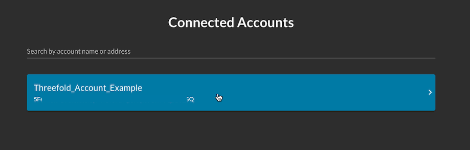
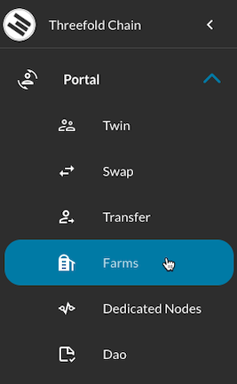
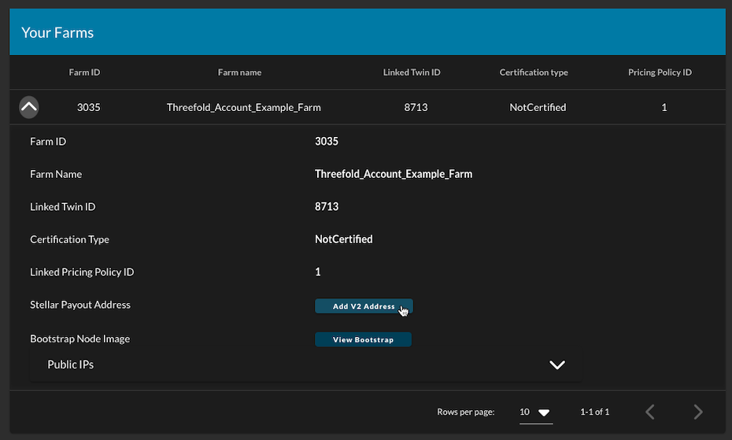

<h1> 1. Create a Farm </h1>

<h2> Table of Contents </h2>

- [Introduction](#introduction)
- [1) Creating a Polkadot.js account](#1-creating-a-polkadotjs-account)
- [2) Creating the Farm on the ThreeFold Grid](#2-creating-the-farm-on-the-threefold-grid)
- [Optional: Add Public IP Addresses](#optional-add-public-ip-addresses)
  - [How to configure public IP addresses for a ThreeFold farm or a 3Node](#how-to-configure-public-ip-addresses-for-a-threefold-farm-or-a-3node)
  - [The Difference Between IPs Assigned to Nodes Versus a Farm](#the-difference-between-ips-assigned-to-nodes-versus-a-farm)

***

## Introduction

The following section will show you how to create a farm and a farm ID. In doing so, we will also learn how to create a ThreeFold Twin and how to use the polkadot.js extension on Chrome or Firefox to create an account on the blockchain. You can also [create a ThreeFold Farm with the ThreeFold Connect App](#create-a-farm).

***

## 1) Creating a Polkadot.js account

    https://polkadot.js.org/extension/

Go on this link and download the extension based on your browser.

 

Choose Chrome or Firefox.

    https://addons.mozilla.org/en-US/firefox/addon/polkadot-js-extension/

In this case, we use Firefox. Clicking on Download for Firefox leads us to this URL.


Click Add to Firefox.


Click Add.

 

This message tells you that the extension was added. Select Allow this extension to run in Private Windows if you want, then click Okay.
***


At first, you have no account. Click on the + sign to create an account.

 

Write down your 12-word mnemonic seed and select ***I have saved my mnemonic seed safely***, once you’ve done so!


Choose a descriptive name for your account. This name is not relevant. If you remove your account from the browser, you will need to enter your 12-word mnemonic seed and choose a new descriptive name.

You will need the password when accepting transactions. Choose it wisely.


 

This is what you see when your account is created.

***

## 2) Creating the Farm on the ThreeFold Grid

Go on the ThreeFold Dashboard.

```
https://dashboard.grid.tf/
```

As you’ve created and logged in your account, you will see your account in the list of connected accounts. Click on your account.

 

You will be asked to read and accept the `Terms and Conditions`.


You will be asked your password in order to confirm the transaction.

 

***

Once you've confirmed the transaction, you want to create a relay address. The relay address should be the following:

```
relay.grid.tf
```

Make sure that `relay.grid.tf` is selected, then click "Create".

 

You will once again be asked to confirm the transaction.

Then, click on the "Farms" button in the Portal menu to your left:

 

On the "Farms" page, click on "Create Farm".

 

Choose a farm name and click "Submit".

 

Once the farm is created, click on the down arrow to see your farm details.

 

In this section, click on "Add V2 Address" to add your farming rewards address.

 

Write a valid Stellar address and click "Submit". 

 

You can, for example, use your ThreeFold Connect App* address or your hardware wallet address (Ledger, Trezor).

*ThreeFold Connect App Hyperlinks:
* Link for [Android](https://play.google.com/store/apps/details?id=org.jimber.threebotlogin&hl=en&gl=US)
* Link for [iOS](https://apps.apple.com/us/app/threefold-connect/id1459845885)

***
## Optional: Add Public IP Addresses
***

> Note: Assuming you are a farmer operating from your home, this field can usually be left blank. You do not have to fill in any details. The add IP option is for farmers that have a block of IP addresses routed to their router (in data centers mostly) and want to present “dedicated IP” addresses for deployments.

The add IP option is for farmers that have a block of IP addresses routed to their router. This is mainly for data centers, but some ISP can provide this service for residential locations. With such public IP addresses, your TF farm and/or your 3Nodes can present “dedicated IP” addresses for deployments.
Unless you are paying for a block of IPs, you only have one static IP which is needed for you router

The [ThreeFold simulator](https://simulator.grid.tf/) is referring to this IP address. Only check the Public IP option in the simulator if you have such block of IP addresses.

 

***
### How to configure public IP addresses for a ThreeFold farm or a 3Node
***

To configure public IP addresses for your 3Node farm, select the  *Farms*  section of the Portal menu in the [ThreeFold Dashboard](https://dashboard.grid.tf/), expand your farm by clicking on the down arrow on the left, then click on the down arrow to the right of the subsection *Public IPs*.

 

Click on "Add IP".

 

Specify the IP address using CIDR format, add the gateway and then click "Save".

 

The same process can be done for individual 3Nodes. This is available in the  *Nodes*  section, just below the  *Farms*  section of the "Farms" page.

To configure public IP addresses to a specific 3Node, click on the Actions *Add a public config* (represented with a Earth icon).

 

Fill in the necessary information and click save. Only the IPv4 address and gateway are necessary. The IPv6 address and the Domain are optional.

 

***
### The Difference Between IPs Assigned to Nodes Versus a Farm
***

IPs assigned to a farm are available to be rented by workloads. They can be assigned to virtual machines for example. IPs assigned to nodes enable each node to become a gateway.

***