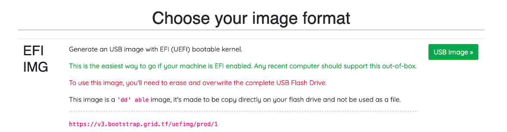

<h1> 2. Create a Zero-OS Bootstrap Image </h1>

<h2> Table of Contents </h2>

- [Introduction](#introduction)
- [Download the Zero-OS Bootstrap Image](#download-the-zero-os-bootstrap-image)
- [Burn the Zero-OS Bootstrap Image](#burn-the-zero-os-bootstrap-image)
  - [CD/DVD BIOS](#cddvd-bios)
  - [USB Key BIOS+UEFI](#usb-key-biosuefi)
- [Bootstrap Image for Certified 3Node](#bootstrap-image-for-certified-3node)

***

## Introduction

We will now learn how to create a Zero-OS bootstrap image in order to boot a DIY 3Node.

Note: For certified 3Nodes, read [this section](./farmer_guide.md#bootstrap-image-for-certified-3node).

## Download the Zero-OS Bootstrap Image

Go on the [Threefold Zero-OS Bootstrap Link](https://v3.bootstrap.grid.tf):

```
https://v3.bootstrap.grid.tf
```

 

This is the Zero-OS v3 Bootstrapping page.

  

Write your farm ID and choose production mode.

  

If your system is new, you might be able to run the bootstrap in UEFI mode.

 

For older systems, run the bootstrap in BIOS mode. For BIOS CD/DVD, choose **ISO**. For BIOS USB, choose **USB**

Download the bootstrap image. Next, we will burn the bootstrap image.

***

## Burn the Zero-OS Bootstrap Image

### CD/DVD BIOS 
***
For the BIOS **ISO** image, download the file and burn it on a DVD.
***

### USB Key BIOS+UEFI

For **MAC**, **Linux** and **Windows**, you can use [BalenaEtcher](https://www.balena.io/etcher/) to load/flash the image on a USB stick. This program also formats the USB in the process. This will work for the option **EFI IMG** for UEFI boot, and with the option **USB** for BIOS boot. Simply follow the steps presented to you and make sure you select the bootstrap image file you downloaded previously.

General Steps:

1. Download BalenaEtcher
2. Open BalenaEtcher
3. Select **Flash from file**
4. Find and select the bootstrap image (with your correct farm ID)
5. Select **Target** (your USB key)
6. Select **Flash**

That's it. Now you have a bootstrap image on Zero-OS as a bootable removable media device.
***

For the BIOS **USB** and the UEFI **EFI IMG** images, with Linux, you will want to do:

    sudo dd status=progress if=FILELOCATION.ISO(or .IMG) of=/dev/sd*.

Here the * is to indicate that you must adjust according to your disk. To see your disks, write lsblk in the command window. Make sure you select the proper disk!

*If you USB key is not new, make sure that you format it before burning the Zero-OS image.
***

For Windows, if you are using the ***"dd" able image***, instead of writing command line, you can use the free USB flashing program called [Rufus](https://sourceforge.net/projects/rufus.mirror/) and it will automatically do this with no need for Linux or command line. Rufus also formats the boot media in the process.

***

## Bootstrap Image for Certified 3Node

After creating a farm, to enable the certified farming status on your 3Node, you need to provide your farm ID and your farm name to the ThreeFold Support. You can do this by either using the [ThreeFold live chat](https://threefoldfaq.crisp.help/en/) or by sending an email at [info@threefold.io](mailto:info@threefold.io). The ThreeFold team will then send you a bootstrap image for your certified 3Node. You will need to replace the existing bootstrap image present on the USB key attached to the 3Node with this new bootstrap image for certified 3Node. Simply follow the steps below:

* Download the zip file containing your new bootstrap image.
* When you unzip the file, you’ll see a file named `BOOTX64.EFI` within the `BOOT/EFI` directory.
  * Simply copy this file onto the USB key within the same directories that exist there, to overwrite the existing `BOOTX64.EFI` file.
* Insert the USB key in the 3Node and boot it again.

Your 3Node has now a bootstrap image for certified 3Node.

***