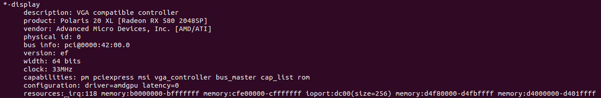

<h1>GPU Farming</h1>

<h2>Table of Contents</h2>

- [Introduction](#introduction)
- [Install the GPU](#install-the-gpu)
- [GPU Node and the Farmerbot](#gpu-node-and-the-farmerbot)
- [Set a Price for the GPU Node](#set-a-price-for-the-gpu-node)
- [Check the GPU Node on the Explorer](#check-the-gpu-node-on-the-explorer)
- [Reserving the GPU Node](#reserving-the-gpu-node)
- [Questions and Feedback](#questions-and-feedback)

***

## Introduction

In this ThreeFold guide, we cover how to add a GPU on a 3Node. Note that any Nvidia or AMD graphics card should work as long as it's supported by the system.

## Install the GPU

We cover the basic steps to install the GPU on your 3Node.

* Find a proper GPU model for your specific 3Node hardware
* Install the GPU on the server 
  * Note: You might need to move or remove some pieces of your server to make room for the GPU
  * Here is a quick example with a Dell R720 rack server and an AMD Radeon GPU

<div class="youtubeVideoWrapper">
<iframe width="560" height="315" src="https://www.youtube.com/embed/o10Ef963vsY?si=-64Tu-xx_VIX9JAM" title="ThreeFold GPU Farming" frameborder="0" allow="accelerometer; autoplay; clipboard-write; encrypted-media; gyroscope; picture-in-picture; web-share" allowfullscreen></iframe>
</div>

* (Optional) Boot the 3Node with a Linux distro (e.g. Ubuntu) and use the terminal to check if the GPU is recognized by the system
  * ```
    sudo lshw -C Display
    ```
  * Output example with an AMD Radeon (on the line `product: ...`)

* Boot the 3Node with the ZOS bootstrap image

## GPU Node and the Farmerbot

If you are using the Farmerbot, it might be a good idea to first boot the GPU node without the Farmerbot (i.e. to remove the node in the config file and restart the Farmerbot). Once you've confirmed that the GPU is properly detected by TFChain, you can then put back the GPU node in the config file and restart the Farmerbot. While this is not necessary, it can be an effective way to test the GPU node separately.

## Set a Price for the GPU Node

You can set a price for your GPU dedicated node on the [TF Dashboard](https://dashboard.grid.tf/).

* On the Dashboard, go to **Portal -> Farms**
* Under the section **Your Farm Nodes**, locate the GPU node and click **Set Additional Fees** under **Actions**
* Set a monthly fee (in USD) and click **Set**

## Check the GPU Node on the Explorer

You can use the Explorer on the [TF Dashboard](https://dashboard.grid.tf/) to verify that the node is displayed as having a GPU.

* On the Dashboard, go to **Explorer -> Nodes**
* Under **Node ID**, write the node ID of the GPU node
* Once the results are displayed, you should see **1** under **GPU**
   * If you are using the Status bot, you might need to change the node status under **Select Nodes Status** (e.g. **Down**, **Standby**) to see the node's information

> Note: It can take some time for the GPU parameter to be displayed.

## Reserving the GPU Node

Now, users can reserve the node in the **Dedicated Nodes** section of the Dashboard and then deploy workloads using the GPU. For more information on how to deploy workloads with a GPU node, read [this documentation](../../dashboard/portal/dashboard_portal_dedicated_nodes.md#gpu-support).

## Questions and Feedback

If you have any questions or feedback, we invite you to discuss with the ThreeFold community on the [ThreeFold Forum](https://forum.threefold.io/) or on the [ThreeFold Farmer chat](https://t.me/threefoldfarmers) on Telegram.