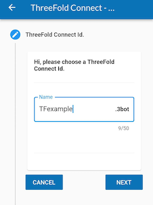
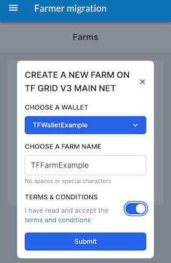
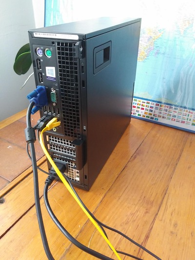
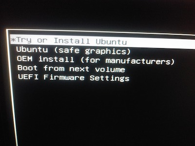
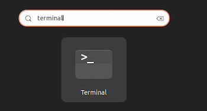
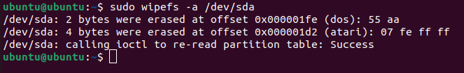
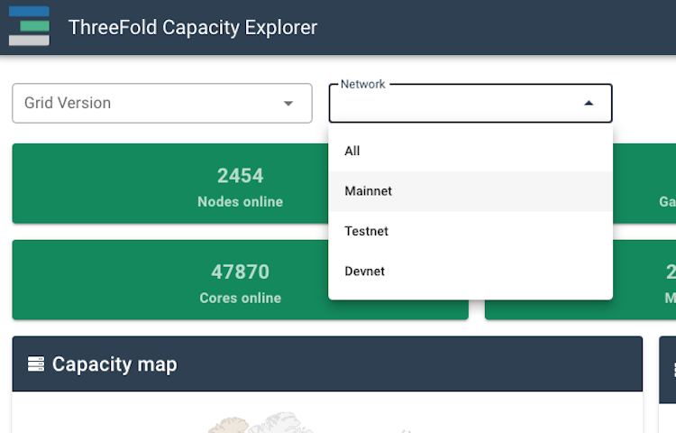

<h1>Building a DIY 3Node: Desktop Computer</h1>

In the following 3Node DIY guide, you will learn how to turn a Dell Optiplex 7020 into a 3Node farming on the ThreeFold Grid. 

Note that the process is similar for other desktop computers.

***

<h2>Table of Contents</h2>

***

- [Prerequisite](#prerequisite)
  - [DIY 3Node Computer Requirements](#diy-3node-computer-requirements)
  - [DIY 3Node Material List](#diy-3node-material-list)
- [1. Create a Farm with ThreeFold Connect App](#1-create-a-farm-with-threefold-connect-app)
  - [ThreeFold Connect App Installation](#threefold-connect-app-installation)
    - [Verify Your Identity (KYC) by Email](#verify-your-identity-kyc-by-email)
  - [Create a Wallet](#create-a-wallet)
  - [Create a Farm](#create-a-farm)
- [2. Create a Zero-OS Bootstrap Image](#2-create-a-zero-os-bootstrap-image)
  - [Download the Zero-OS Boostrap Image](#download-the-zero-os-boostrap-image)
  - [Burn the Zero-OS Bootstrap Image](#burn-the-zero-os-bootstrap-image)
- [3. Set the Hardware](#3-set-the-hardware)
- [4. Wipe All the Disks](#4-wipe-all-the-disks)
  - [1. Create a Linux Boostrap Image](#1-create-a-linux-boostrap-image)
  - [2. Boot Linux in Try Mode](#2-boot-linux-in-try-mode)
  - [3. Use wipefs to Wipe All Disks](#3-use-wipefs-to-wipe-all-disks)
- [5. Set the BIOS/UEFI](#5-set-the-biosuefi)
  - [The Essential Features of BIOS/UEFI for a 3Node](#the-essential-features-of-biosuefi-for-a-3node)
  - [Set the BIOS/UEFI on a Dell Optiplex 7020](#set-the-biosuefi-on-a-dell-optiplex-7020)
- [6. Boot the 3Node](#6-boot-the-3node)
  - [Check the 3Node's Status on the TF Explorer](#check-the-3nodes-status-on-the-tf-explorer)
  - [Farming Rewards Distribution](#farming-rewards-distribution)
- [Additional Information](#additional-information)

***

# Prerequisite

## DIY 3Node Computer Requirements

***

Any computer with the following specifications can be used as a DIY 3Node.

- Any 64-bit hardware with an Intel or AMD processor chip.
- Servers, desktops and mini computers type hardware are compatible.
- A minimum of 500 GB of SSD and a bare minimum of 2 GB of RAM is required.
- A ratio of 100GB of SSD and 8GB of RAM per thread is recommended.
- A wired ethernet connection is highly recommended to maximize reliability and the ability to farm TFT.
- A [passmark](https://www.passmark.com/) of 1000 per core is recommended and will be a minimum requirement in the future.

In this guide, we are using a Dell Optiplex 7020. It constitutes a perfect affordable entry DIY 3Node as it can be bought refurbished with the proper ratio of 100GB of SSD and 8GB of RAM per thread, and this, without any need of upgrades or updates.

***

## DIY 3Node Material List

***

* Any computer respecting the DIY 3Node Computer Requirements stated above
* Ethernet cable
* Router + Modem
* Surge Protector
* 2x USB key 4 Go
* Android/iOS Phone
* Computer monitor and cable, keyboard and mouse
* MAC/Linux/Windows Computer

***

***

# 1. Create a Farm with ThreeFold Connect App

## ThreeFold Connect App Installation

***

The ThreeFold Connect App is available for [Android](https://play.google.com/store/apps/details?id=org.jimber.threebotlogin&hl=en&gl=US) and [iOS](https://apps.apple.com/us/app/threefold-connect/id1459845885).

- Note that for Android phones, you need at minimum Android Nougat, the 8.0 software version.
- Note that for iOS phones, you need at minimum iOS 14.5. It will be soon available to iOS 13.

Either use the links above, or search for the ThreeFold Connect App on the Apple Store or the Google Play store. Then install and open the app. If you want to leave a 5 star review of the App, no one here will stop you!

Once you are in the application, you will see some introduction pages to help you familiarize with the TF Connect App. You will also be asked to read and accept ThreeFold's Terms and conditions.

You will then be asked to either *SIGN UP* or *RECOVER ACCOUNT*. For now, we will show how to sign up. Later in the guide, we will show you how to recover an account.

You will then be asked to choose a *ThreeFold Connect Id*. This ID will be used, as well as the seed phrase, when you want to recover an account. Choose wisely. And do not forget it! Here we will use TFExample, as an example.

Next, you need to add a valid email address. This will be used as a broad KYC. You will need to access your email and confirm the validation email from ThreeFold to use properly the TF Connect App Wallet.

Then, the next step is crucial! Make sure no one is around looking at your screen. You will be shown your seed phrase. Keep this in a secure and offline place. You will need the 3bot ID and the seed phrase to recover your account. This seed phrase is of utmost important. Do not lose it nor give it to anyone.

Once you've hit Next, you will be asked to write down 3 random words of your seed phrase. This is a necessary step to ensure you have taken the time to write down your seed phrase.

Then, you'll be asked to confirm your TF 3bot name and the associated email.

Finally, you will be asked to choose a 4-digit pin. This will be needed to use the ThreeFold Connect App. If you ever forget this 4-digit pin, you will need to recover your account from your 3bot name and your seed phrase. You will need to confirm the new pin in the next step.

That's it! You've created your ThreeFold Connect account. You can press the hamburger menu on the top left to explore the ThreeFold Connect App.

***

***

### Verify Your Identity (KYC) by Email

***

Once you've created your account, an email will be sent to the email address you've chosen in the account creation process. 

To verify your email, go on your email account and open the email sent by *info@openkyc.live* with the subject *Verify your email address*. 

In this email, click on the link *Verify my email address*. This will lead you to a *login.threefold.me* link. The process should be automatic. Once this is done, you will receive a confirmation on screen, as well as on your phone.

If for some reason, you did not receive the verification email, simply click on *Verify* and another email will be sent.

***

***

## Create a Wallet

***
To create a wallet, click on the ThreeFold Connect App menu. This is what you see. Choose *Wallet*.

Once you are in the section *Wallet*, click on *Create Initial Wallet*. 

This is what you see when the TF Grid is initializing your wallet.

Once your wallet is initialized, you will see *No blanace found for this wallet*. You can click on this button to enter the wallet.

Once inside your wallet, this is what you see.

***

## Create a Farm

***

To create a farm, follow those steps.

Click on the hamburger menu on the top left of your screen and select *Farmer Migration*. This title is somehow misleading, as you can not only migrate farms, but create farms too!

To create a farm, either click on the *plus* sign at the top right, or click on *Click to create ->*.

To create a farm, choose the wallet associated with the farm. Also, choose a Farm Name then read and accept the Terms and Conditions. Finally, click *submit*.

The TF Connect App will give you a confirmation message if the farm was created successfully. If it doesn't work the first time, make sure you have a good Internet connection and try again. If you click on the down arrow, you will be able to see your *Farm Information*.

You can see on this screen the address were your farming rewards will be sent to. It is the Stellar address associated with the ThreeFold Wallet used to create the farm.

We can see on the picture above that the Farm ID here is 1821. The farm ID will be used to create the Zero-OS Bootstrap Image in the next section.

***

***

# 2. Create a Zero-OS Bootstrap Image

## Download the Zero-OS Boostrap Image

***

We will now learn how to create a Zero-OS Bootstrap Image in order to boot a DIY 3Node.

    https://v3.bootstrap.grid.tf

Go on the [ThreeFold Zero-OS Bootstrap Link](https://v3.bootstrap.grid.tf) as shown above.

 

This is the Zero-OS v3 Bootstrapping page.

  

Write your farm ID and choose production mode.

  

Download the bootstrap image. Next, we will burn the bootstrap image.

***

***

## Burn the Zero-OS Bootstrap Image

***

For **MAC**, **Linux** and **Windows**, you can use [BalenaEtcher](https://www.balena.io/etcher/) to load/flash the image on a USB stick. This program also formats the USB in the process. This will work for the option **EFI IMG** for UEFI boot, and with the option **USB** for BIOS boot. Simply follow the steps presented to you and make sure you select the correct bootstrap image file you downloaded previously.

General Steps:

1. Download BalenaEtcher at [https://balena.io/etcher](https://balena.io/etcher)

2. Open BalenaEtcher

3. Select **Flash from file**

1. Find and select the bootstrap image in your computer

2. Select **Target** (your USB key)

6. Select **Flash**

That's it. Now you have a bootstrap image on Zero-OS as a bootable removable media device.

***

***

# 3. Set the Hardware

Setting the hardware of this DIY 3node is very easy as there are no updates or upgrades needed. Simply unbox the computer and plug everything.

Plug the computer cable in the surge protector

Connect the computer cable, the ethernet cable, the mouse and keyboard cable and the monitor cable.

Plug the ethernet cable in the router (or the switcher)

***

***

# 4. Wipe All the Disks

In this section, we will learn how to create a Linux bootstrap image, boot it in Try mode and then wipe all the disks in your 3Node. To create a Linux boostrap image, follow the same process as when we burnt the Zero-OS Boostrap Image.

***

## 1. Create a Linux Boostrap Image

***

1. Download the Ubuntu 20.04 ISO file [here](https://releases.ubuntu.com/20.04/)
2. Burn the ISO image on a USB key with Balena Etcher

***

## 2. Boot Linux in Try Mode

***

1. Insert your Linux boostrap image USB key in your computer and boot it
2. During boot, press F12 to enter into Settings
3. Select your booting device, here it is: *UEFI: USB DISK 2.0*
 

4. Select Try or install Ubuntu

5. Select Try Ubuntu

***

## 3. Use wipefs to Wipe All Disks

***

Once Ubuntu is booted, you will land on the main page.

At the bottom left of the screen, click on Applications.

In Applications, select Terminal. 

If you don't see it, write terminal in the search box.

You will land in the Ubuntu Terminal.

Write the command line *lsblk* as shown below. You will then see the disks in your computer. You want to wipe the main disk, but not the USB key we are using, named *sdb* here. We can see here that the SSD disk, *sda*, has 3 partitions: *sda1*, *sda2*, *sda3*. Note that when wiping the disks, we want no partition.

In this case, the disk we want to wipe is *sda*.

Write the command line *sudo wipefs -a /dev/sda*. This will wipe the disk *sda*. 

If you write the command line *lsblk* once more, you should see that your SSD disk has no more partition. The disk has been properly wiped. 

Power off the computer by selecting *Power Off* after having clicked on the button at the top right of the screen as shown below. 

That's it! The disks are all wiped. All that is left now is to set the BIOS/UEFI settings and then boot the 3Node!

***

***

# 5. Set the BIOS/UEFI

Before booting the main operating system, in our case Zero-OS, a computer will boot in either BIOS or UEFI mode. Older systems use BIOS and newer systems uses UEFI. Both BIOS and UEFI are low-lewel softwares needed to interact between the hardware and the main OS of the computer. Note that BIOS is also called Legacy BIOS.

## The Essential Features of BIOS/UEFI for a 3Node

***

There are certain things that you should make sure are set properly on your 3Node.

As a general advice, you can Load Defaults (Settings) on your BIOS, then make sure the options below are set properly.

* Choose the correct combination of BIOS/UEFI and bootstrap image on [https://bootstrap.grid.tf/](https://bootstrap.grid.tf/)
  * Newer system will use UEFI --> the Dell Optiplex 7020 uses UEFI
    * Bootstrap image: *EFI IMG* and *EFI FILE*
  * Older system will use Legacy BIOS
    * Bootstrap image: *ISO* and *USB*
* Set *Multi-Processor* and *Hyperthreading* at Enabled
  * Sometimes, it will be written *Virtual Cores*, or *Logical Cores*. 
* Set *Virtualization* at Enabled
  * On Intel, it is denoted as *CPU virtualization* and on ASUS, it is denoted as *SVM*. 
  * Make sure virtualization is enabled and look for the precise terms in your specific BIOS/UEFI.
* Enable *Network Stack* (sometimes called *Network Boot*)
* Set *AC Recovery* at *Last Power State*
  * This will make sure your 3Node restarts after losing power momentarily.
* Select the proper *Boot Sequence* for the 3Node to boot Zero-OS from your bootstrap image
  * e.g., if you have a USB key as a bootstrap image, select it in *Boot Sequence*
* Set *Server Lookup Method* (or the equivalent) at *DNS*.
  * Only use Static IP if you know what you are doing.
  * Your router will automatically assign a dynamic IP address to your 3Node when it connects to Internet.
* Set *Client Address Method* (or the equivalent) at *DHCP*. Only use Static IP if you know what you are doing.
  * Your router will automatically assign a dynamic IP address to your 3Node when it connects to Internet.
* *Secure Boot* should be left at disabled
  * Enable it if you know what you are doing. Otherwise, it can be set at disabled.

***

***

## Set the BIOS/UEFI on a Dell Optiplex 7020

***

1. Insert your Zero-OS boostrap image USB key in your computer and boot it.
2. During boot, press F12 to enter into *Settings* then choose *BIOS Setup*.

3. In BIOS Setup, click on Load Default and confirm by clicking on *OK*

4. Leave the BIOS Setup (Exit) and re-enter. This will set the default settings.
  
5. Go through each page and make sure you are following the guidelines set in the section Essential Features as shown in the following pictures.

6. Once you are done, click on *Exit* and then click *Yes* to save your changes. The 3node will now boot Zero-OS.

  
***

***

# 6. Boot the 3Node

If your BIOS/UEFI settings are set properly and you have the Zero-OS bootstrap image USB key plugged in, your 3node should automatically boot Zero-OS every time that it is turned on.

1. Power on the 3Node with the Zero-OS boostrap image USB key
2. Let the 3Node load Zero-OS
   * The first time it boots, the 3node will register to the TF Grid
3. Verify the 3Node's status on ThreeFold Explorer

The first time you boot a 3Node, it will be written: “This node is not registered (farmer ***: NameOfFarm). This is normal. The Grid will create a node ID and you will be able to see it on screen. This can take a couple of minutes.

This is the final screen you should see when your 3Node is connected to the ThreeFold Grid. Note that it is normal if it is written *no public config* next to *PUB* as we did not set any public IP address.

Naturally, your node ID as well as your farm ID and name will be shown.

Once you have your node ID, you can also go on the ThreeFold Explorer to see your 3Node and verify that your 3Node is online.

***

***

## Check the 3Node's Status on the TF Explorer

***
In a browser, go on the [ThreeFold Explorer](https://explorer.threefold.io/). 

Select **Grid V3**.

Then select **Mainnet**.

In this example, we will look for the farm 100. Use your farm ID.

We can see here that 5 x 3Nodes of the Farm 100 are online. 

On the top right of this section, you can click on "Show offline nodes". 

Now we can see the 3Nodes that are offline.

***

## Farming Rewards Distribution

***

The farming reward will be sent once per month directly in your ThreeFold Connect App wallet. Farming rewards are usually distributed around the 5th of each month.

***

# Additional Information

Congratulations, you now have built your first ThreeFold 3Node server! 

If you have any questions, you can ask the ThreeFold community for help on the [ThreeFold Forum](https://forum.threefold.io/) or on the [ThreeFold Telegram Farmer Group](https://t.me/threefoldfarmers).