<h1>Building a DIY 3Node: Rack Server</h1>

In the following 3Node DIY guide, you will learn how to turn a Dell server (R620, R720) into a 3Node farming on the ThreeFold Grid. 

Note that the process is similar for other rack servers.

<body>
<h2>Table of Contents</h2>
</body>

- [Setting Up the Hardware](#setting-up-the-hardware)
  - [Avoiding Static Discharge](#avoiding-static-discharge)
  - [Setting the M.2 NVME SSD Disk with the PCIe Adaptor](#setting-the-m2-nvme-ssd-disk-with-the-pcie-adaptor)
  - [Checking the RAM sticks](#checking-the-ram-sticks)
    - [General Rules when Installing RAM Sticks](#general-rules-when-installing-ram-sticks)
      - [Procedure to Install RAM Sticks](#procedure-to-install-ram-sticks)
  - [Installing the SSD Disks](#installing-the-ssd-disks)
  - [Plugging the 3node Server](#plugging-the-3node-server)
  - [Removing the DVD Optical Drive - Installing a SSD disk in the DVD Optical Drive Slot](#removing-the-dvd-optical-drive---installing-a-ssd-disk-in-the-dvd-optical-drive-slot)
  - [Using Onboard Storage - RAID Controller Details](#using-onboard-storage---raid-controller-details)
- [Zero-OS Bootstrap Image](#zero-os-bootstrap-image)
  - [Creating a Farm](#creating-a-farm)
    - [Using Dashboard](#using-dashboard)
    - [Using TF Connect App](#using-tf-connect-app)
  - [Wiping All the Disks](#wiping-all-the-disks)
  - [Downloading the Zero-OS Bootstrap Image](#downloading-the-zero-os-bootstrap-image)
    - [DVD ISO BIOS Image](#dvd-iso-bios-image)
    - [USB BIOS Image](#usb-bios-image)
- [BIOS Settings](#bios-settings)
  - [Processor Settings](#processor-settings)
  - [Boot Settings](#boot-settings)
- [Booting the 3Node](#booting-the-3node)
- [Additional Information](#additional-information)
  - [Differences between the R620 and the R720](#differences-between-the-r620-and-the-r720)
  - [Different CPUs and RAMs Configurations for 3Node Dell Servers](#different-cpus-and-rams-configurations-for-3node-dell-servers)
- [Closing Words](#closing-words)

***

# Setting Up the Hardware

 

Dell R620 1U server

## Avoiding Static Discharge

 

Some will recommend to wear anti-static gloves as shown here. If you don’t have anti-static gloves, remember this: 

> Always touch the metal side of the server before manipulating the hardware. 

Your hands will discharge the static on the outside of the box, which is secure.

## Setting the M.2 NVME SSD Disk with the PCIe Adaptor

  

Here is one of the two 2TB SSD NVME m.2 that we will install on the server. Above the SSD is the PCIe Gen 3, x4 that we will use to connect the SSD to the server.

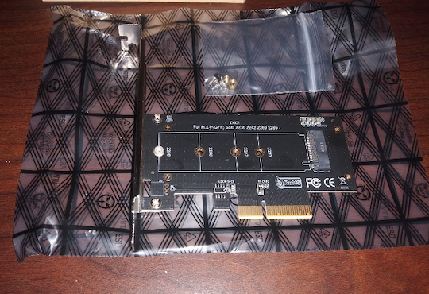  

You can see at the left of the adaptor that there is a metal piece that can be used to hold more firmly the PCIe adaptor and the SSD. We will remove it for this DIY build. Why? Because it is not necessary as the adaptor can hold the weight of the SSD. Also, this metal piece is full while the brackets in the server have holes in it. This will ensure a better airflow and thus less heat.

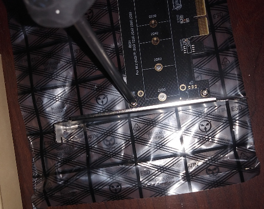  

We remove the screws with a star screwdriver.

 

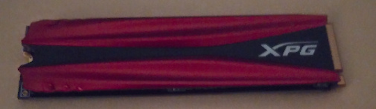  

This SSD already has a heatsink. There is no need to use the heatsink included in the PCIe adaptor kit. If you remove the heatsink or the sticker under the SSD, you will lose your 5 years warranty.

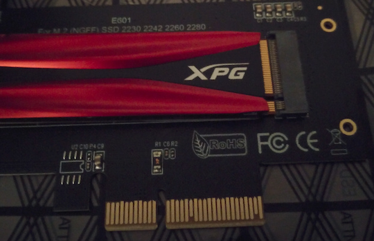  

When you put the SSD in the adaptor, make sure you have the opening in line with the adaptor.

  

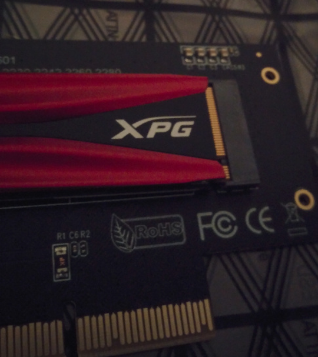  

Fitting in the SSD takes some force. Do not overdo it and take your time!

  

It’s normal that the unscrewed part is lifting in the air before you screw the SSD on the adaptor.

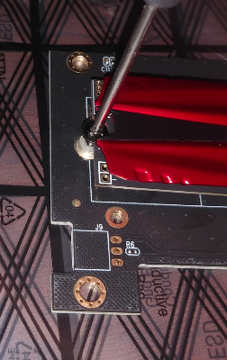  

To screw the SSD in place, use the screwdriver included in the PCIe adaptor kit.

  

  

Now that’s a steady SSD!

## Checking the RAM sticks

  

It’s now time to get under the hood! Make sure the case is at the unlocked position. If you need to turn it to unlocked position, use a flathead screwdriver or a similar tool.

  

  

Lift up the lock and the top server plate should glide to the back. You can remove the top of the server.

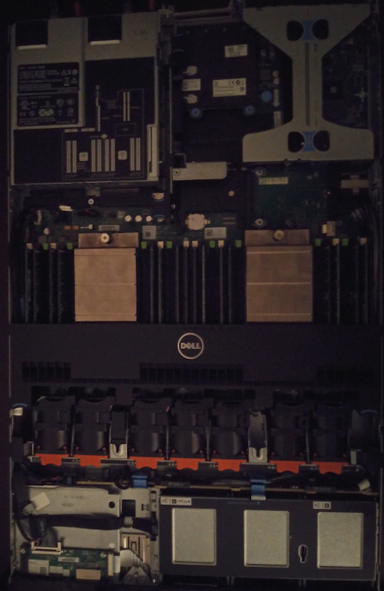  

Here’s the full story! R620 and all!

  

  

  

To remove this plastic piece, simply lift with your fingers at the designated spot (follow the blue line!).

  

Here’s the RAMs! This R620 came already equipped with 256GB of rams dispersed in 16x16GB sticks. If you need to add the RAM sticks yourself, make sure you are doing it correctly. The FAQ covers some basic information for RAM installation.

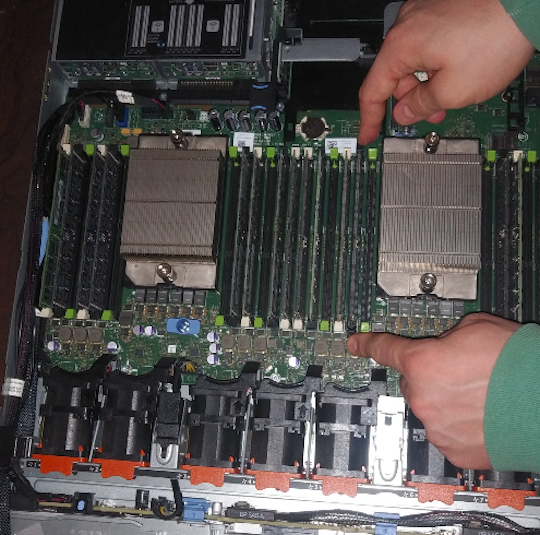  

To remove a stick, push on the clips on both sides. You can do it one at a time if you want. Make sure it doesn’t pop out and fall on a hardware piece! Once the clips are opened, pull out the RAM stick by holding it on the sides. This will ensure it does not get damaged.

  

Here’s the RAM in it’s purest form!

  

Here you can see that the gap is not in the middle of the RAM stick. You must be careful when inserting the RAM. Make sure you have the gap aligned with the RAM holder.

  

When you want to put a RAM stick in its slot, make sure the plastic holders on the sides are opened and insert the RAM stick. Make sure you align the RAM stick properly. You can then push on one side at a time until the RAM stick clicks in. You can do it both sides at once if you are at ease.

### General Rules when Installing RAM Sticks

First, always use RAM sticks of the same size and type. It should be noted on your motherboard which slots to populate first. 

As a general guide, there is usually 2 slots A and B, with each 2 memory stick entries. You must then install the ram sticks on A1 and B1 in order to achieve dual channel, then A2 and B2 if you have more (visual order: A1 A2 B1 B2).

#### Procedure to Install RAM Sticks

You want to start with your largest sticks, evenly distributed between both processors and work your way down to your smallest. 

As an example, let's say you have 2 processors and 4x 16GB sticks and 4x 8GB sticks. The arrangement would be A1-16GB, B1-16GB, A2-16GB, B2-16GB, A3-8GB, B3-8GB, A4-8GB, B4-8GB. 

Avoid odd numbers as well. You optimally want pairs. So if you only have 5x 8GB sticks, only install 4 until you have an even 6.

## Installing the SSD Disks

  

To put back the plastic protector, simply align the plastic piece with the two nudges in the metal case.

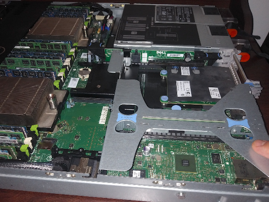  

  

We will now remove this PCIe riser in order to connect the SSDs.

  

Optional step: put the SSDs and the PCIe riser next to each other so they can talk and break the ice. They will get to learn one another before going into the server to farm TFT.

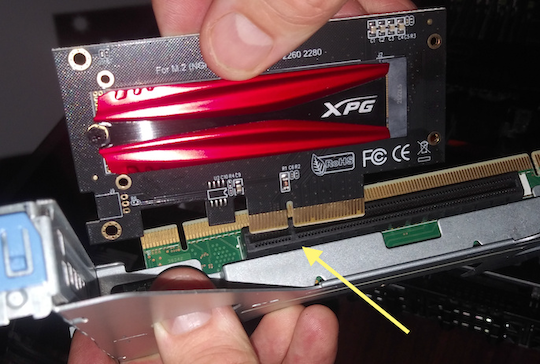  

Just like with RAM sticks, you want to make sure you are aligned with the slot.

  

Next, push the adaptor inside the riser’s opening. This takes some force too. If you are well aligned, it should be done with ease.

  

This is what the riser looks like with the two SSDs installed. Now you simply need to put the riser back inside the server.

  

Push down on the riser to insert it properly.

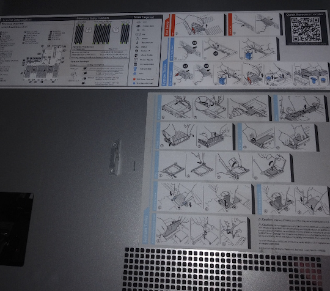  

It’s good to notice that the inside of the top plate of the server has great pictures showing how to manipulate the hardware.

## Plugging the 3node Server

  

Now you will want to plug in the power cable in the PSU. Here we show two 495W PSUs. With 256GB of RAM and two SSDs NVME, it is better to use two 750W PSUs. Note that this server will only use around 100W at idle. There are two power cables for redundancy. The unit does not need more than one to function.

On a 15A/120V breaker, you can have more than one server. But note that, at full load, this server can use up to 400W. In this case, no more than 3 servers could be plugged on the same breaker. Make sure you adapt to your current situation (server's power consumption, electric breaker, etc.).

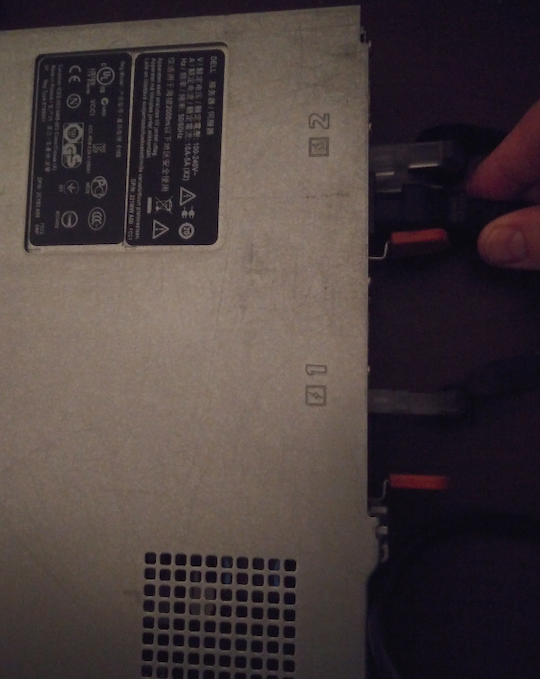  

Plugging in the power cable is pretty straightforward. Just make sure you have the 3 pins oriented properly!

  

It is highly recommended to plug the power cable in a surge protector. If you have unsteady electricity at your location, it might be good to use a UPS, uninterrupted power supply. A surge protector is essential to avoid overpowering and damaging the server.

  

  

  

Before starting the server, you can plug in the monitor and the keyboard as well as the ethernet cable. Make sure you plug the ethernet cable in one of the four NIC ports.

  

Now, power it on!

  

The server is booting.

## Removing the DVD Optical Drive - Installing a SSD disk in the DVD Optical Drive Slot

  

  

If you want to change the DVD optical drive, push where indicated and remove the power and SATA cables. 

It is possible to install a SSD disk in there. To do so, use a SATA HDD hard drive caddy CD/DVD **9.5mm** and put in a SATA III 2.5" disk. The caddy is not necessary. You could simply remove the standard CD/DVD caddy and plug the SATA disk.

The hardware part is done. Next, you will want to set the BIOS properly as well as get the bootstrap image of Zero-OS. Before we get into this, let's have some information on using the onboard storage of your 3node server.

## Using Onboard Storage - RAID Controller Details

If you want to use the onboard storage on your server, you will probably need to flash the RAID card or do some adjustment in order for Zero-OS to recognize your disks.

You can use the onboard storage on a server without RAID. You can [re-flash](https://fohdeesha.com/docs/perc.html)  the RAID card, turn on HBA/non-RAID mode, or install a different card. It's usually easy to set servers such as a HP Proliant with the HBA mode. 

For Dell servers, you can either cross-flash the RAID controller with an “IT-mode-Firmware” (see this [video](https://www.youtube.com/watch?v=h5nb09VksYw)) or get a DELL H310-controller (which has the non-RAID option). Otherwise, as shown in this guide, you can install a NVME SSD with a PCIe adaptor, and turn off the RAID controller.

Note that for Dell R610 and R710, you can re-flash the RAID card. For the R910, you can’t re-flash the card. In this case, you will need to get a LSI Dell card.

# Zero-OS Bootstrap Image

With R620 and R720 Dell servers, UEFI does not work well. You will want to use either a DVD or a USB in BIOS mode.

Go on https://bootstrap.grid.tf/ and download the appropriate image: option **ISO** for the DVD and option **USB** for BIOS USB (not UEFI).

Write your farmer ID and make sure you select production mode.

## Creating a Farm

You can create a farm with either the ThreeFold Dashboard or the ThreeFold Connect app.

### Using Dashboard

The Dashboard section contains all the information required to [create a farm](../../../dashboard/farms/your_farms.md).

### Using TF Connect App

You can [create a ThreeFold farm](../../../threefold_token/storing_tft/tf_connect_app.md) with the ThreeFold Connect App.

## Wiping All the Disks

You might need to wipe your disks if they are not brand new. To wipe your disks, read the section [Wipe All the Disks](../../3node_building/4_wipe_all_disks.md) of the ThreeFold Farming Documentation.

## Downloading the Zero-OS Bootstrap Image

You can then download the [Zero-OS bootstrap image](https://v3.bootstrap.grid.tf) for your farm.

  

  

Use the ISO image for DVD boot and the USB image for USB BIOS boot (not UEFI). We use the farm ID 1 here as an example. Put your own farm ID.

### DVD ISO BIOS Image
For the ISO image, download the file and burn it on a DVD.

### USB BIOS Image
Note: the USB key must be formatted before burning the Zero-OS bootstrap image.

For Windows, MAC and Linux, you can use [balenaEtcher](https://www.balena.io/etcher/), a free and open source software that will let you create a bootstrap image on a USB key, while also formatting the USB key at the same time. 

This is the **easiest way** to burn your Zero-OS bootstrap image. All the steps are clearly explained within the software.

For Windows, you can also use Rufus.

For the USB image, with Linux, you can also go through the command window and write:

> dd status=progress if=FILELOCATION.ISO(or .IMG) of=/dev/sd*. 

Here the * is to indicate that you must adjust according to your disk. To see your disks, write **lsblk** in the command window. Make sure you select the proper disk. 

# BIOS Settings

Before starting the server, plug in the USB bootstrap image. You can also insert the DVD once the server is on.

When you start the server, press F2 to get into System Setup.

Then, select System BIOS. In System BIOS settings, select Processor Settings.

Note: More details are available for BIOS Settings in this [documentation](../../3node_building/5_set_bios_uefi.md).

## Processor Settings

Make sure you have enabled the Logical Processor (Hyper Threading with HP). This turns 8 cores into 16 virtual cores. You can set QPI Speed at Maximum data rate. Make sure you set All to Number of Cores per Processor. You can adjust the Processor Core speed and Processor Bus Speed for specific uses.

It is also good to take a look at the Processors and make sure the hardware is correct.

## Boot Settings

Go to System BIOS Settings and select Boot Settings. In Boot Settings, choose BIOS and not UEFI as the Boot Mode. You need to save your preferences and comeback to select BIOS Boot Settings.

Once back in BIOS Boot Settings, go to Boot Sequence. Depending on your bootstrap image of Zero-OS, select either the USB key or the Optical Drive CD-DVD option. The name of the USB key can be Drive C or else depending on where you plugged it and your server model.

You can also disable the booting options that are not need. It can be good to have a DVD and a USB key with the bootstrap images for redundancy. If one boot fails, the computer would try with the other options of the boot sequence. This can be done with 2 USB keys too.

Boot Sequence Retry enabled will simply redo the booting sequence if the last time did not work.

That's it. You've set the BIOS settings properly and now is time to boot the 3Node and connect to the ThreeFold Grid.

You can then save your preferences and exit. Your server should restart and load the bootstrap image. 

# Booting the 3Node

Once you've set the BIOS settings and restarted your computer, it will download the Zero-OS bootstrap image. This takes a couple of minutes.

The first time you boot a 3Node, it will be written: “This node is not registered (farmer : NameOfFarm). This is normal. The Grid will create a node ID and you will be able to see it on screen. This can take a couple of minutes.

Once you have your node ID, you can also go on the ThreeFold Explorer to see your 3Node and verify that the connection is recognized by the Explorer.

# Additional Information
## Differences between the R620 and the R720

Note that the main difference between the R620 and the R720 is that the former is a 1U and the latter a 2U. 2U servers are usually less noisy and generate less heat than 1U servers since they have a greater volume. In the R720, fans are bigger and thus less noisy. This can be an important factor to consider. Both offer great performances and work well with Zero-OS.

## Different CPUs and RAMs Configurations for 3Node Dell Servers

Different CPUs and RAMs configurations are possible for the Dell R620/R720 servers.

For example, you could replace the E5-2640 v2 CPUs for the E5-2695 V2. This would give you 48 Threads. You could then go with 12x32GB DDR3 LRDIMM. You would also need 5TB SSD total instead to get the proper ratio, which is 100GB of SSD and 8GB of RAM per virtual core (also called thread or logical core).

Note that you cannot have more than 16 sticks of ECC DIMM on the R620/R720. For more sticks, you need LRDIMM as stated above. 

# Closing Words
That's it. You have now built a DIY 3Node and you are farming on the ThreeFold Grid.

If you encounter errors, you can read the section [Troubleshooting and Error Messages](../../../faq/faq.md#troubleshooting-and-error-messages) of the Farmer FAQ.

If you have any questions, you can ask the ThreeFold community for help on the [ThreeFold Forum](https://forum.threefold.io/) or on the [ThreeFold Telegram Farmer Group](https://t.me/threefoldfarmers).

>Welcome to the New Internet!
