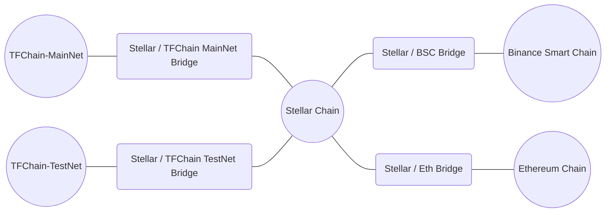

<h1> TFT Bridges </h1>

<h2> Table of Contents </h2>

- [BSC-Stellar Bridge](./bsc_stellar_bridge.html)
- [TFChain-Stellar Bridge](./tfchain_stellar_bridge.html)
- [Ethereum-Stellar Bridge](../../../getstarted/TF_Token/tft_ethereum/tft_ethereum.html)

***

There are different bridges and ways to transfer TFT from one chain to another.

The current bridges for TFT are the following:

* [Stellar <-> Eth](https://bridge.eth.threefold.io/)
* [Stellar <-> BSC](https://bridge.bsc.threefold.io/)
* Stellar <-> TFChain Main Net
* Stellar <-> TFChain Test Net

***

Here are the main ways to navigate between chains supporting the ThreeFold Token.

Click on a given bridge to access the necessary steps.

***

To use the Stellar/TFChain bridges, you can read [this guide](https://www2.manual.grid.tf/getstarted/TF_Dashboard/TF_Dashboard.html?highlight=transfer%20tfchain#transfer-tft-from-stellar-chain-to-tfchain).

* TFChain Main Net is accessible with the Main Net Dashboard: [https://dashboard.grid.tf/](https://dashboard.grid.tf/). 
* TFChain Test Net is accessible with the Test Net Dashboard: [https://dashboard.test.grid.tf/](https://dashboard.test.grid.tf/).

***

The different bridges help you move your TFT and achieve different goals:

* The BSC-Stellar Bridge is used to go between the Stellar Chain and Binance Smart Chain (BSC).
* The TFChain-Stellar Bridge is used to go between the Stellar Chain and TF Chain.
* The Stellar-Ethereum Bridge is used to go between the Stellar Chain and the Ethereum blockchain.
  
To go from BSC to TF Chain, or from TF Chain to BSC, you need to use first the BSC-Stellar bridge, then the Stellar-TFChain bridge.

To go from the Ethereum blockchain to TFChain, you need to use the Ethereum-Stellar bridge then the Stellar-TFChain bridge.

BSC, Stellar and Ethereum can be used to sell/buy TFT, while TF Chain can be used to deploy Dapps on the [ThreeFold Playground](https://play.grid.tf).

> Note: You should always start with a small amount the first time you try a bridge.