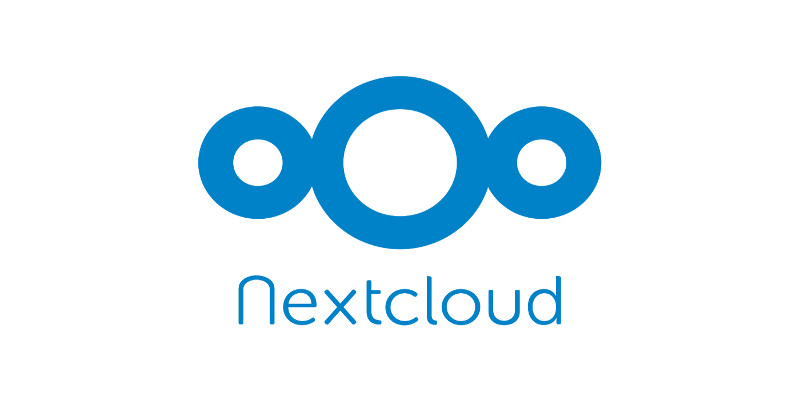

<h1> FList Case Study: Nextcloud All-in-One </h1>



<h2> Table of Contents </h2>

- [Introduction](#introduction)
  - [FList: What is It?](#flist-what-is-it)
  - [Case Study Objective](#case-study-objective)
  - [The Overall Process](#the-overall-process)
- [Docker Image Creation](#docker-image-creation)
  - [Nextcloud FList Directory Tree](#nextcloud-flist-directory-tree)
  - [Caddyfile](#caddyfile)
  - [Dockerfile](#dockerfile)
  - [README.md File](#readmemd-file)
  - [scripts Folder](#scripts-folder)
    - [caddy.sh](#caddysh)
    - [sshd\_init.sh](#sshd_initsh)
    - [ufw\_init.sh](#ufw_initsh)
    - [nextcloud.sh](#nextcloudsh)
    - [nextcloud\_conf.sh](#nextcloud_confsh)
  - [zinit Folder](#zinit-folder)
    - [ssh-init.yaml and sshd.yaml](#ssh-inityaml-and-sshdyaml)
    - [ufw-init.yaml and ufw.yaml](#ufw-inityaml-and-ufwyaml)
    - [dockerd.yaml](#dockerdyaml)
    - [nextcloud.yaml](#nextcloudyaml)
    - [nextcloud-conf.yaml](#nextcloud-confyaml)
  - [Putting it All Together](#putting-it-all-together)
- [Docker Publishing Steps](#docker-publishing-steps)
  - [Create Account and Access Token](#create-account-and-access-token)
  - [Build and Push the Docker Image](#build-and-push-the-docker-image)
- [Convert the Docker Image to an FList](#convert-the-docker-image-to-an-flist)
- [Deploy Nextcloud AIO on the TFGrid with Terraform](#deploy-nextcloud-aio-on-the-tfgrid-with-terraform)
  - [Create the Terraform Files](#create-the-terraform-files)
  - [Deploy Nextcloud with Terraform](#deploy-nextcloud-with-terraform)
  - [Nextcloud Setup](#nextcloud-setup)
- [Conclusion](#conclusion)

***

# Introduction

In this case study, we explain how to create a new FList on the ThreeFold Ecosystem. We will show the process of creating a Nextcloud All-in-One FList and we will deploy a micro VM on the ThreeFold Playground to access our Nextcloud instance. As a reference, the official Nextcloud FList is available [here](https://hub.grid.tf/tf-official-apps/threefoldtech-nextcloudaio-latest.flist.md).

To achieve all this, we will need to create a Docker Hub account, create a Dockerfile and its associated files, a docker image and a docker container, then convert the docker image to a Zero-OS FList. After all this, we will be deploying our Nextcloud instance on the ThreeFold Playground.

As a general advice, before creating an FList for a ThreeFold deployment, you should make sure that you are able to deploy your workload properly by using a micro VM or a full VM on the TFGrid. Once you know all the steps to deploy your workload, and after some thorough tests, you can take what you've learned and incorporate all this into an FList.

## FList: What is It?

Before we go any further, let us recall what is an FList. In short, an FList is a very effective way to deal with software data and the end result is fast deployment and high reliability.

In an FList, we separate the metadata from the data. The metadata is a description of what files are in that particular image. It's thus the data providing information about the app/software. Thanks to FList, the 3Node doesn't need to install a complete software program in order to run properly. Only the necessary files are installed. Zero-OS can read the metadata of a container and only download and execute the necessary binaries and applications to run the workload when necessary.

One amazing thing about the FList technology is that it is possible to convert any Docker image into an FList, thanks to the [ThreeFold Docker Hub Converter tool](https://hub.grid.tf/docker-convert). It is very easy to do and we will show you how to proceed in this case study. For a quick guide on converting Docker images into FLists, read [this section](../flist_hub/convert_docker_image.md) of the ThreeFold Manual.

## Case Study Objective

The goal of this case study is to give you enough information and tools so that you can build your own FList projects and deploy on the ThreeFold Grid.

We will explore the different files needed to create the FList and explain the overall process. Instead of starting from scratch, we will analyze the Nextcloud FList directory in the [tf-images](https://github.com/threefoldtech/tf-images/tree/development/tfgrid3/nextcloud) ThreeFold Tech repository. As the project is already done, it will be easier to get an overview of the process. Once you know the different components needed to create an FList, it will be easier for your to create your own.

## The Overall Process

To give you a bird's-eye view of the whole project, here are the main steps:

* Create the Docker image
* Push the Docker image to the Docker Hub
* Convert the Docker image to a Zero-OS FList
* Deploy a micro VM with the FList on the ThreeFold Playground with Terraform

One important thing to have in mind is that, when we create an FList, what we are doing is basically automating the required steps to deploy a given workload on the TFGrid. Usually, these steps would be done manually and step-by-step by an individual deploying on a micro or a full VM.

Once we've successfully created an FList, we thus have a very quick way to deploy a specific workload while always obtaining the same result. This is why it is highly recommended to test a given deployment on a full or micro VM before building an FList. 

For example, in the case of building a Nextcloud All-in-One FList, the prerequisites would be to successfully deploy a Nextcloud AIO instance on a full VM by executing each step sequentially. This specific example is documented in the Terraform section [Nextcloud All-in-One Guide](../../terraform/advanced/terraform_nextcloud_aio.md) of the System Administrators book.

In our case, the FList we will be using has some specific configurations depending on the way we deploy Nextcloud (e.g. using or not the gateway and a custom domain). The Terraform **main.tf** we will be sharing later on will thus take all this into account for a smooth deployment.

# Docker Image Creation

As we've said previously, we will explore the different components of the existing Nextcloud FList directory. We thus want to check the existing codes and try to understand as much as possible how the different components work together. This is also a very good introduction to the ThreeFold ecosystem.

We will be using the codes available on the [ThreeFold Tech Github page](https://github.com/threefoldtech). In our case, we want to explore the repository [tf-images](https://github.com/threefoldtech/tf-images).

If you go in the subsection [tfgrid3](https://github.com/threefoldtech/tf-images/tree/development/tfgrid3), you can see many different FLists available. In our case, we want to deploy the [Nextcloud All-in-One Flist](https://github.com/threefoldtech/tf-images/tree/development/tfgrid3/nextcloud). 

## Nextcloud FList Directory Tree

The Nextcloud FList directory tree is the following:

```
.
├── Caddyfile
├── Dockerfile
├── README.md
├── scripts
│   ├── caddy.sh
│   ├── nextcloud_conf.sh
│   ├── nextcloud.sh
│   ├── sshd_init.sh
│   └── ufw_init.sh
└── zinit
    ├── dockerd.yaml
    ├── nextcloud-conf.yaml
    ├── nextcloud.yaml
    ├── sshd.yaml
    ├── ssh-init.yaml
    ├── ufw-init.yaml
    └── ufw.yaml
```

We can see that the directory is composed of a Caddyfile, a Dockerfile, a README.md and two directories, **scripts** and **zinit**. We will now explore each of those components to have a good grasp of the whole repository and to understand how it all works together.

To get a big picture of this directory, we could say that the **README.md** file provides the necessary documentation for the users to understand the Nextcloud FList, how it is built and how it works, the **Caddyfile** provides the necessary requirements to run the reverse proxy, the **Dockerfile** provides the necessary requirements for the Docker image to be built, installing things such as [openssh](https://www.openssh.com/) and the [ufw firewall](https://wiki.ubuntu.com/UncomplicatedFirewall) for secure remote connection, while the two folders, **scripts** and **zinit**, could be said to work hand-in-hand. While commands can be executed in the .yaml files contained within the zinit folder, these files also serve as a way to organize the scripts. As we will see later on, zinit coupled with the `.yaml` files provides ordered steps for the scripts (i.e. the files with the extension `.sh`) to be executed. This ensures that the Nextcloud deployment gets built systematically in the proper order.

## Caddyfile

For our Nextcloud deployment, we will be using Caddy as a reverse proxy. We note that a reverse proxy is an application that sits in front of back-end applications and forwards client requests to those applications.

File: `Caddyfile`
```
{
	order replace after encode
	servers {
		trusted_proxies static 100.64.0.0/10 10.0.0.0/8
	}
}


{$DOMAIN}:{$PORT} {
	handle_path /aio* {
		replace {
			href="/ href="/aio/
			src="/ src="/aio/
			action=" action="/aio
			url(' url('/aio
			`value="" placeholder="nextcloud.yourdomain.com"` `value="{$DOMAIN}"`
			`"Submit domain"` `"Submit domain" id="domain-submit"` 
			{$REPLACEMENTS}
			<body> {$BODY}
		}

		reverse_proxy localhost:8000 {
			header_down Location "^/(.*)$" "/aio/$1"
			header_down Refresh "^/(.*)$" "/aio/$1"
		}
			
	}

	redir /api/auth/getlogin /aio{uri}

	reverse_proxy localhost:11000

	handle_errors {
		@502-aio expression {err.status_code} == 502 && path('/aio*')
		handle @502-aio {
			header Content-Type text/html
			respond <<HTML
				<html>
				  <head><title>Nextcloud</title></head>
				  <body>Your Nextcloud management interface isn't ready. If you just deployed this instance, please wait a minute and refresh the page.</body>
				</html>
				HTML 200
		}

		@502 expression {err.status_code} == 502
		handle @502 {
			redir /* /aio
		}
	}
}
```

We can see in the first section (`trusted_proxies static`) that we set a range of static IP addresses as trusted proxy addresses.

In the section section, starting with `{$DOMAIN}:{$PORT}`, we provide the different rules to deal with different URLs that will be used during our deployment. We thus proceed with some replacement rules such as replace the end of the URL, **/**, by **/aio/**.

Afterward, with the line `redir /api/auth/getlogin /aio{uri`, we redirect `/api/auth/getlogi` to `/air{uri}`. We also set the port 11000 for the reverse proxy.

The section starting with `handle_errors` ensures that the user will receive an understandble error message when logging into the Nextcloud deployment before it is properly configured.

## Dockerfile

We recall that to make a Docker image, you need to create a Dockerfile. As per the [Docker documentation](https://docs.docker.com/engine/reference/builder/), a Dockerfile is "a text document that contains all the commands a user could call on the command line to assemble an image". 

File: `Dockerfile`

```Dockerfile
FROM ubuntu:22.04

RUN apt update && \
  apt -y install wget openssh-server curl sudo ufw inotify-tools iproute2

RUN wget -O /sbin/zinit https://github.com/threefoldtech/zinit/releases/download/v0.2.5/zinit && \
  chmod +x /sbin/zinit

RUN wget -O /sbin/caddy 'https://caddyserver.com/api/download?os=linux&arch=amd64&p=github.com%2Fcaddyserver%2Freplace-response&idempotency=43631173212363' && \
  chmod +x /sbin/caddy

RUN curl -fsSL https://get.docker.com -o /usr/local/bin/install-docker.sh && \
  chmod +x /usr/local/bin/install-docker.sh

RUN sh /usr/local/bin/install-docker.sh

COPY ./Caddyfile /etc/caddy/
COPY ./scripts/ /scripts/
COPY ./zinit/ /etc/zinit/
RUN chmod +x /sbin/zinit && chmod +x /scripts/*.sh

ENTRYPOINT ["/sbin/zinit", "init"]
```

We can see from the first line that this Dockerfile uses the Linux distribution Ubuntu 22.04. 

With the first **RUN** command, we update and upgrade the system, and we also install **openssh**, **ufw** and other dependencies for our Nextcloud uses. Note that we also install **curl** so that we can quickly install **Docker**.

With the second **RUN** command, we install **zinit** and we give it execution permission with the command `chmod +x`. In a nutshell, zinit is a process manager (pid 1) that knows how to launch, monitor and sort dependencies. It thus executes targets in the proper order. For more information on zinit, check the [zinit repository](https://github.com/threefoldtech/zinit). Reading the rest of the case study will also help you to understand how zinit works.

With the third **RUN** command, we install **caddy** and we give it execution permission with the command `chmod +x`. Caddy is an extensible, cross-platform, open-source web server written in Go. For more information on Caddy, check the [Caddy website](https://caddyserver.com/).

With fourth **RUN** command, we download and give proper permissions to the script `install-docker.sh`. On a terminal, the common line to install Docker would be `curl -fsSL https://get.docker.com | sudo sh`. To understand really what's going here, we can simply go to the link provided in the line [https://get.docker.com](https://get.docker.com) for more information. 

The fifth **RUN** command runs the `install-docker.sh` script to properly install Docker within the image.

Once those commands are run, we proceed to copy to our Docker image the necessary folders `scripts` and `zinit` as well as the Caddyfile. Once this is done, we want to give execution permissions to the folders by running the **RUN** command with `chmod +x`.

Finally, we set an entrypoint in our Dockerfile. As per the [Docker documentation](https://docs.docker.com/engine/reference/builder/), an entrypoint "allows you to configure a container that will run as an executable". Since we are using zinit, we set the entrypoint `/sbin/zinit`.

## README.md File

The **README.md** file has the main goal of explaining clearly to the user the functioning of the Nextcloud directory and its associated FList. In this file, we can explain what our code is doing and offer steps to properly configure the whole deployment.

We also give the necessary steps to create the Docker image and convert it into an FList starting directly with the Nextcloud directory. This can be useful for users that want to create their own FList, instead of using the [official ThreeFold Nextcloud FList](https://hub.grid.tf/tf-official-apps/threefoldtech-nextcloudaio-latest.flist.md).

To read the complete README.md file, go to [this link](https://github.com/threefoldtech/tf-images/blob/development/tfgrid3/nextcloud/README.md).

## scripts Folder

The **scripts** folder contains without surprise the scripts necessary to run the Nextcloud instance. 

In the Nextcloud Flist case, there are five scripts: 

* **caddy.sh**
* **nextcloud.sh**
* **nextcloud_conf.sh**
* **sshd_init.sh**
* **ufw_init.sh**

Let's take a look at each of them.

### caddy.sh

File: `caddy.sh`

```bash
#!/bin/bash
export DOMAIN=$NEXTCLOUD_DOMAIN

if $IPV4 && ! $GATEWAY; then
  export PORT=443
else
  export PORT=80
fi

if $IPV4; then
  export BODY="\`<body onload=\"if (document.getElementById('domain-submit')) {document.getElementById('domain-submit').click()}\">\`"

else
  export BODY="\`<body onload=\"if (document.getElementById('domain-submit')) {document.getElementById('domain-submit').click()}; if (document.getElementById('talk') && document.getElementById('talk').checked) {document.getElementById('talk').checked = false; document.getElementById('options-form-submit').click()}\">\`"

  export REPLACEMENTS='			`name="talk"` `name="talk" disabled`
			`needs ports 3478/TCP and 3478/UDP open/forwarded in your firewall/router` `running the Talk container requires a public IP and this VM does not have one. It is still possible to use Talk in a limited capacity. Please consult the documentation for details`'
fi

caddy run --config /etc/caddy/Caddyfile
```

The script **caddy.sh** sets the proper port depending on the network configuration (e.g. IPv4 or Gateway) in the first if/else section. In the second if/else section, the script also makes sure that the proper domain is given to Nextcloud All-in-One. This quickens the installation process as the user doesn't have to set the domain in Nextcloud AIo after deployment.

### sshd_init.sh

File: `sshd_init.sh`

```bash
#!/bin/bash

mkdir -p ~/.ssh
mkdir -p /var/run/sshd
chmod 600 ~/.ssh
chmod 600 /etc/ssh/*
echo $SSH_KEY >> ~/.ssh/authorized_keys
```

The first two symbols (`#!`) on the first line are often called shebang. When the file is used as an executable in a Unix-like system (sometimes referred to UN*X or nix), the loader, the part of the OS that is responsible for loading programs and libraries, will then parse the rest of the file's initial line as an interpreter directive. In our case, the first line `#!/bin/bash` will thus make sure that the file is executed using the [Bash shell](https://www.gnu.org/software/bash/).

The goal of this script is to add the public key within the VM in order for the user to get a secure and remote connection to the VM. The two lines starting with `mkdir` create the necessary folders. The lines starting with `chmod` give the owner the permission to write and read the content within the folders. Finally, the line `echo` will write the public SSH key in a file within the VM. In our case, the SSH key is set in the Playground profile manager and passed as a variable when we deploy a micro VM running the Nextcloud FList.

### ufw_init.sh

File: `ufw_init.sh`

```bash
#!/bin/bash

ufw default deny incoming
ufw default allow outgoing
ufw allow ssh
ufw allow http
ufw allow https
ufw allow 8443
ufw allow 3478
ufw limit ssh
```

The script `ufw_init.sh` goal is to set the correct firewall parameters to make sure that our deployment is secure while also providing the necessary access for the Nextcloud users. 

The first two lines starting with `ufw default` are self-explanatory. We want to restrain incoming traffic while making sure that outgoing traffic has no restraints.

The lines starting with `ufw allow` open the ports necessary for our Nextcloud instance. We note that **ssh** is port 22, **http** is port 80 and **https** is port 443. This means, for example, that the line `ufw allow 22` is equivalent to the line `ufw allow ssh`. The port 8443 is the default port that [Tomcat](https://tomcat.apache.org/) uses to open the SSL text service. In the case of the Nextcloud instance, it is used to access the Nextcloud interface through HTTPS secure connection. More on this will be said later. Finally, the port 3478 is used for Nextcloud Talk.

We also note that there are two protocols, **tcp** and **udp**. When none of the protocols are specified, it allows both protocols to access the ports. For example, if we only wanted to allow the protocol tcp with port 22 (ssh), we would write `ufw allow ssh/tcp`. To allow both protocols, we write `ufw allow ssh`.

The line `ufw limit ssh` will provide additional security by denying connection from IP addresses that attempt to initiate 6 or more connections within a 30-second period.

### nextcloud.sh

File: `nextcloud.sh`

```bash
#!/bin/bash

export COMPOSE_HTTP_TIMEOUT=800
while ! docker info > /dev/null 2>&1; do
    echo docker not ready
    sleep 2
done

docker run \
--init \
--sig-proxy=false \
--name nextcloud-aio-mastercontainer \
--restart always \
--publish 8000:8000 \
--publish 8080:8080 \
--env APACHE_PORT=11000 \
--env APACHE_IP_BINDING=0.0.0.0 \
--env SKIP_DOMAIN_VALIDATION=true \
--volume nextcloud_aio_mastercontainer:/mnt/docker-aio-config \
--volume /var/run/docker.sock:/var/run/docker.sock:ro \
nextcloud/all-in-one:latest
```

The **nextcloud.sh** script is where the real action starts. This is where we run the Nextcloud All-in-One docker image.

Before discussing the main part of this script, we note that the `while` loop is used to ensure that the `docker run` command starts only after the Docker daemon has properly started.

The code section starting with `docker run` is taken from the [Nextcloud All-in-One repository on Github](https://github.com/nextcloud/all-in-one) with some slight modifications. The last line indicates that the Docker image being pulled will always be the latest version of Nextcloud All-in-One.

We note here that Nextcloud AIO is published on the port 8000 and 8080. We also note that we set restart to **always**. This is very important as it will make sure that the Nextcloud instance is restarted if the Docker daemon reboots. We take the opportunity to note that, on a Linux system, the Docker daemon restarts automatically after a reboot. Thus, this latter fact combined with the line `--restart always` ensures that the user that the Nextcloud instance will restart after a VM reboot.

We also set **11000** as the Apache port with an IP binding of **0.0.0.0**. For our deployment, we want to skip the domain validation, thus it is set to **true**.

Finally, we note that this docker run command is specifically written for a container on Linux, hence the line `--sig-proxy=false`.

For more information on this, we invite the readers to consult the [Nextcloud documentation](https://github.com/nextcloud/all-in-one#how-to-use-this).

### nextcloud_conf.sh

File: `nextcloud_conf.sh`

```bash
#!/bin/bash

# Wait for the nextcloud container to become healthy. Note that we can set the
# richtext config parameters even before the app is installed

nc_ready () {
  until [[ "`docker inspect -f {{.State.Health.Status}} nextcloud-aio-nextcloud 2> /dev/null`" == "healthy" ]]; do
      sleep 1;
  done;
}

# When a gateway is used, AIO sets the WOPI allow list to only include the
# gateway IP. Since requests don't originate from the gateway IP, they are 
# blocked by default. Here we add the public IP of the VM, or of the router 
# upstream of the node
# See: github.com/nextcloud/security-advisories/security/advisories/GHSA-24x8-h6m2-9jf2

if $IPV4; then
  interface=$(ip route show default | cut -d " " -f 5)
  ipv4_address=$(ip a show $interface | grep -Po 'inet \K[\d.]+')
fi

if $GATEWAY; then
  nc_ready
  wopi_list=$(docker exec --user www-data nextcloud-aio-nextcloud php occ config:app:get richdocuments wopi_allowlist)

  if $IPV4; then
    ip=$ipv4_address
  else
    ip=$(curl -fs https://ipinfo.io/ip)
  fi

  if [[ $ip ]] && ! echo $wopi_list | grep -q $ip; then
    docker exec --user www-data nextcloud-aio-nextcloud php occ config:app:set richdocuments wopi_allowlist --value=$ip
  fi
fi


# If the VM has a gateway and a public IPv4, then AIO will set the STUN/TURN 
# servers to the gateway domain which does not point to the public IP, so we  
# use the IP instead. In this case, we must wait for the Talk app to be
# installed before changing the settings. With inotifywait, we don't need
# a busy loop that could run indefinitely

apps_dir=/mnt/data/docker/volumes/nextcloud_aio_nextcloud/_data/custom_apps/

if $GATEWAY && $IPV4; then
  if [[ ! -d ${apps_dir}spreed ]]; then
    inotifywait -qq -e create --include spreed $apps_dir
  fi
  nc_ready
  
  turn_list=$(docker exec --user www-data nextcloud-aio-nextcloud php occ talk:turn:list)
  turn_secret=$(echo "$turn_list" | grep secret | cut -d " " -f 4)
  turn_server=$(echo "$turn_list" | grep server | cut -d " " -f 4)
  
  if ! echo $turn_server | grep -q $ipv4_address; then
    docker exec --user www-data nextcloud-aio-nextcloud php occ talk:turn:delete turn $turn_server udp,tcp
    docker exec --user www-data nextcloud-aio-nextcloud php occ talk:turn:add turn $ipv4_address:3478 udp,tcp --secret=$turn_secret
  fi
  
  stun_list=$(docker exec --user www-data nextcloud-aio-nextcloud php occ talk:stun:list)
  stun_server=$(echo $stun_list | cut -d " " -f 2)
  
  if ! echo $stun_server | grep -q $ipv4_address; then
    docker exec --user www-data nextcloud-aio-nextcloud php occ talk:stun:add $ipv4_address:3478
    docker exec --user www-data nextcloud-aio-nextcloud php occ talk:stun:delete $stun_server
  fi
fi
```

The script **nextcloud_conf.sh** ensures that the network settings are properly configured. In the first section, we use a function called **nc_ready ()**. This function will makes sure that the rest of the script only starts when the Nextcloud container is healthy. 

We note that the comments present in this script explain very well what is happening. In short, we want to set the Nextcloud instance according to the user's choice of network. For example, the user can decide to deploy using a ThreeFold gateway or a standard IPv4 connection. If the VM has a gateway and a public IPv4, then Nextcloud All-in-One will set the STUN/TURN servers to the gateway domain which does not point to the public IP, so we use the IP instead.

## zinit Folder

Next, we want to take a look at the zinit folder. 

But first, what is zinit? In a nutshell, zinit is a process manager (pid 1) that knows how to launch, monitor and sort dependencies. It thus executes targets in the proper order. For more information on zinit, check the [zinit repository](https://github.com/threefoldtech/zinit). 

When we start the Docker container, the files in the folder zinit will be executed. Those zinit files will run commands that will either execute direct commands and also execute some of the scripts we've seen in the previous sections.

In the Nextcloud Flist case, there are seven **.yaml** files: 

* **dockerd.yaml**
* **nextcloud-conf.yaml**
* **nextcloud.yaml**
* **ssh-init.sh**
* **sshd.sh**
* **ufw-init.sh**
* **ufw.sh**

### ssh-init.yaml and sshd.yaml

We start by taking a look at the **ssh-init.yaml** and **sshd.yaml** files. 

File: `ssh-init.yaml`

```yaml
exec: /scripts/sshd_init.sh
oneshot: true
```

In this zinit service file, we define a service named `ssh-init.yaml`, where we tell zinit to execute the following command: `exec: /scripts/sshd_init.sh`.  This command thus runs the script `sshd_init.sh` we covered in a previous section. 

We also note that `oneshot` is set to `true` and this means that it should only be executed once. This command is often used with zinit files and it comes up frequently in the Nextcloud FList directory.

Now, we take a look at the file `sshd.yaml`:

File: `sshd.yaml`

```yaml
exec: bash -c "/usr/sbin/sshd -D"
after:
  - ssh-init
```

We can see that this file executes a line from the Bash shell. It is important to note that, with zinit and .yaml files, you can easily order the executions of the files by setting lines such as the following: `after: - ssh-init`. In this case, it means that the file `sshd.yaml` will only be executed after the file `ssh-init.yaml` is executed.

### ufw-init.yaml and ufw.yaml

Let's take a look at the files **ufw-init.yaml** and **ufw.yaml**.

File: `ufw-init.yaml`

```yaml
exec: /scripts/ufw_init.sh
oneshot: true
```

The file `ufw-init.yaml` is very similar to the previous file `ssh-unit.yaml`. In this case, this file is ran only once and it runs the script `ufw_unit.sh`. 

File: `ufw.yaml`

```yaml
exec: ufw --force enable
oneshot: true
after:
  - ufw-init
```

We can see that the file `ufw.yaml` will only run once and only after the file `ufw-init.yaml` has been run. This is important since the file `ufw-unit.yaml` executes the script `unit_init.sh`. We recall this script allows different ports in the firewall. Once those ports are defined, we can then run the command `ufw --force enable`. This will start the ufw firewall.

### dockerd.yaml

We now take a look at the file **dockerd.yaml**.

File: `dockerd.yaml`

```yaml
exec: /usr/bin/dockerd --data-root /mnt/data/docker
```

This file will run the [dockerd daemon](https://docs.docker.com/engine/reference/commandline/dockerd/) which is the persistent process that manages containers. We also note that it sets the data to be stored in the directory **/mnt/data/docker**.

### nextcloud.yaml

File: `nextcloud.yaml`

```yaml
exec: /scripts/nextcloud.sh
after:
  - dockerd
```

The file `nextcloud.yaml` runs after dockerd.

This file will execute the `nextcloud.sh` script we saw earlier. We recall that this script starts the Nextcloud All-in-One image.

### nextcloud-conf.yaml

File: `nextcloud-conf.yaml`

```yaml
exec: /scripts/nextcloud_conf.sh
oneshot: true
after:
    - nextcloud
```

Finally, the file `nextcloud-conf.yaml` runs after `nextcloud.yaml`.

This file will execute the `nextcloud-conf.sh` script we saw earlier. We recall that this script starts the Nextcloud All-in-One image. At this point, the deployment is complete.

## Putting it All Together

We've now went through all the files available in the Nextcloud FList directory. You should now have a proper understanding of the interplay between the zinit (.yaml) and the scripts (.sh) files as well as the basic steps to build a Dockerfile and to write clear documentation.

To build your own Nextcloud docker image, you would simply need to clone this directory to your local computer and to follow the steps presented in the next section [Docker Publishing Steps](#docker-publishing-steps).

To have a look at the complete directory, you can always refer to the [Nextcloud FList directory](https://github.com/threefoldtech/tf-images/tree/development/tfgrid3/nextcloud) on the ThreeFold tf-images repository.

# Docker Publishing Steps

In this section, we show the necessary steps to publish the Docker image to the Docker Hub. 

To do so, we need to create an account and an access token. Then we will build the Docker image and push it to the Docker Hub.

## Create Account and Access Token

To be able to push Docker images to the Docker Hub, you obviously need to create a Docker Hub account! This is very easy and note that there are many great tutorials online about Docker.

Here are the steps to create an account and an access token:

* Go to the [Docker Hub](https://hub.docker.com/)
* Click `Register` and follow the steps given by Docker
* On the top right corner, click on your account name and select `Account Settings`
* On the left menu, click on `Security`
* Click on `New Access Token`
* Choose an Access Token description that you will easily identify then click `Generate`
  * Make sure to set the permissions `Read, Write, Delete`
* On your local computer, make sure that the Docker daemon is running
* Write the following in the command line to connect to the Docker hub:
  * Run `docker login -u <account_name>`
  * Set the password

You now have access to the Docker Hub from your local computer. We will then proceed to push the Docker image to the Docker Hub.

## Build and Push the Docker Image

* Make sure the Docker Daemon is running
* Build the docker container
  * Template:
    * ```
      docker build -t <docker_username>/<docker_repo_name> . 
      ```
  * Example:
    * ```
      docker build -t dockerhubuser/nextcloudaio . 
      ```
* Push the docker container to the [Docker Hub](https://hub.docker.com/)
  * Template:
    * ```
      docker push <your_username>/<docker_repo_name>
      ```
  * Example:
    * ```
      docker push dockerhubuser/nextcloudaio
      ```
* You should now see your docker image on the [Docker Hub](https://hub.docker.com/) when you go into the menu option `My Profile`.
  * Note that you can access this link quickly with the following template:
    * ```
      https://hub.docker.com/u/<account_name>
      ```

# Convert the Docker Image to an FList

We will now convert the Docker image into a Zero-OS FList.

* Go to the [ThreeFold Hub](https://hub.grid.tf/).
* Sign in with the ThreeFold Connect app.
* Go to the [Docker Hub Converter](https://hub.grid.tf/docker-convert) section.
* Next to `Docker Image Name`, add the docker image repository and name, see the example below:
  * Template:
    * `<docker_username>/docker_image_name:tagname`
  * Example:
    * `dockerhubuser/nextcloudaio:latest`
* Click `Convert the docker image`.
* Once the conversion is done, the FList is available as a public link on the ThreeFold Hub.
* To get the FList URL, go to the [TF Hub main page](https://hub.grid.tf/), scroll down to your 3Bot ID and click on it.
* Under `Name`, you will see all your available FLists.
* Right-click on the FList you want and select `Copy Clean Link`. This URL will be used when deploying on the ThreeFold Playground. We show below the template and an example of what the FList URL looks like.
  * Template:
    * ```
      https://hub.grid.tf/<3BOT_name.3bot>/<docker_username>-<docker_image_name>-<tagname>.flist
      ```
  * Example:
    * ```
      https://hub.grid.tf/tf-official-apps/threefoldtech-nextcloudaio-latest.flist
      ```

# Deploy Nextcloud AIO on the TFGrid with Terraform

We now proceed to deploy a Nextcloud All-in-One instance by using the Nextcloud FList we've just created.

To do so, we will deploy a micro VM with the Nextcloud FList on the TFGrid using Terraform.

## Create the Terraform Files

For this guide, we use two files to deploy with Terraform. The first file contains the environment variables and the second file contains the parameters to deploy our workloads.

To facilitate the deployment, only the environment variables file needs to be adjusted. The **main.tf** file contains the environment variables (e.g. **var.size** for the disk size) and thus you do not need to change this file. Of course, you can adjust the deployment based on your preferences. That being said, it should be easy to deploy the Terraform deployment with the main.tf as is.

For this example, we will be deployment with a ThreeFold gateway as well as a gateway domain.

* Copy the following content and save the file under the name `credentials.auto.tfvars`:

```
mnemonics = "..."
network = "main"
SSH_KEY = "..."

size = "50"
cpu = "2"
memory = "4096"

gateway_id = "50"
vm1_id = "5453"

deployment_name = "nextcloudgateway"
nextcloud_flist = "https://hub.grid.tf/tf-official-apps/threefoldtech-nextcloudaio-latest.flist"
```

Make sure to add your own seed phrase and SSH public key. Simply replace the three dots by the content. Note that you can deploy on a different node than node 5453 for the **vm1** node. If you want to deploy on another node than node 5453 for the **gateway** node, make sure that you choose a gateway node. To find a gateway node, go on the [ThreeFold Dashboard](https://dashboard.grid.tf/) Nodes section of the Explorer and select **Gateways (Only)**.

Obviously, you can decide to increase or modify the quantity in the variables `size`, `cpu` and `memory`. 

Note that in our case, we set the FList to be the official Nextcloud FList. Simply replace the URL with your newly created Nextcloud FList to test it!

* Copy the following content and save the file under the name `main.tf`:

```
variable "mnemonics" {
  type = string
  default = "your mnemonics"
}

variable "network" {
  type = string
  default = "main"
}

variable "SSH_KEY" {
  type = string
  default = "your SSH pub key"
}

variable "deployment_name" {
  type = string
}

variable "size" {
  type = string
}

variable "cpu" {
  type = string
}

variable "memory" {
  type = string
}

variable "nextcloud_flist" {
  type = string
}

variable "gateway_id" {
  type = string
}

variable "vm1_id" {
  type = string
}


terraform {
  required_providers {
    grid = {
      source = "threefoldtech/grid"
    }
  }
}

provider "grid" {
    mnemonics = var.mnemonics
    network = var.network
}

data "grid_gateway_domain" "domain" {
  node = var.gateway_id
  name = var.deployment_name
}

resource "grid_network" "net" {
    nodes = [var.gateway_id, var.vm1_id]
    ip_range = "10.1.0.0/16"
    name = "network"
    description = "My network"
    add_wg_access = true
}

resource "grid_deployment" "d1" {
  node = var.vm1_id
  network_name = grid_network.net.name

  disks {
    name = "data"
    size = var.size
  }

  vms {
    name = "vm1"
    flist = var.nextcloud_flist
    cpu = var.cpu
    memory = var.memory
    rootfs_size = 15000
    entrypoint = "/sbin/zinit init"
    env_vars = {
      SSH_KEY = var.SSH_KEY
      GATEWAY = "true"
      IPV4 = "false"
      NEXTCLOUD_DOMAIN = data.grid_gateway_domain.domain.fqdn
    }
    mounts {
        disk_name = "data"
        mount_point = "/mnt/data"
    }
  }
}

resource "grid_name_proxy" "p1" {
  node            = var.gateway_id
  name            = data.grid_gateway_domain.domain.name
  backends        = [format("http://%s:80", grid_deployment.d1.vms[0].ip)]
  network         = grid_network.net.name
  tls_passthrough = false
}

output "wg_config" {
  value = grid_network.net.access_wg_config
}

output "vm1_ip" {
  value = grid_deployment.d1.vms[0].ip
}
output "vm1_ygg_ip" {
  value = grid_deployment.d1.vms[0].ygg_ip
}

output "fqdn" {
  value = data.grid_gateway_domain.domain.fqdn
}
```

## Deploy Nextcloud with Terraform

We now deploy Nextcloud with Terraform. Make sure that you are in the correct folder containing the main and variables files.

* Initialize Terraform:
  *  ```
     terraform init
     ```

* Apply Terraform to deploy Nextcloud:
  *  ```
     terraform apply
     ```

Note that, at any moment, if you want to see the information on your Terraform deployment, write the following:
  * ```
    terraform show
    ```

## Nextcloud Setup

Once you've deployed Nextcloud, you can access the Nextcloud setup page by pasting the URL displayed on the line `fqdn = "..."` of the Terraform output.

# Conclusion

In this case study, we've seen the overall process of creating a new FList to deploy a Nextcloud instance on a Micro VM on the TFGrid with Terraform.

If you have any questions or feedback, please let us know by either writing a post on the [ThreeFold Forum](https://forum.threefold.io/), or by chatting with us on the [TF Grid Tester Community](https://t.me/threefoldtesting) Telegram channel.