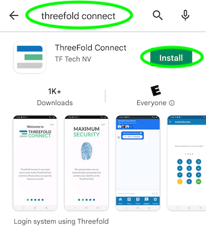
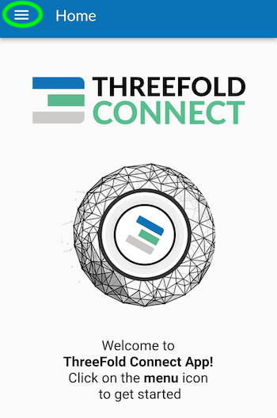
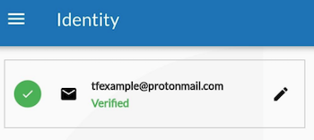
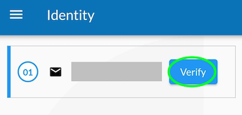
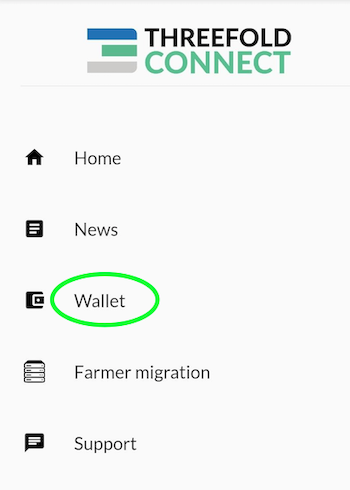
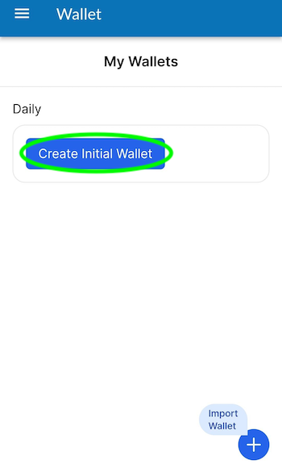
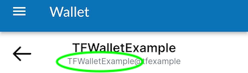

<h1>ThreeFold Connect: Create a Threefold Connect Account and Wallet</h1>

<h2>Table of Contents</h2>

- [Introduction](#introduction)
- [Download the ThreeFold Connect App](#download-the-threefold-connect-app)
- [Create a ThreeFold Connect Account](#create-a-threefold-connect-account)
- [Verify Your Email](#verify-your-email)
- [Create a ThreeFold Connect Wallet](#create-a-threefold-connect-wallet)

***

## Introduction

The ThreeFold Connect app emerges as a dynamic and essential companion for individuals seeking seamless access to the ThreeFold ecosystem on the go. Available for free download on both iOS and Android mobile platforms,  the TF Connect app ensures that users can effortlessly engage with the ThreeFold Grid, empowers users to manage their digital assets, engage in secure transactions, and explore decentralized financial opportunities, all within a unified mobile experience.

In this tutorial, we show you how to create a ThreeFold Connect account and wallet. The main steps are simple and you will be done in no time. If you have any questions, feel free to write a post on the [ThreeFold Forum](http://forum.threefold.io/).

## Download the ThreeFold Connect App

The ThreeFold Connect app is available for [Android](https://play.google.com/store/apps/details?id=org.jimber.threebotlogin&hl=en&gl=US) and [iOS](https://apps.apple.com/us/app/threefold-connect/id1459845885).

- Note that for Android phones, you need at minimum Android 8.1
- Note that for iOS phones, you need at minimum iOS 15

Either use the links above, or search for the ThreeFold Connect app on the App Store or the Google Play Store. Then install and open the app. If you want to leave a 5-star review of the app, no one here will stop you!

When you try to open the app, if you get an error message such as: "Error in initialization in Flagsmith...", you might need to upgrade your phone to a newer software version (Android 8.1 and iOS 15).

***

## Create a ThreeFold Connect Account

Once you are in the app, you will see some introduction pages to help you familiarize with the TF Connect app. You will also be asked to read and accept ThreeFold's Terms and Conditions.

You will then be asked to either *SIGN UP* or *RECOVER ACCOUNT*. To create a new account, click *SIGN UP*.

Then, choose a *ThreeFold Connect Id*. This 3bot ID will be used, as well as the seed phrase, when you want to recover an account. Choose wisely. And do not forget it! Here we will use TFExample, as an example.

Next, you need to add a valid email address. You will need to access your email and confirm the ThreeFold validation email to fully use the ThreeFold Connect app.

The next step is crucial! Make sure no one is around looking at your screen. You will be shown your seed phrase. Keep this in a secure and offline place. You will need the 3bot ID and the seed phrase to recover your account. This seed phrase is of utmost important. Do not lose it nor give it to anyone.

Once you've hit *Next*, you will be asked to write down 3 random words of your seed phrase. This is a necessary step to ensure you have taken the time to write down your seed phrase.

Then, you'll be asked to confirm your TF 3bot ID and the associated email.

Finally, you will be asked to choose a 4-digit pin. This will be needed to use the ThreeFold Connect app. If you ever forget this 4-digit pin, you will need to recover your account from your 3bot name and your seed phrase. You will need to confirm the new pin in the next step.

That's it! You've created your ThreeFold Connect account. You can press the hamburger menu on the top left to explore the ThreeFold Connect app.

In the next step, we will create a ThreeFold Connect wallet. You'll see, it's very simple!

But first, let's see how to verify your email.

***

## Verify Your Email

Once you've created your account, an email will be sent to the email address you've chosen in the account creation process. To verify your email, go on your email inbox and open the email sent by *info@openkyc.live* with the subject *Verify your email address*. 

In this email, click on the link *Verify my email address*. This will lead you to a *login.threefold.me* link. The process should be automatic. Once this is done, you will receive a confirmation on screen, as well as on your phone.

If, for some reason, you did not receive the verification email, simply click on *Verify* and another email will be sent.

That's it! You've now created a ThreeFold Connect account. 

All that is left to do is to create a ThreeFold Connect wallet. This is very simple. 

Let's go!

***

## Create a ThreeFold Connect Wallet

To create a wallet, click on the ThreeFold Connect app menu, then choose *Wallet*.

Once you are in the section *Wallet*, click on *Create Initial Wallet*. If it doesn't work the first time, retry some more. If you have trouble creating a wallet, make sure your connection is reliable. You can try a couple of minutes later if it still doesn't work. With a reliable connection, there shouldn't be any problem. Contact TF Support if problems persist.

This is what you see when the TF Grid is initializing your wallet.

Once your wallet is initialized, you will see *No balance found for this wallet*. You can click on this button to enter the wallet.

Once inside your wallet, this is what you see.

We will now see where the Stellar and the TFChain addresses and secrets are to be found. We will also change the wallet name. To do so, click on the *encircled i* at the bottom right of the screen.

On this page, you can access your Stellar and TFChain addresses as well as your Stellar and TFChain secret keys.

To change the name of your wallet, click on the button next to *Wallet Name*. Here we use TFWalletExample. Note that you can also use alphanumeric characters.

At the top of the section *Wallet*, we can see that the name has changed.

That's it! You now have a ThreeFold Connect account and wallet.
This will be very useful for your TFT transactions on the ThreeFold ecosystem.

***