<h1> Threefold Dashboard: Create Account and Transfer TFT </h1>

<h2> Table of Contents </h2>

- [Introduction](#introduction)
- [Create Polkadot Extension Account](#create-polkadot-extension-account)
- [Transfer TFT from Stellar Chain to TFChain](#transfer-tft-from-stellar-chain-to-tfchain)

## Introduction

For this section, we will create an account on the TFChain and transfer TFT from Stellar chain to TFChain. We will then be able to use the TFT and deploy workloads on the Threefold Playground.

## Create Polkadot Extension Account

Go to the Threefold Dashboard: [dashboard.grid.tf](https://dashboard.grid.tf/)

If you don't have the Polkadot extension installed on your browser, you will be able to click on the download link directly on the Threefold Dashboard page:

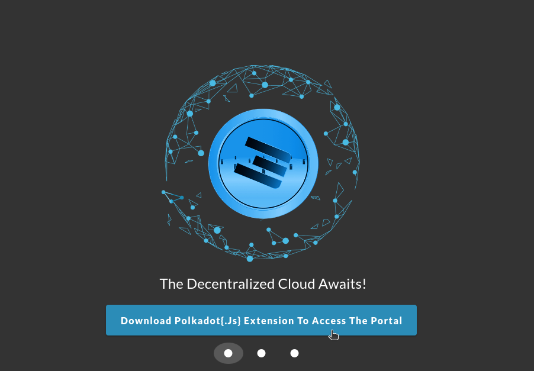

This link will lead you to the Polkadot extension download page: https://polkadot.js.org/extension/

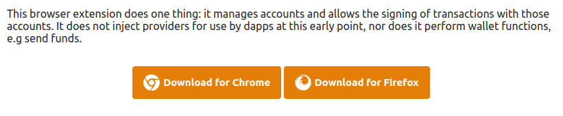

Then, simply click on "Add to Chrome".

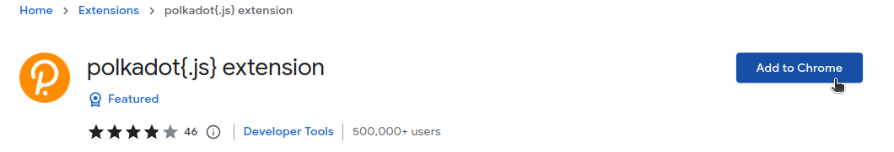

Then, confirm by clicking on "Add extension".

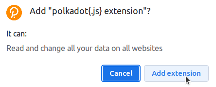

You can now access the extension by clicking on the browser's extension button on the top right of the screen, and by then clicking on *polkadot{.js} extension*:

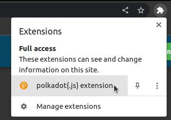

Make sure to carefully read the Polkadot message then click on **Understood, let me continue**:

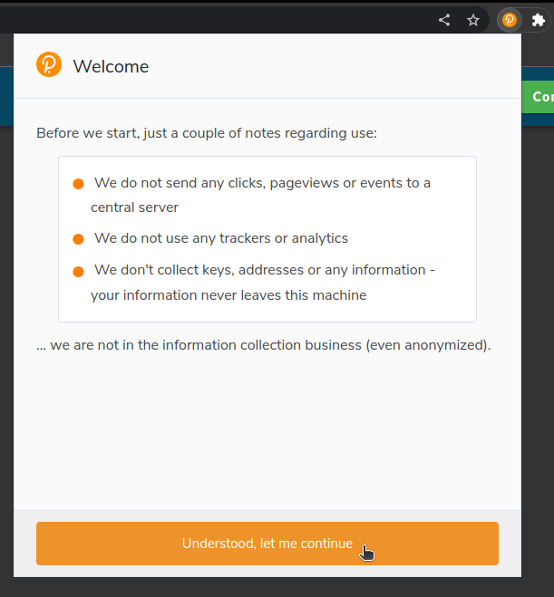

Then click on the **plus** symbol to create a new account:

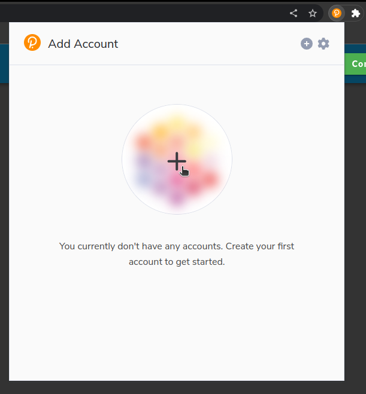

For this next step, you should be very careful. Your seed phrase is your only access to your account. Make sure to keep a copy somewhere safe and offline.

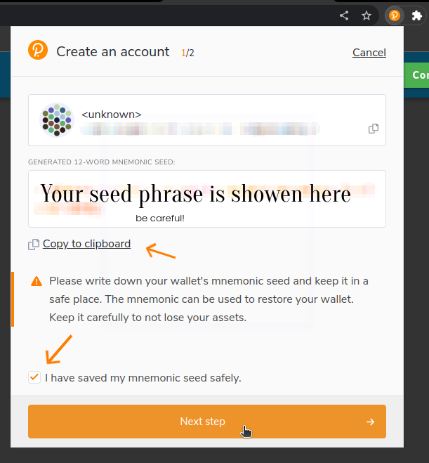

After, choose a name for your account and a password:

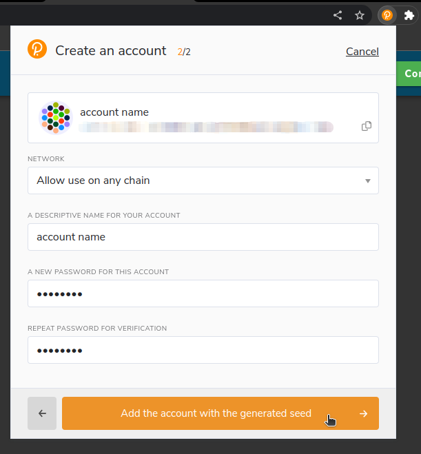

Your account is now created. You can see it when you open the Polkadot extension on your browser:

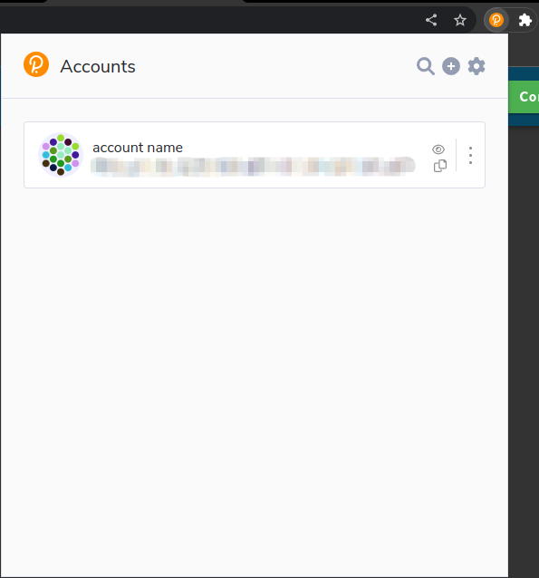

Now, when you go on the [Threefold Dashboard](https://dashboard.grid.tf/), you can click on the **Connect** button on the top right corner:

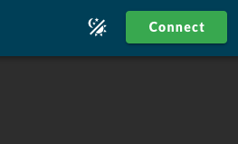

You will then need to grant the Threefold Dashboard access to your Polkadot account.

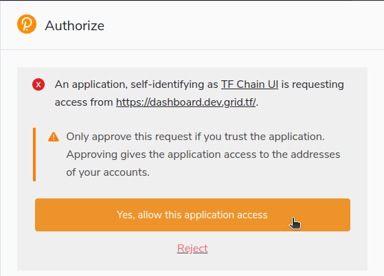

Then, simply click on your account name to access the Threefold Dashboard:

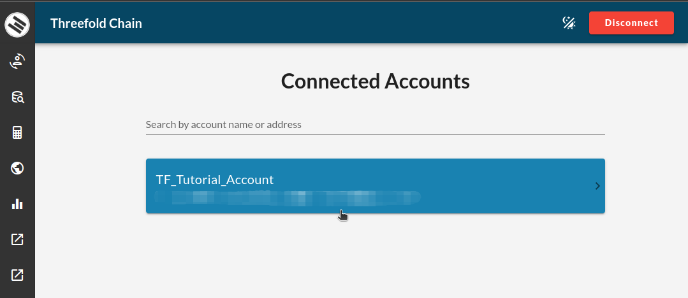

Read and accept the Terms and Conditions

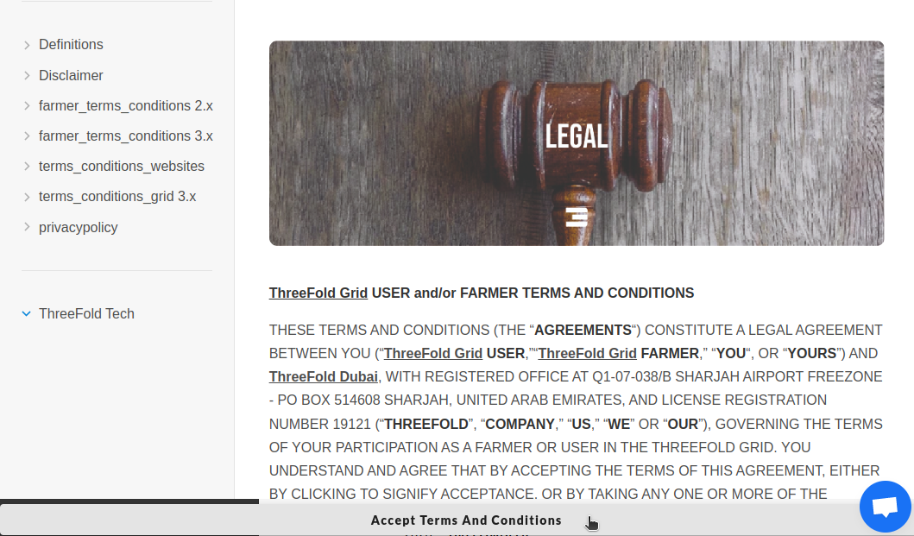

You will be asked to confirm the transaction, write your password and click on **Sign the transaction** to confirm.

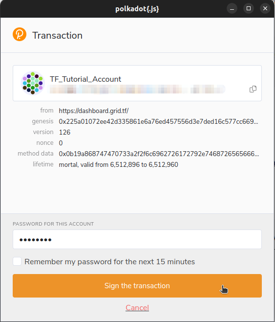

Once you open your account, you can choose  a relay for it then click on **Create**.

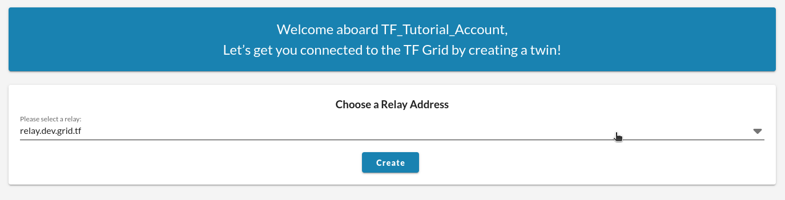

You will also be asked to confirm the transaction.

That's it! You've successfully created an account on the TFChain thanks to the Polkadot extension. You can now access the Threefold Dashboard.

On to the next section! Where we will transfer (or swap) TFT from the Stellar Chain on your Threefold Connect app wallet to the TFChain on the Threefold Dashboard.

You'll see, this is so easy thanks to the Threefold Dashboard configuration.

***

## Transfer TFT from Stellar Chain to TFChain

On the [Threefold Dashboard](https://dashboard.grid.tf/), click on the **Portal**, then click on **Swap**.

Make sure the chain **stellar** is selected. Then click **Deposit**, as we want to deposit TFT from the Stellar Chain to the TFChain.

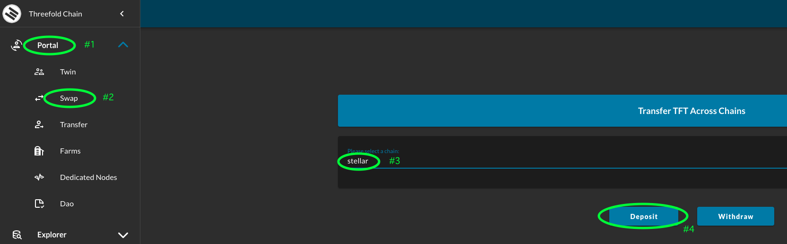

Next, you will scan the QR code shown on the screen with the Threefold Connect app.

> Note that you can also manually enter the Stellar Chain address and the Twin ID.

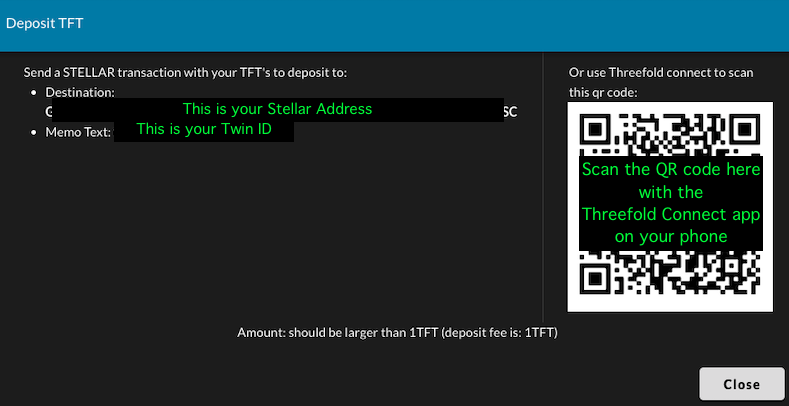

To scan the QR code on the Threefold Connec app, follow those steps:

Click on the menu button:

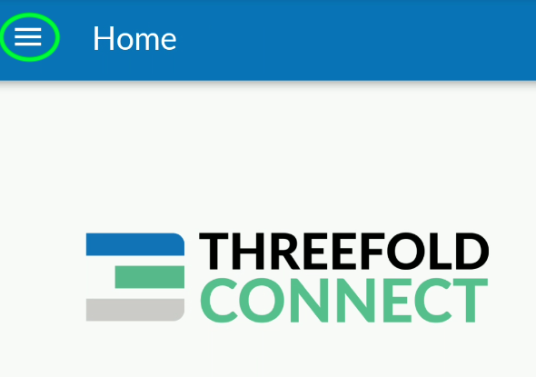

Click on **Wallet**:

Then, click on **Send Coins**:

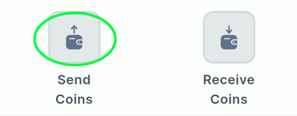

On the next page, select the **Stellar** chain, then click on **SCAN QR**:

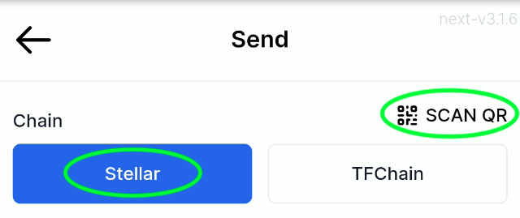

This will automatically write the correct address and twin ID.

You can now write the amount of TFT you wish to send, and then click **SEND**

> We recommend to try with a small amount of TFT first to make sure everything is OK.
>
> The transfer fees are of 1 TFT per transfer.

You will then simply need to confirm the transaction. It is a good opportunity to make sure everything is OK.

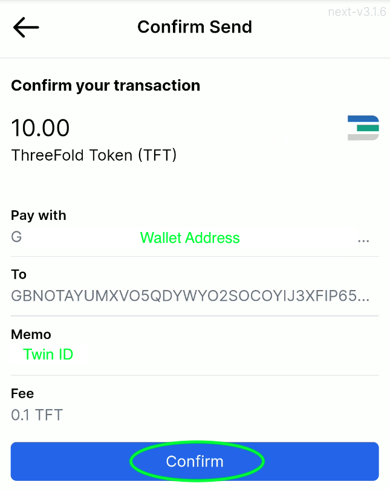

You should then receive your TFT on your Dashboard account within a few minutes.

You can see your TFT balance on the top of the screen. Here's an example of what it could look like:

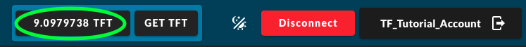

> Note: You might need to refresh (reload) the webpage to see the new TFT added to the account.

That's it! You've swapped TFT from Stellar Chain to TFChain.
