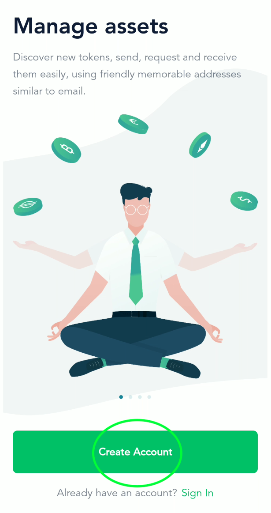
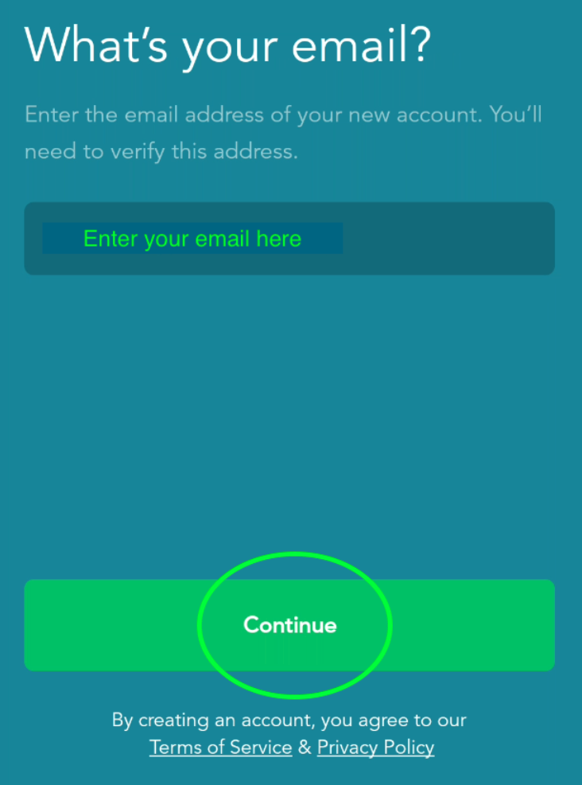
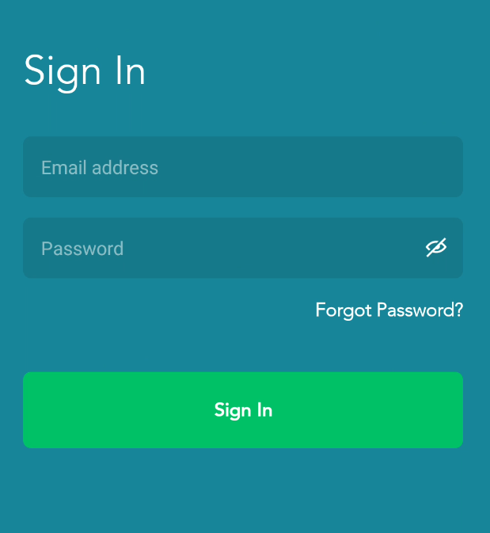
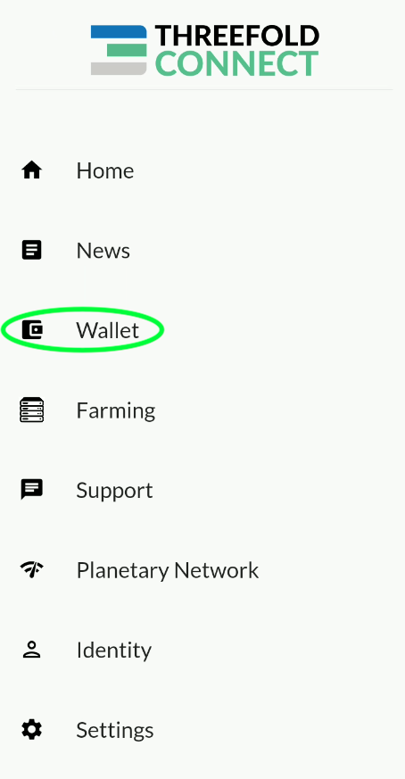
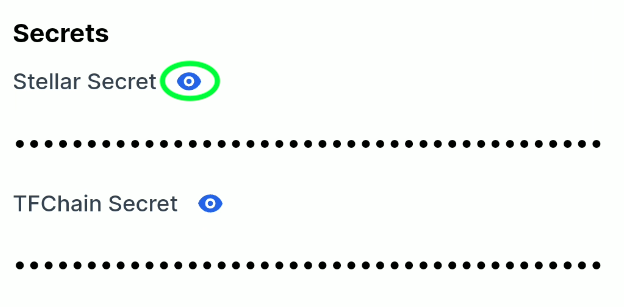
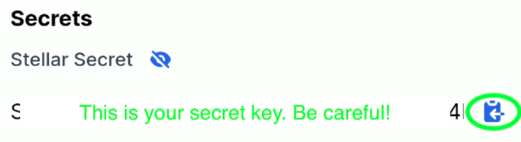
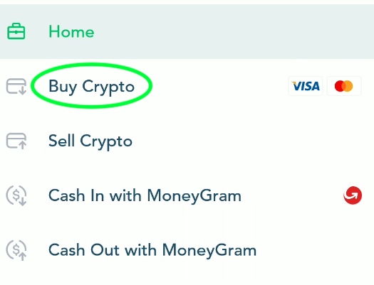
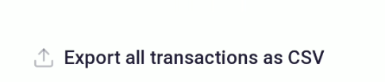
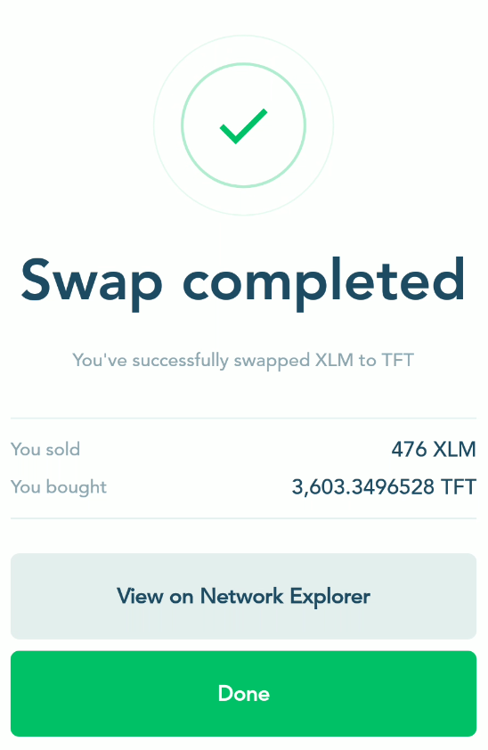

<h1>Threefold Token: Buy TFT on Lobstr</h1>

<iframe title="How to Buy TFT on Lobstr" width="560" height="315" src="https://www.youtube-nocookie.com/embed/1N15bKztiqk" frameborder="0" allowfullscreen="" sandbox="allow-same-origin allow-scripts allow-popups"></iframe>

<h2>Table of Contents</h2>

- [Introduction](#introduction)
- [Download the App and Create an Account](#download-the-app-and-create-an-account)
- [Connect Your TF Connect App Wallet](#connect-your-tf-connect-app-wallet)
- [Buy XLM with Fiat Currency](#buy-xlm-with-fiat-currency)
- [Swap XLM for TFT](#swap-xlm-for-tft)

***

## Introduction

The Threefold token (TFT) is the utility token of the Threefold Grid, a decentralized and open-source project offering network, compute and storage capacity.

Threefold Tokens (TFT) are created (minted) by the ThreeFold Blockchain (TFChain) only when new Internet capacity is added to the ThreeFold Grid by farmers. For this reason, TFT is a pure utility token as minting is solely the result of farming on the Threefold Grid.

* To **farm** TFT, read the [complete farming guide](https://forum.threefold.io/t/threefold-farming-guide-part-1/2989).

* To **buy** TFT, follow this guide.

There are many ways to buy TFT:

* You can buy TFT on [Lobstr](https://lobstr.co/)

* You can buy TFT at [GetTFT.com](https://gettft.com/gettft/)

* You can buy TFT on [Pancake Swap](https://pancakeswap.finance/swap?inputCurrency=BNB&outputCurrency=0x8f0FB159380176D324542b3a7933F0C2Fd0c2bbf)

For the current guide, we will show how to buy TFT on the [Lobstr app](https://lobstr.co/).
The process is simple.

Note that it is possible to do these steps without connecting the Lobstr wallet to the TF Connect App wallet. But doing this has a clear advantage: when we buy and swap on Lobstr, the TFT is directly accessible on the TF Connect app wallet.

Here we go!

***

## Download the App and Create an Account

Go on [www.lobstr.co](https://www.lobstr.co) and download the Lobstr app.
You can download it for Android or iOS.

We will show here the steps for Android, but it is very similar with iOS.
Once you've clicked on the Android button, you can click install on the Google Store page:

Once the app is downloaded, open it:

On the Lobstr app, click on **Create Account**:

You will then need to enter your email address:

Then, choose a safe password for your account:

Once this is done, you will need to verify your email.

Click on **Verify Email** and then go check your email inbox.

Simply click on **Verify Email** on the email you've received.

Once your email is verified, you can sign in to your Lobstr account:

***

## Connect Your TF Connect App Wallet

You will then need to either create a new wallet or connect an existing wallet.

Since we are working on the Threefold ecosystem, it is very easy and practical to simply connect your Threefold Connect app wallet. You can also create a new wallet.

Using the TF Connect wallet is very useful and quick. When you buy XLM and swap XLM tokens for TFTs, they will be directly available on your TF Connect app wallet.

To connect your TF Connect app wallet, you will need to find your Stellar address and chain secret key.
This is very simple to do.

Click on **I have a public or secret key**.

As you can see on this next picture, you need the Stellar address and secret key to properly connect your TF Connect app wallet to Lobstr:

To find your Stellar address and secret key, go on the TF Connect app and select the **Wallet** section:

At the top of the section, click on the **copy** button to copy your Stellar Address:

Now, we will find the Stellar secret key.
At the botton of the section, click on the encircled **i** button:

Next, click on the **eye** button to reveal your secret key:

You can now simply click on the **copy** button on the right:

That's it! You've now connected your TF Connect app wallet to your Lobstr account.

## Buy XLM with Fiat Currency

Now, all we need to do, is buy XLM and then swap it for TFT.
It will be directly available in your TF Connect App wallet.

On the Lobstr app, click on the top right menu button:

Then, click on **Buy Crypto**:

By default, the crypto selected is XLM. This is alright for us as we will quickly swap the XLM for TFT.

On the Buy Crypto page, you can choose the type of Fiat currency you want.
By default it is in USD. To select some othe fiat currency, you can click on **ALL** and see the available fiat currencies:

You can search or select the current you want for the transfer:

You will then need to decide how much XLM you want to buy. Note that there can be a minimum amount.
Once you chose the desired amount, click on **Continue**.

Lobstr will then ask you to proceed to a payment method. In this case, it is Moonpay.
Note that in some cases, your credit card won't accept Moonpay payments. You will simply need to confirm with them that you agree with transacting with Moonpay. This can be done by phone. Check with your bank and credit card company if this applies.

Once you've set up your Moonpay payment method, you will need to process and confirm the transaction:

You will then see a processing window.
This process is usually fast. Within a few minutes, you should receive your XLM.

Once the XLM is delivered, you will receive a notification:

When your transaction is complete, you will see this message:

On the Trade History page, you can choose to download the csv file version of your transaction:

That's it! You've bought XLM on Lobstr and Moonpay.

## Swap XLM for TFT

Now we want to swap the XLM tokens for the Threefold tokens (TFT).
This is even easier than the previous steps.

Go to the Lobstr Home menu and select **Swap**:

On the **Swap** page, write "tft" and select the Threefold token:

Select the amount of XLM you want to swap. It is recommended to keep at least 1 XLM in your wallet for transaction fees.

Within a few seconds, you will receive a confirmation that your swap is completed:
Note that the TFT is directly sent on your TF Connect app wallet.

That's it. You've swapped XLM for TFT.

You can now use your TFT to deploy workloads on the Threefold Grid.
