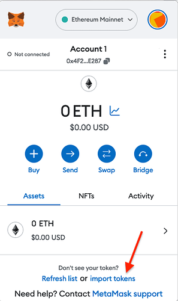
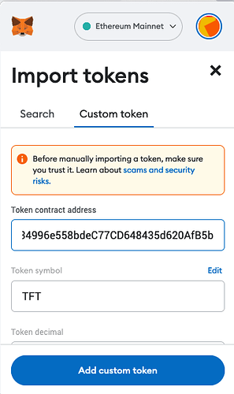
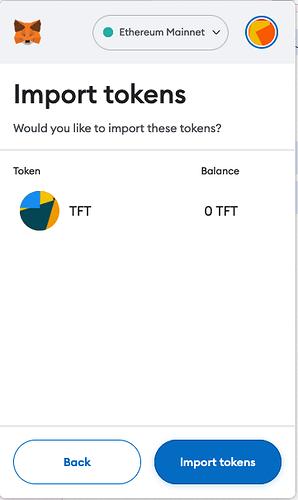

<h1>TFT on Ethereum</h2>

<h2>Table of Contents</h2>

- [Introduction](#introduction)
- [TFT Ethereum-Stellar Bridge](#tft-ethereum-stellar-bridge)
- [TFT and Metamask](#tft-and-metamask)
  - [Add TFT to Metamask](#add-tft-to-metamask)
  - [Buy TFT on Metamask](#buy-tft-on-metamask)
- [Questions and Feedback](#questions-and-feedback)

***

## Introduction

The TFT Stellar-Ethereum bridge serves as a vital link between the Stellar and Ethereum blockchains, enabling the seamless transfer of TFT tokens between these two networks. This bridge enhances interoperability and expands the utility of TFT by allowing users to leverage the strengths of both platforms. With the bridge in place, TFT holders can convert their tokens from the Stellar network to the Ethereum network and vice versa, unlocking new possibilities for engagement with decentralized applications, smart contracts, and the vibrant Ethereum ecosystem. This bridge promotes liquidity, facilitates cross-chain transactions, and encourages collaboration between the Stellar and Ethereum communities.

***

## TFT Ethereum-Stellar Bridge

The easiest way to transfer TFT between Ethereum and Stellar is to use the [TFT Ethereum Bridge](https://bridge.eth.threefold.io). We present here the main steps on how to use this bridge.

When you go to the [TFT Ethereum-Stellar bridge website](https://bridge.eth.threefold.io/), connect your Ethereum wallet. Then the bridge will present a QR code which you scan with your Stellar wallet. This will populate a transaction with the bridge wallet as the destination and an encoded form of your Ethereum address as the memo. The bridge will scan the transaction, decode the Ethereum wallet address, and deliver newly minted TFT on Ethereum, minus the bridge fees.

For the reverse operation, going from Ethereum to Stellar, there is a smart contract interaction that burns TFT on Ethereum while embedding your Stellar wallet address. The bridge will scan that transaction and release TFT from its vault wallet to the specified Stellar address, again minus the bridge fees.

Note that the contract address for TFT on Ethereum is the following: `0x395E925834996e558bdeC77CD648435d620AfB5b`.

To see the ThreeFold Token on Etherscan, check [this link](https://etherscan.io/token/0x395E925834996e558bdeC77CD648435d620AfB5b).

***

## TFT and Metamask

The ThreeFold Token (TFT) is available on Ethereum.
It is implemented as a wrapped asset with the following token address:

```
0x395E925834996e558bdeC77CD648435d620AfB5b
```

We present here the basic steps to add TFT to Metamask. We also show how to buy TFT Metamask. Finally, we present the simple steps to use the [TFT Ethereum Bridge](https://bridge.eth.threefold.io/).


***

### Add TFT to Metamask

Open Metamask and import the ThreeFold Token. First click on `import tokens`:

 

Then, choose `Custom Token`:

 

To add the ThreeFold Token, paste its Ethereum address in the field `Token contract address field`. The address is the following:

```
0x395E925834996e558bdeC77CD648435d620AfB5b
```

Once you paste the TFT contract address, the parameter `Token symbol` should automatically be filled with `TFT`. 

Click on the button `Add Custom Token`.

 

To confirm, click on the button `Import tokens`:

 

TFT is now added to Metamask.

***

### Buy TFT on Metamask

Liquidity is present on Ethereum  so you can use the "Swap" functionality from Metamask directly or go to [Uniswap](https://app.uniswap.org/#/swap) to swap Ethereum, or any other token, to TFT.

When using Uniswap, paste the TFT token address in the field `Select a token` to select TFT on Ethereum. The TFT token address is the following:

```
0x395E925834996e558bdeC77CD648435d620AfB5b
```

 

***

## Questions and Feedback

If you have any question, feel free to write a post on the [Threefold Forum](https://forum.threefold.io/).