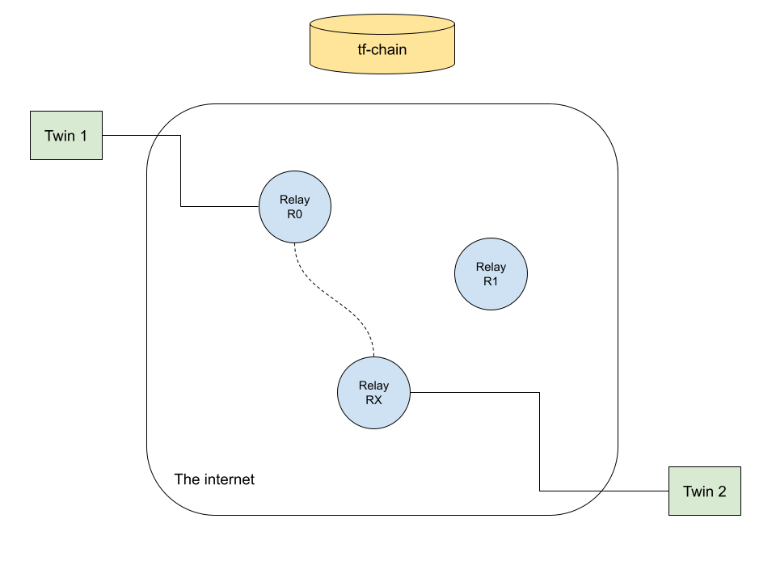

<h1> Introduction to Reliable Message Bus (RMB) </h1>

<h2> Table of Contents </h2>

- [What is RMB](#what-is-rmb)
- [Why](#why)
- [Specifications](#specifications)
- [How to Use RMB](#how-to-use-rmb)
- [Libraries](#libraries)
  - [Known Libraries](#known-libraries)
  - [No Known Libraries](#no-known-libraries)
- [What is rmb-peer](#what-is-rmb-peer)
- [Download](#download)
- [Building](#building)
- [Running tests](#running-tests)

***

## What is RMB

Reliable message bus is a secure communication panel that allows `bots` to communicate together in a `chat` like way. It makes it very easy to host a service or a set of functions to be used by anyone, even if your service is running behind NAT.

Out of the box RMB provides the following:

- Guarantee authenticity of the messages. You are always sure that the received message is from whoever is pretending to be
- End to End encryption
- Support for 3rd party hosted relays. Anyone can host a relay and people can use it safely since there is no way messages can be inspected while using e2e. That's similar to `home` servers by `matrix`


***
## Why

RMB is developed by ThreefoldTech to create a global network of nodes that are available to host capacity. Each node will act like a single bot where you can ask to host your capacity. This enforced a unique set of requirements:

- Communication needed to be reliable
  - Minimize and completely eliminate message loss
  - Reduce downtime
- Node need to authenticate and authorize calls
  - Guarantee identity of the other peer so only owners of data can see it
- Fast request response time

Starting from this we came up with a more detailed requirements:

- User (or rather bots) need their identity maintained by `tfchain` (a blockchain) hence each bot needs an account on tfchain to be able to use `rmb`
- Then each message then can be signed by the `bot` keys, hence make it easy to verify the identity of the sender of a message. This is done both ways.
- To support federation (using 3rd party relays) we needed to add e2e encryption to make sure messages that are surfing the public internet can't be sniffed
- e2e encryption is done by deriving an encryption key from the same identity seed, and share the public key on `tfchain` hence it's available to everyone to use
***
## Specifications

For details about protocol itself please check the [specs](./rmb_specs.md).
***
## How to Use RMB

There are many ways to use `rmb` because it was built for `bots` and software to communicate. Hence, there is no mobile app for it for example, but instead a set of libraries where you can use to connect to the network, make chitchats with other bots then exit.

Or you can keep the connection forever to answer other bots requests if you are providing a service.
***
## Libraries

If there is a library in your preferred language, then you are in luck! Simply follow the library documentations to implement a service bot, or to make requests to other bots.

### Known Libraries

- Golang [rmb-sdk-go](https://github.com/threefoldtech/rmb-sdk-go)
- Typescript [rmb-sdk-ts](https://github.com/threefoldtech/rmb-sdk-ts)
***
### No Known Libraries

If there are no library in your preferred language, here's what you can do:

- Implement a library in your preferred language
- If it's too much to do all the signing, verification, e2e in your language then use `rmb-peer`
***
## What is rmb-peer

think of `rmb-peer` as a gateway that stands between you and the `relay`. `rmb-peer` uses your mnemonics (your identity secret key) to assume your identity and it connects to the relay on your behalf, it maintains the connection forever and takes care of

- reconnecting if connection was lost
- verifying received messages
- decrypting received messages
- sending requests on your behalf, taking care of all crypto heavy lifting.

Then it provide a simple (plain-text) api over `redis`. means to send messages (or handle requests) you just need to be able to push and pop messages from some redis queues. Messages are simple plain text json.

> More details can be found [here](./rmb_specs.md)

***
## Download

Please check the latest [releases](https://github.com/threefoldtech/rmb-rs/releases) normally you only need the `rmb-peer` binary, unless you want to host your own relay.
***
## Building

```bash
git clone git@github.com:threefoldtech/rmb-rs.git
cd rmb-rs
cargo build --release --target=x86_64-unknown-linux-musl
```
***
## Running tests

While inside the repository

```bash
cargo test
```
