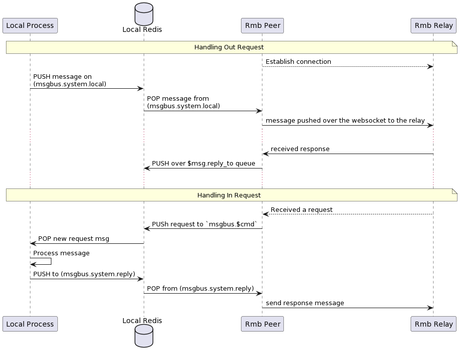

<h1> RMB Specs </h1>

<h2> Table of Contents </h2>

- [Introduction](#introduction)
- [Overview of the Operation of RMB Relay](#overview-of-the-operation-of-rmb-relay)
  - [Connections](#connections)
  - [Peer](#peer)
  - [Peer implementation](#peer-implementation)
    - [Message Types](#message-types)
      - [Output Requests](#output-requests)
      - [Incoming Response](#incoming-response)
      - [Incoming Request](#incoming-request)
      - [Outgoing Response](#outgoing-response)
- [End2End Encryption](#end2end-encryption)
- [Rate Limiting](#rate-limiting)

***

# Introduction

RMB is (reliable message bus) is a set of protocols and tools (client and daemon) that aims to abstract inter-process communication between multiple processes running over multiple nodes.

The point behind using RMB is to allow the clients to not know much about the other process, or where it lives (client doesn't know network addresses, or identity). Unlike HTTP(S) or gRPC where the caller must know exact address (or dns-name) and endpoints of the service it's trying to call. Instead RMB requires you to only know about

- Twin ID (numeric ID) of the endpoint as defined by `tfchain`
- Command (string) is simply the function to call
- The request "body" which is binary blob that is passed to the command as is
  - implementation of the command need then to interpret this data as intended (out of scope of rmb)

Twins are stored on tfchain. hence identity of twins is granted not to be spoofed, or phished. When a twin is created he needs to define 2 things:

- RMB Relay
- His Elliptic Curve public key (we use secp256k1 (K-256) elliptic curve)

> This data is stored on tfchain forever, and only the twin can change it using his secure-key. Hence phishing is impossible. A twin can decide later to change this encryption key or relay.

Once all twins has their data set correctly on the chain. Any 2 twins can communicate with full end-to-end encryption as follows:

- A twin establish a WS connection to his relay of choice
- A twin create an `envelope` as defined by the protobuf [schema](https://github.com/threefoldtech/rmb-rs/blob/main/proto/types.proto)
- Twin fill in all envelope information (more about this later)
- Twin pushes the envelope to the relay
  - If the destination twin is also using the same relay, message is directly forwarded to this twin
  - If federation is needed (twin using different relay), message is forwarded to the proper twin.

> NOTE: since a sender twin need to also encrypt the message for the receiver twin, a twin queries the `tf-chain` for the twin information. Usually it caches this data locally for reuse, hence clients need to make sure this data is always up-to-date.

On the relay, the relay checks federation information set on the envelope and then decide to either to forward it internally to one of it's connected clients, or forward it to the destination relay. Hence relays need to be publicly available.

When the relay receive a message that is destined to a `local` connected client, it queue it for delivery. The relay can maintain a queue of messages per twin to a limit. If the twin does not come back online to consume queued messages, the relay will start to drop messages for that specific twin client.

Once a twin come online and connect to its peer, the peer will receive all queued messages. the messages are pushed over the web-socket as they are received. the client then can decide how to handle them (a message can be a request or a response). A message type can be inspected as defined by the schema.
***
# Overview of the Operation of RMB Relay


## Connections

By design, there can be only `ONE TWIN` with that specific ID. Hence only has `ONE RELAY` set on tfchain per twin. This force a twin to always use this defined relay if it wishes to open multiple connections to its relay. In other words, a twin once sets up a relay on its public information can only use that relay for all of its connections. If decided to change the relay address, all connections must use the new relay otherwise messages will get lost as they will be delivered to the wrong relay.

In an RPC system, the response of a request must be delivered to the requester. Hence if a twin is maintaining multiple connections to its relay, it need to identify `uniquely` the connection to allow the relay to route back the responses to the right requester. We call this `id` a `session-id`. The `session-id` must be unique per twin.

The relay can maintain **MULTIPLE** connections per peer given that each connection has a unique **SID** (session id). But for each (twin-id, session-id) combo there can be only one connection. if a new connection with the same (twin-id, session-id) is created, the older connection is dropped.

The message received always has the session-id as part of the source address. a reply message then must have destination set back to the source as is, this allows the relay to route the message back correctly without the need to maintain an internal state.

The `rmb-peer` process reserved the `None` sid. It connects with No session id, hence you can only run one `rmb-peer` per `twin` (identity). But the same twin (identity) can make other connection with other rmb clients (for example rmb-sdk-go direct client) to establish more connections with unique session ids.

## Peer

Any language or code that can open `WebSocket` connection to the relay can work as a peer. A peer need to do the following:

- Authenticate with the relay. This is by providing a `JWT` that is signed by the twin key (more on that later)
- Handle received binary mesasge
- Send binary messages

Each message is an object of type `Envelope` serialized as with protobuf. Type definition can be found under `proto/types.proto`

## Peer implementation

This project already have a peer implementation that works as local peer gateway. By running this peer instance it allows you to
run multiple services (and clients) behind that gateway and they appear to the world as a single twin.

- The peer gateway (rmb-peer) starts and connects to realy
- If requests are received, they are verified, decrypted and pushed to a redis queue that as command specific (from the envelope)
- A service can then be waiting on this redis queue for new messages
  - The service can process the command, and push a response back to a specific redis queue for responses.
- The gateway can then pull ready responses from the responses queue, create a valid envelope, encrypt, and sign and send to destination



### Message Types

Concerning, `rmb-peer` message types, to make it easy for apps to work behind an `rmb-peer`, we use JSON message for communication between the local process and the rmb-peer. the rmb-peer still
maintains a fully binary communication with the relay.

A request message is defined as follows

#### Output Requests

This is created by a client who wants to request make a request to a remote service

> this message is pushed to `msgbus.system.local` to be picked up by the peer

```rust
#[derive(Serialize, Deserialize, Clone, Debug)]
pub struct JsonOutgoingRequest {
    #[serde(rename = "ver")]
    pub version: usize,
    #[serde(rename = "ref")]
    pub reference: Option<String>,
    #[serde(rename = "cmd")]
    pub command: String,
    #[serde(rename = "exp")]
    pub expiration: u64,
    #[serde(rename = "dat")]
    pub data: String,
    #[serde(rename = "tag")]
    pub tags: Option<String>,
    #[serde(rename = "dst")]
    pub destinations: Vec<u32>,
    #[serde(rename = "ret")]
    pub reply_to: String,
    #[serde(rename = "shm")]
    pub schema: String,
    #[serde(rename = "now")]
    pub timestamp: u64,
}
```

#### Incoming Response

A response message is defined as follows this is what is received as a response by a client in response to his outgoing request.

> This response is what is pushed to `$ret` queue defined by the outgoing request, hence the client need to wait on this queue until the response is received or it times out

```rust
#[derive(Serialize, Deserialize, Clone, Debug)]
pub struct JsonError {
    pub code: u32,
    pub message: String,
}

#[derive(Serialize, Deserialize, Clone, Debug)]
pub struct JsonIncomingResponse {
    #[serde(rename = "ver")]
    pub version: usize,
    #[serde(rename = "ref")]
    pub reference: Option<String>,
    #[serde(rename = "dat")]
    pub data: String,
    #[serde(rename = "src")]
    pub source: String,
    #[serde(rename = "shm")]
    pub schema: Option<String>,
    #[serde(rename = "now")]
    pub timestamp: u64,
    #[serde(rename = "err")]
    pub error: Option<JsonError>,
}
```

#### Incoming Request

An incoming request is a modified version of the request that is received by a service running behind RMB peer
> this request is received on `msgbus.${request.cmd}` (always prefixed with `msgbus`)

```rust
#[derive(Serialize, Deserialize, Clone, Debug)]
pub struct JsonIncomingRequest {
    #[serde(rename = "ver")]
    pub version: usize,
    #[serde(rename = "ref")]
    pub reference: Option<String>,
    #[serde(rename = "src")]
    pub source: String,
    #[serde(rename = "cmd")]
    pub command: String,
    #[serde(rename = "exp")]
    pub expiration: u64,
    #[serde(rename = "dat")]
    pub data: String,
    #[serde(rename = "tag")]
    pub tags: Option<String>,
    #[serde(rename = "ret")]
    pub reply_to: String,
    #[serde(rename = "shm")]
    pub schema: String,
    #[serde(rename = "now")]
    pub timestamp: u64,
}
```

Services that receive this needs to make sure their responses `destination` to have the same value as the incoming request `source`

#### Outgoing Response

A response message is defined as follows this is what is sent as a response by a service in response to an incoming request.

Your bot (server) need to make sure to set `destination` to the same value as the incoming request `source`

The
> this response is what is pushed to `msgbus.system.reply`

```rust
#[derive(Serialize, Deserialize, Clone, Debug)]
pub struct JsonOutgoingResponse {
    #[serde(rename = "ver")]
    pub version: usize,
    #[serde(rename = "ref")]
    pub reference: Option<String>,
    #[serde(rename = "dat")]
    pub data: String,
    #[serde(rename = "dst")]
    pub destination: String,
    #[serde(rename = "shm")]
    pub schema: Option<String>,
    #[serde(rename = "now")]
    pub timestamp: u64,
    #[serde(rename = "err")]
    pub error: Option<JsonError>,
}
```
***
# End2End Encryption

Relay is totally opaque to the messages. Our implementation of the relay does not poke into messages except for the routing attributes (source, and destinations addresses, and federation information). But since the relay is designed to be hosted by other 3rd parties (hence federation) you should
not fully trust the relay or whoever is hosting it. Hence e2e was needed

As you already understand e2e is completely up to the peers to implement, and even other implementations of the peers can agree on a completely different encryption algorithm and key sharing algorithm (again, relay does not care). But in our implementation of the e2e (rmb-peer) things goes like this

- Each twin has a `pk` field on tfchain. when rmb-peer start, it generates an `secp256k1` key from the same seed as the user tfchain mnemonics. Note that this will not make the encryption key and the signing key any related, they just are driven from the same seed.
- On start, if the key is not already set on the twin object, the key is updated.
- If a peer A is trying to send a message to peer B. but peer B does not has his `pk` set, peer A will send the message in plain-text format (please check the protobuf envelope type for details)
- If peer B has public key set, peer A will prefer e2e encryption and will does the following:
- Drive a shared secret point with `ecdh` algorithm, the key is the `sha256` of that point
- `shared = ecdh(A.sk, B.pk)`
- create a 12 bytes random nonce
- encrypt data as `encrypted = aes-gcm.encrypt(shared-key, nonce, plain-data)`
- create cipher as `cipher nonce + encrypted`
- fill `envelope.cipher = cipher`
- on receiving a message peer B does the same in the opposite direction
- split data and nonce (nonce is always first 12 bytes)
- derive the same shared key
- `shared = ecdh(B.sk, A.pk)`
- `plain-data = aes-gcm.decrypt(shared-key, nonce, encrypted)`
***
# Rate Limiting

To avoid abuse of the server, and prevent DoS attacks on the relay, a rate limiter is used to limit the number of clients' requests.\
It was decided that the rate limiter should only watch websocket connections of users, since all other requests/connections with users consume little resources, and since the relay handles the max number of users inherently.\
The limiter's configurations are passed as a command line argument `--limit <count>, <size>`. `<count>` represents the number of messages a twin is allowed to send in each time window, `<size>` represents the total size of messages in bytes a twin is allowed to send in each time window.\
Currently there are two implementations of the rate limiter:

- `NoLimit` which imposes no limits on users.
- `FixedWindowLimiter` which breaks the timeline into fixed time windows, and allows a twin to send a fixed number of messages, with a fixed total size, in each time window. If a twin exceeded their limits in some time window, their message is dropped, an error message is sent back to the user, the relay dumps a log about this twin, and the user gets to keep their connection with the relay.
