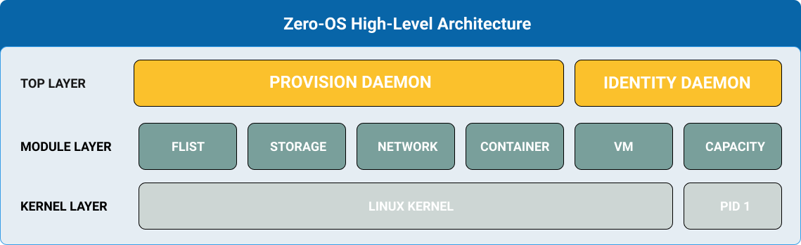

<h1> Zero-OS </h1>

<h2> Table of Contents </h2>

- [Manual](manual/manual.md)
- [Workload Types](manual/workload_types.md)
  - [`network`](manual/network/index.md)
  - [`ip`](manual/ip/index.md)
  - [`zmount`](manual/zmount/index.md)
  - [`zmachine`](manual/zmachine/index.md)
  - [`zlogs`](manual/zlogs/index.md)
  - [`zdb`](manual/zdb/index.md)
  - [`qsfs`](manual/qsfs/index.md)
  - [`gateway-name-proxy`](manual/gateway/name-proxy.md)
  - [`gateway-fqdn-proxy`](manual/gateway/fqdn-proxy.md)
- [Internal Modules](internals/internals.md)
  - [Identity](internals/identity/index.md)
    - [Node ID Generation](internals/identity/identity.md)
    - [Node Upgrade](internals/identity/upgrade.md)
  - [Node](internals/node/index.md)
  - [Storage](internals/storage/index.md)
  - [Network](internals/network/index.md)
    - [Introduction](internals/network/introduction.md)
    - [Definitions](internals/network/definitions.md)
    - [Mesh](internals/network/mesh.md)
    - [Setup](internals/network/setup_farm_network.md)
  - [Flist](internals/flist/index.md)
  - [Container](internals/container/index.md)
  - [VM](internals/vmd/index.md)
  - [Provision](internals/provision/index.md)
- [Capacity](internals/capacity.md)
- [Performance Monitor Package](./performance/performance.md)
  - [Public IPs Validation Task](./performance/publicips.md)
  - [CPUBenchmark](./performance/cpubench.md)
  - [IPerf](./performance/iperf.md)
  - [Health Check](./performance/healthcheck.md)
- [API](manual/api.md)
- [FAQ](faq/index.md)

***
