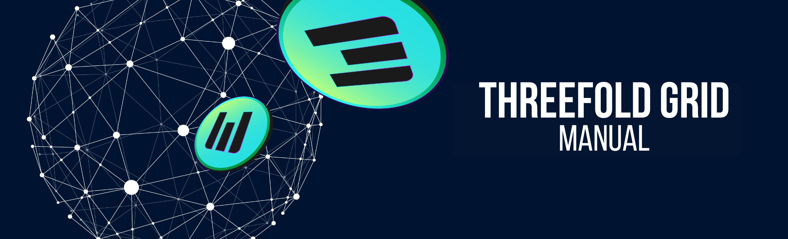

# Welcome to the ThreeFold Grid Manual!

Welcome to the __ThreeFold Grid Manual__, your comprehensive guide to understanding and harnessing the power of the ThreeFold Grid. This manual has been meticulously created to provide you with the knowledge and tools you need to navigate and make the most of this revolutionary decentralized grid infrastructure.

## About the ThreeFold Grid

The ThreeFold Grid (TFGrid) is a global, peer-to-peer network that aims to create a more sustainable and equitable digital world. It is built on the principles of decentralization, empowering individuals and organizations to take control of their digital assets, data, and interactions. The ThreeFold Grid is designed to be highly scalable, secure, and environmentally friendly, offering a robust and efficient alternative to traditional centralized cloud and computing services.

Within this manual, you will find a wealth of information on how to leverage the capabilities of the ThreeFold Grid. Whether you are an individual user, a farmer, a developer, or a business entity, this manual will guide you through the process of accessing, deploying, and managing resources on the grid.

> Explore the TFGrid status page for live updates on Threefold services!
> 
> [Access with Grid.tf](https://status.grid.tf) | [Access with ThreeFold.io](https://status.threefold.io)

## Where to Start?

* If you are new to the ThreeFold ecosystem and would like to understand the big picture...
  * Read the [General Information](../general/general.md) book.
* If you want to farm TFT, the token fueling the ThreeFold ecosystem...
  * Read the [Farmers](../farmers/farmers.md) book.
* If you want to become a developer on the ThreeFold Grid...
  * Read the [Developers](../developers/developers.md) book.
* If you want to become a system administrator on the ThreeFold Grid...
  * Read the [System Administrators](../system_administrators/system_administrators.md) book.

## Key Sections

- [The Grid Concepts](../concepts/concepts_readme.md): This section provides a brief introduction to the ThreeFold Grid, its core concepts, and its key benefits. It will help you understand the fundamental principles behind the grid and set the stage for further exploration.
- [How it Works](../intro/grid3_howitworks.md): This section provides a brief description of the platform in a nutshell, so we understand the mechanics and clear the terminology a little bit.
- [Getting Started](../getstarted/tfgrid3_getstarted.md): Here, you will learn how to connect to the ThreeFold Grid, access its distributed resources. We will walk you through the prerequisites and necessary steps to establish a connection and configure your environment for seamless interaction with the grid.
- [FAQ](../faq/faq.md): Frequently asked questions about the ThreeFold ecosystem, its technologies, and the various aspects of its implementation. 

We hope that the ThreeFold Grid Manual proves to be a valuable resource as you embark on your journey through the decentralized world of the ThreeFold Grid. Whether you are new to decentralized technologies or an experienced user, this manual aims to equip you with the knowledge and understanding needed to fully leverage the potential of the ThreeFold Grid.

## Join the ThreeFold Community

The ThreeFold community is very active and its members will be more than happy to discuss and help you get started.

* [ThreeFold Forum](https://forum.threefold.io/)
* [ThreeFold General Telegram Channel](https://t.me/threefold)
* [ThreeFold Farmer Telegram Channel](https://t.me/threefoldfarmers)
* [TFGrid Tester Telegram Channel](https://t.me/threefoldtesting)

## Questions and Feedback

To explore this manual, you can use the search function by hitting **'s'** on your keyboard, or by clicking on the magnifier button at the top left of each page. Answers to your questions might also be on the [ThreeFold Forum](https://forum.threefold.io/).

If you can't find the answer to your question, our dedicated [ThreeFold Support](https://threefoldfaq.crisp.help/en/) team is here to help.

Welcome to the ThreeFold Grid, where together we can shape a more sustainable and inclusive digital future!