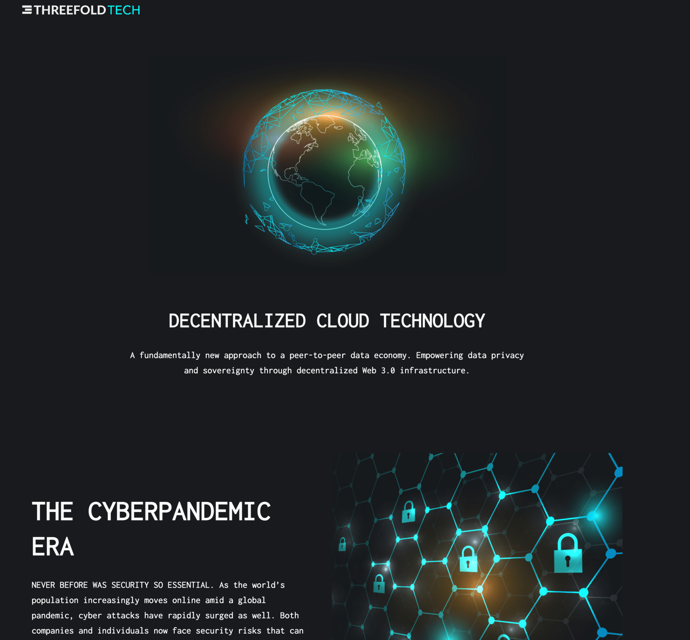
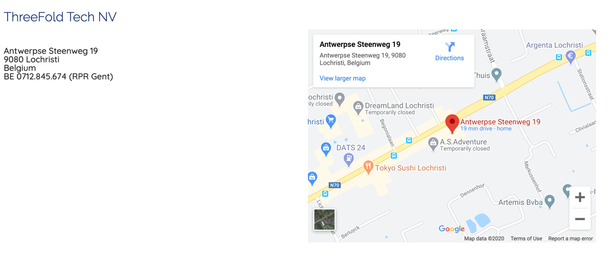

<h1> ThreeFold Tech </h1>

<h2>Table of Contents </h2>

- [Overview](#overview)
- [Location](#location)

***

## Overview

Company developing & promoting software for self-healing, self-driving cloud & blockchain workloads. Has developed most of the software as used in the ThreeFold_Grid.

- TFTech is working together with industry partners to sell its software
  - Major partners: HPE, Solidaridad, Kleos (learn more on [threefold.io/partners](https://threefold.io/partners)
- Income - License and OEM agreements involving the TFTech technology: - License fees can be in the form of a revenue share on commercial products being developed on top of the TF platform. - With respect to the TF Grid, a fee of 10% of revenue generated is charged
  for as a license fee for certified edge Internet Capacity registered on the TF Grid
  network
- Investors to this point:
  - Self-funded by founders & current funding round

see https://threefold.tech/

We believe that doing good for the world and growing a successful software company can go hand in hand.

ThreeFold Tech is a Belgium-based for-profit software company that believes that doing good for the world and building a successful company can go hand-in-hand. They are responsible for the technology behind the ThreeFold_Grid.

ThreeFold Tech business wise focusses on

- [X] sell licenses to companies and/or governments to deploy private versions of our cloud technology.
- [X] create an antidote for the Cyberpandemic, help customers to protect themselves against this huge threat.

The company is 80% engineering centric today.

> TFTech has no links to tokens, at this point (March 2021) does not own any of them either. All Token & TFGrid activities are coordinate from ThreeFold Dubai.

## Location

