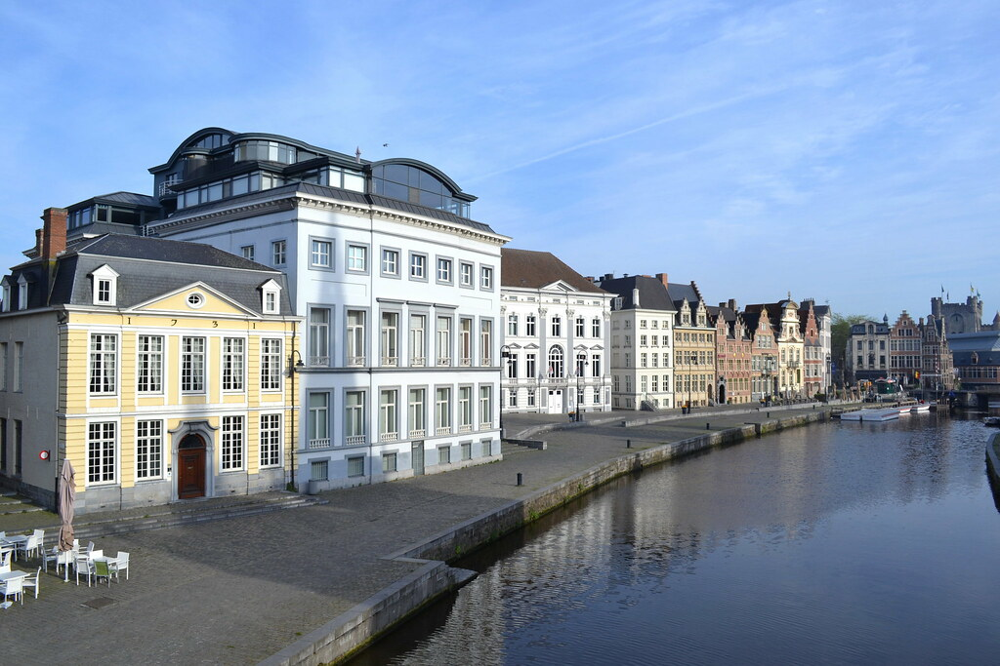
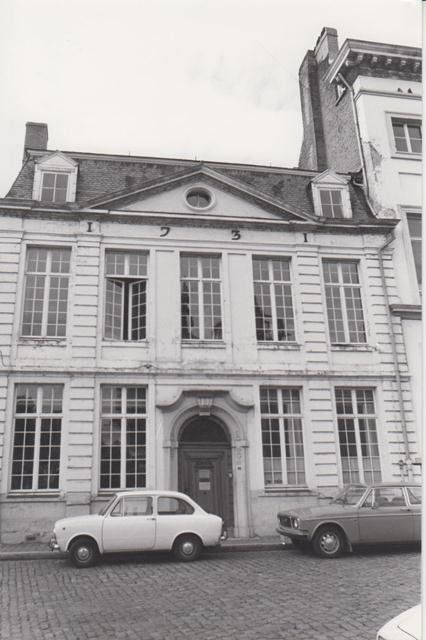
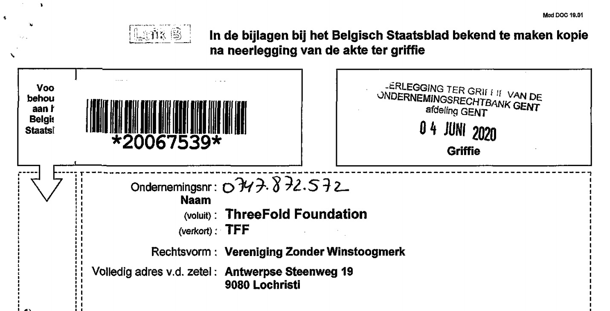

<h1> ThreeFold VZW </h1>

<h2>Table of Contents</h2>

- [Introduction](#introduction)
- [Functions](#functions)
- [Some History](#some-history)
- [Belgium Official Doc](#belgium-official-doc)

***

## Introduction

ThreeFold VZW is a non for profit organization based in Belgium.

A **VZW** has no shareholders, only members.

<!-- [filename](structure/images_threefold_vzw.html ':include :type=iframe width=100% height=550px frameBorder="0" scrolling="no" align="center"')
 -->

## Functions

- owner of the wisdom_council
- eventuallly ThreeFold VZW will own some decentralized organizations as operating in the ThreeFold world e.g. [TF Dubai](./threefold_dubai.md)

## Some History

We all started in Belgium from Korenlei 22, a super old building in the middle of the town. It dates back to 1731.

Now the foundation has another address in Lochristi.

<!-- 

Todo: Find/create wisdom council page

The **VZW** is home to the [Wisdom Council](wisdom_council) -->

## Belgium Official Doc

<!-- see [threefold_vzw_be_book_20067539.pdf]() -->

See also https://trendstop.knack.be/en/detail/747872572/threefold-foundation.aspx