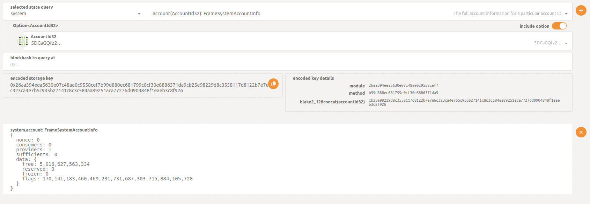
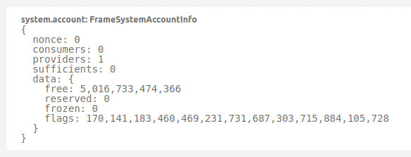
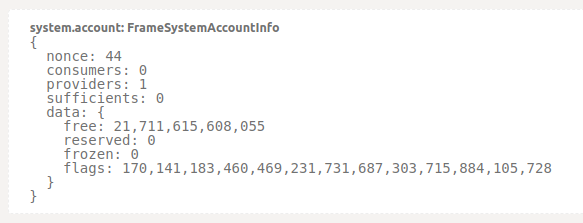
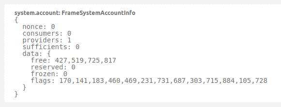
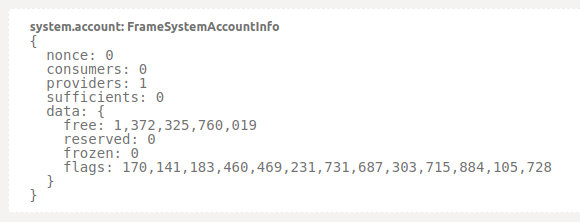

<h1> ThreeFold Special Wallets </h1>

<h2>Table of Contents</h2>

- [Introduction](#introduction)
- [Exchange and OTC Wallets](#exchange-and-otc-wallets)
- [ThreeFold Contribution Wallets](#threefold-contribution-wallets)
- [Wisdom Council Wallets](#wisdom-council-wallets)
- [Important Note](#important-note)
- [Remarks](#remarks)
- [Proof-of-Utilization Wallets](#proof-of-utilization-wallets)

***

## Introduction

We present special wallets that hold a given amount of TFT.

## Exchange and OTC Wallets

| **Description**    | **TFT Balance** | **Address**                                                                      |
| ------------------ | ----------- | -------------------------------------------------------------------------------- |
| Liquid Exchange #1 |  {{#include ./wallet_data/GA7OPN4A3JNHLPHPEWM4PJDOYYDYNZOM7ES6YL3O7NC3PRY3V3UX6ANM.md}}      | [GA7OPN4A3JNHLPHPEWM4PJDOYYDYNZOM7ES6YL3O7NC3PRY3V3UX6ANM](https://stellar.expert/explorer/public/account/GA7OPN4A3JNHLPHPEWM4PJDOYYDYNZOM7ES6YL3O7NC3PRY3V3UX6ANM) |
| Liquid Exchange #2 | {{#include ./wallet_data/GDSKFYNMZWTB3V5AN26CEAQ27643Q3KB4X6MY4UTO2LIIDFND4SPQZYU.md}}           | [GDSKFYNMZWTB3V5AN26CEAQ27643Q3KB4X6MY4UTO2LIIDFND4SPQZYU](https://stellar.expert/explorer/public/account/GDSKFYNMZWTB3V5AN26CEAQ27643Q3KB4X6MY4UTO2LIIDFND4SPQZYU) |
| gettft.com         | {{#include ./wallet_data/GBQHN7RL4LSRPR2TT74ID2UJPZ2AXCHQY2WKGCTDLJM3NXVJ7GQHUCOD.md}}     | [GBQHN7RL4LSRPR2TT74ID2UJPZ2AXCHQY2WKGCTDLJM3NXVJ7GQHUCOD](https://stellar.expert/explorer/public/account/GBQHN7RL4LSRPR2TT74ID2UJPZ2AXCHQY2WKGCTDLJM3NXVJ7GQHUCOD) |
| BTC-Alpha Exchange | {{#include ./wallet_data/GBTPAXXP6534UPC4MLNGFGJWCD6DNSRVIPPOZWXAQAWI4FKTLOJY2A2S.md}}     | [GBTPAXXP6534UPC4MLNGFGJWCD6DNSRVIPPOZWXAQAWI4FKTLOJY2A2S](https://stellar.expert/explorer/public/account/GBTPAXXP6534UPC4MLNGFGJWCD6DNSRVIPPOZWXAQAWI4FKTLOJY2A2S) |

## ThreeFold Contribution Wallets

| **Description**                 | **TFT Balance** | **Address**                                                                      |
| ------------------------------- | ----------- | -------------------------------------------------------------------------------- |
| TF DAY2DAY operations           | {{#include ./wallet_data/GB2C5HCZYWNGVM6JGXDWQBJTMUY4S2HPPTCAH63HFAQVL2ALXDW7SSJ7.md}}    | [GB2C5HCZYWNGVM6JGXDWQBJTMUY4S2HPPTCAH63HFAQVL2ALXDW7SSJ7](https://stellar.expert/explorer/public/account/GB2C5HCZYWNGVM6JGXDWQBJTMUY4S2HPPTCAH63HFAQVL2ALXDW7SSJ7) |
| TF Promotion Wallet             | {{#include ./wallet_data/GDLVIB44LVONM5K67LUPSFZMSX7G2RLYVBM5MMHUJ4NAQJU7CH4HBJBO.md}}    | [GDLVIB44LVONM5K67LUPSFZMSX7G2RLYVBM5MMHUJ4NAQJU7CH4HBJBO](https://stellar.expert/explorer/public/account/GDLVIB44LVONM5K67LUPSFZMSX7G2RLYVBM5MMHUJ4NAQJU7CH4HBJBO) |
| TF Grants Wallet                | {{#include ./wallet_data/GDKXTUYNW4BJKDM2L7B5XUYFUISV52KUU4G7VPNLF4ZSIKBURM622YPZ.md}}    | [GDKXTUYNW4BJKDM2L7B5XUYFUISV52KUU4G7VPNLF4ZSIKBURM622YPZ](https://stellar.expert/explorer/public/account/GDKXTUYNW4BJKDM2L7B5XUYFUISV52KUU4G7VPNLF4ZSIKBURM622YPZ) |
| ThreeFold Carbon Credit Funding | {{#include ./wallet_data/GDIJY6K2BBRIRX423ZFUYKKFDN66XP2KMSBZFQSE2PSNDZ6EDVQTRLSU.md}}     | [GDIJY6K2BBRIRX423ZFUYKKFDN66XP2KMSBZFQSE2PSNDZ6EDVQTRLSU](https://stellar.expert/explorer/public/account/GDIJY6K2BBRIRX423ZFUYKKFDN66XP2KMSBZFQSE2PSNDZ6EDVQTRLSU) |
| TF Team Wallet                  | {{#include ./wallet_data/GCWHWDRXYPXQAOYMQKB66SZPLM6UANKGMSL4SP7LSOIA6OTTOYQ6HBIH.md}}      | [GCWHWDRXYPXQAOYMQKB66SZPLM6UANKGMSL4SP7LSOIA6OTTOYQ6HBIH](https://stellar.expert/explorer/public/account/GCWHWDRXYPXQAOYMQKB66SZPLM6UANKGMSL4SP7LSOIA6OTTOYQ6HBIH) |

## Wisdom Council Wallets

| **Description**                         | **TFT Balance** | **Address**                                                                      |
| --------------------------------------- | ----------- | -------------------------------------------------------------------------------- |
| Liquidity/Ecosystem Contribution Wisdom | {{#include ./wallet_data/GBV734I2SV4YDDPVJMYXU3IZ2AIU5GEAJRAD4E4BQG7CA2N63NXSPMD6.md}}    | [GBV734I2SV4YDDPVJMYXU3IZ2AIU5GEAJRAD4E4BQG7CA2N63NXSPMD6](https://stellar.expert/explorer/public/account/GBV734I2SV4YDDPVJMYXU3IZ2AIU5GEAJRAD4E4BQG7CA2N63NXSPMD6) |
| TF Promotion Wisdom                     | {{#include ./wallet_data/GAI4C2BGOA3YHVQZZW7OW4FHOGGYWTUBEVNHB6MW4ZAFG7ZAA7D5IPC3.md}}         | [GAI4C2BGOA3YHVQZZW7OW4FHOGGYWTUBEVNHB6MW4ZAFG7ZAA7D5IPC3](https://stellar.expert/explorer/public/account/GAI4C2BGOA3YHVQZZW7OW4FHOGGYWTUBEVNHB6MW4ZAFG7ZAA7D5IPC3) |
| TF Grants Wisdom                        | {{#include ./wallet_data/GCEJ7DMULFTT25UH4FAAGOZ6KER4WXAYQGJUSIITQD527DGTKSXKBQGR.md}}    | [GCEJ7DMULFTT25UH4FAAGOZ6KER4WXAYQGJUSIITQD527DGTKSXKBQGR](https://stellar.expert/explorer/public/account/GCEJ7DMULFTT25UH4FAAGOZ6KER4WXAYQGJUSIITQD527DGTKSXKBQGR) |
| TF Team Wisdom                          | {{#include ./wallet_data/GAQXBLFG4BZGIVY6DBJVWE5EAP3UNHMIA2PYCUVLY2JUSPVWPUF36BW4.md}}     | [GAQXBLFG4BZGIVY6DBJVWE5EAP3UNHMIA2PYCUVLY2JUSPVWPUF36BW4](https://stellar.expert/explorer/public/account/GAQXBLFG4BZGIVY6DBJVWE5EAP3UNHMIA2PYCUVLY2JUSPVWPUF36BW4) |
| Wisdom Council Locked                   | {{#include ./wallet_data/GAUGOSYLCX7JZTQYF2K7RIMHFWKSA3WSI2OQ4IRKXMDMVE6ABJIJMFQR.md}}    | [GAUGOSYLCX7JZTQYF2K7RIMHFWKSA3WSI2OQ4IRKXMDMVE6ABJIJMFQR](https://stellar.expert/explorer/public/account/GAUGOSYLCX7JZTQYF2K7RIMHFWKSA3WSI2OQ4IRKXMDMVE6ABJIJMFQR) |

## Important Note
 
ThreeFold DMCC (Dubai) is in the process of acquiring a substantial number of tokens. While these tokens possess liquidity from a technical standpoint, they are not currently accessible or traded on the open market. This reserve of tokens has been allocated for our upcoming commercial rollout, and their governance will be managed through consensus based system with input from the community.

## Remarks

- All wisdom council wallets are protected by multisignature of the members of the wisdom council
- All foundation wallets are protected by members of the foundation (4 on 6 need to sign)
- Signatures can be checked by going to detail of account and then to the stellar link
- The foundation will never spend tokens if the markets cannot support it and all proceeds are 100% used for the benefit of the ThreeFold project.

## Proof-of-Utilization Wallets

There are some wallets associated with [proof-of-utilization](../../../farming/proof_of_utilization.md). These wallets are on TFChain.

The addresses are the following:

- Mainnet ThreeFold Foundation: 5DCaGQfz2PH35EMJTHFMjc6Tk5SkqhjekVvrycY5M5xiYzis
- Mainnet Default Solution Provider: 5Dd6adUJH8wvqb9SPC96JdZ85nK1671MeMSxkPZ6Q7rE4byc
- Testnet ThreeFold Foundation: 5H6XYX17yJyjazoLVZqxxEPwMdGn99wginjmFBKtjvk8iJ3e
- Testnet Default Solution Provider: 5Esq6iLLBGGJFsCEXpoFhxHhqcaGqTvDasdwy8jPFDH1jYaM
- Staking Pool: 5CNposRewardAccount11111111111111111111111111FSU

To check the balance of any of those wallets, follow those steps:

- Go to the Polkadot API ([Mainnet](https://polkadot.js.org/apps/?rpc=wss%3A%2F%2Ftfchain.grid.tf#/chainstate), [Testnet](https://polkadot.js.org/apps/?rpc=wss%3A%2F%2Ftfchain.test.grid.tf#/chainstate))
- Under `selected state query`, select `system`
- On the right drop down menu, select `account(AccountId32): FrameSystemAccountInfo`
- Under `Option<AccountId32>`, write the wallet address of one of the three accounts displayed above
- Click on the `plus` button on the far right of the `selected state query` line.

As a general example, here's what it looks like:

Here are the outputs for three wallets shown above:

- Mainnet ThreeFold Foundation

- Mainnet Default Solution Provider

- Testnet ThreeFold Foundation

- Testnet Default Solution Provider

- Staking Pool

> Note: To get the proper TFT amount, you need to account fo the fact that TFT uses 7 decimal places. For this reason, to get the proper quantity in TFT, move the decimal place by dividing by 1e7 (i.e. 1x10⁷).