<h1> ThreeFold Circle Tool </h1>

<h2>Table of Contents</h2>

- [Introduction](#introduction)
- [Overview](#overview)
- [Prerequisites](#prerequisites)
- [How to Use the Circle Tool](#how-to-use-the-circle-tool)
- [Circle Tool Overview](#circle-tool-overview)
- [Dashboard View](#dashboard-view)
- [Profile view](#profile-view)
- [Projects](#projects)
- [Scrum Module on Project](#scrum-module-on-project)
  - [Scrum Backlog](#scrum-backlog)
  - [Scrum Sprints](#scrum-sprints)
- [More Info](#more-info)

***

## Introduction

The [__ThreeFold Circle Tool__](https://circles.threefold.me ) is our own self-hosted (desktop only) project management tool based on [Taiga](https://www.taiga.io/), an open-source project management tool for cross-functional agile. It offers a lot of different project management kits and features such as the scrum board, kanban board, issues management, and many more. 

Our teams at ThreeFold use the Circle Tool to self-manage our tasks, thus it is deemed necessary for the new onboarded team members to learn how to use the tool. Unfortunately we only provide the desktop version of the tool at this moment since we normally manage our projects on the computer.

This manual will be a beneficial thing to read for anyone: our team members, as well as our community members who are interested in using Circle Tool for their projects.

## Overview

Here is an overview of the tool.

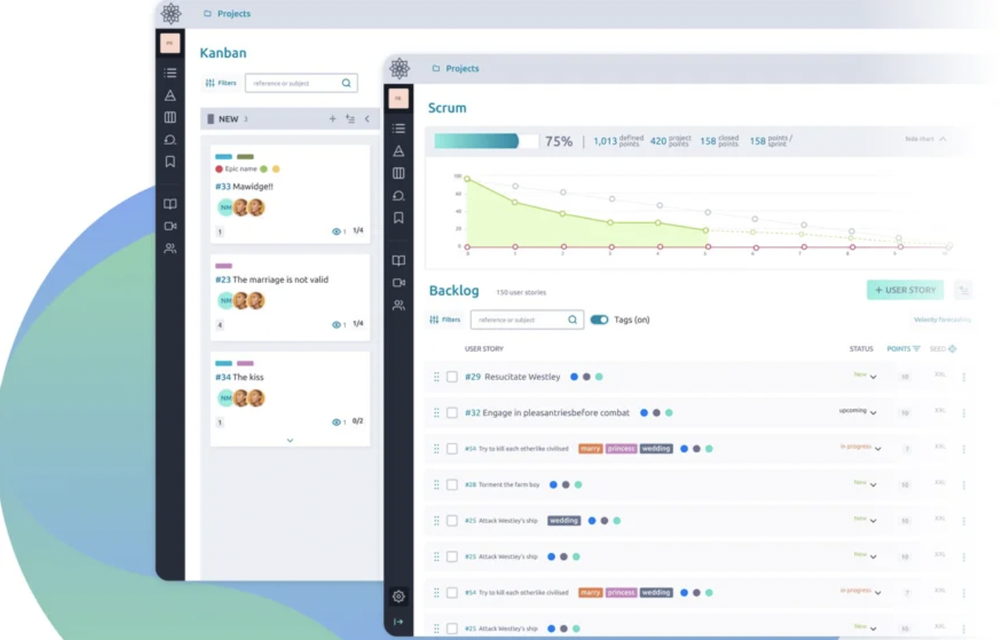

## Prerequisites

You would need to install and create an account on the [TF Connect App](../../../documentation/threefold_token/storing_tft/tf_connect_app.md) before being able to register and use the Circle Tool.

## How to Use the Circle Tool

* Go to [Circle Tool's desktop homepage](https://circles.threefold.me) on your computer as shown below. Click on '__Login__' button on the very top right corner of your screen.

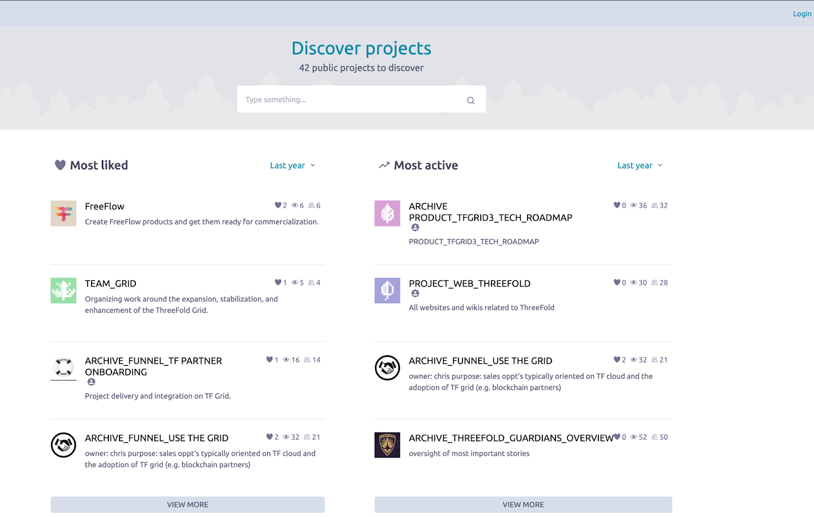

* Click on "TF Connect" button to log into the Circle Tool by using your TF Connect Account.

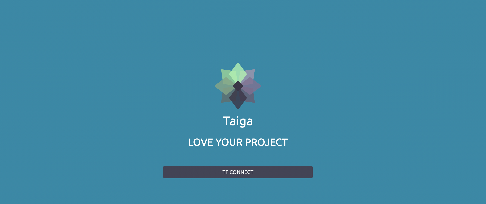

* Fill in your TF Connect usernames (without adding the '@' sign) on the provided box, and click on the 'Sign in' button.

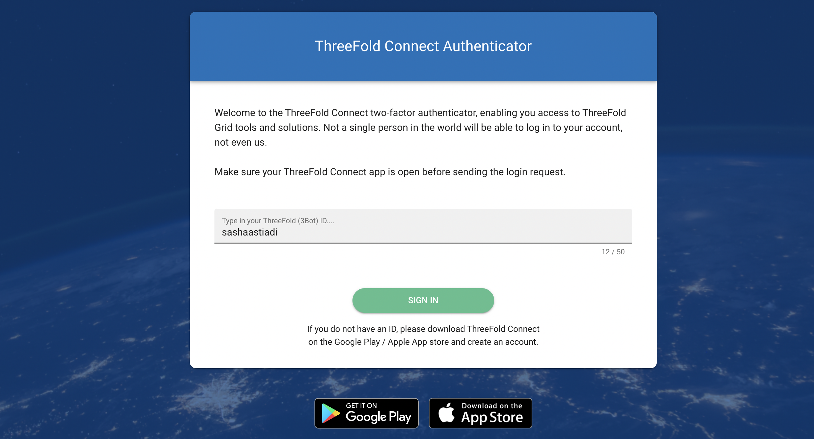

* Circle Tool will ask you to verify your login by clicking the right emoji that is sent to your TF Connect App.

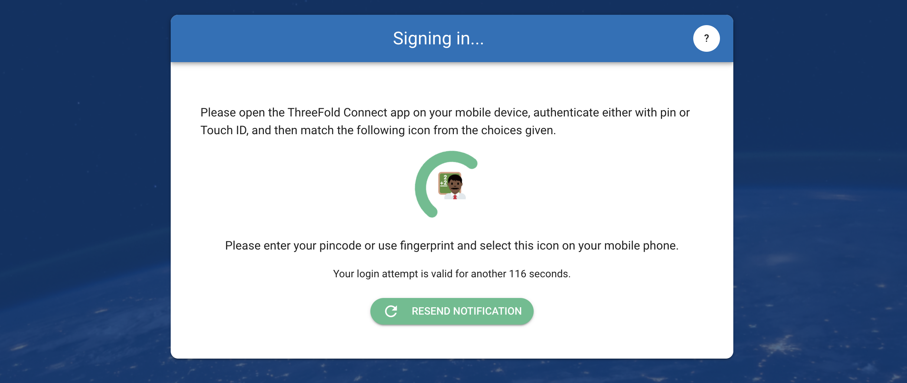

* Verify your sign in process by loggin in to your TF Connect App on your mobile phone. Click on the same emoji that you see on your circle tool (desktop).

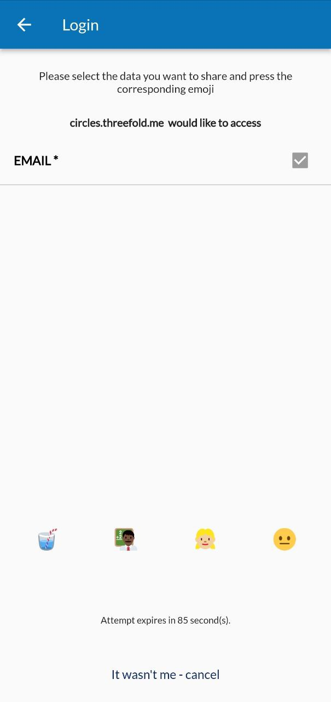

* Congratulations, you are now officially logged in on the circle tool. The Dashboard view will be the first thing you will see once you are logged in to the tool.

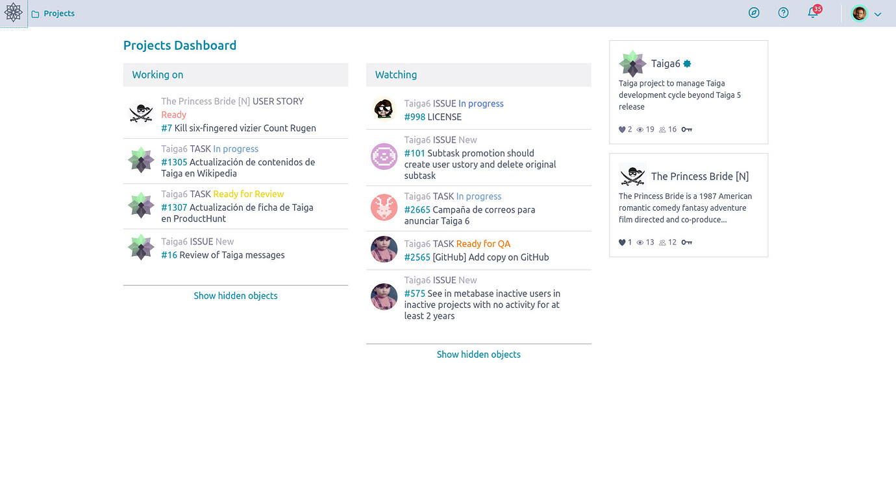

***

## Circle Tool Overview

The Circle Tool always try to make things easy and intuitive for new users but it’s good to have a nice & quick overview for your first couple of days.

## Dashboard View

Upon login or if you just go to your Circle Tool, you’re confronted with your dashboard with quick access to your working on items, a list of watched items and shortcuts to your projects. You can always go back to your dashboard by clicking on the Taiga 
icon on the top bar.

## Profile view

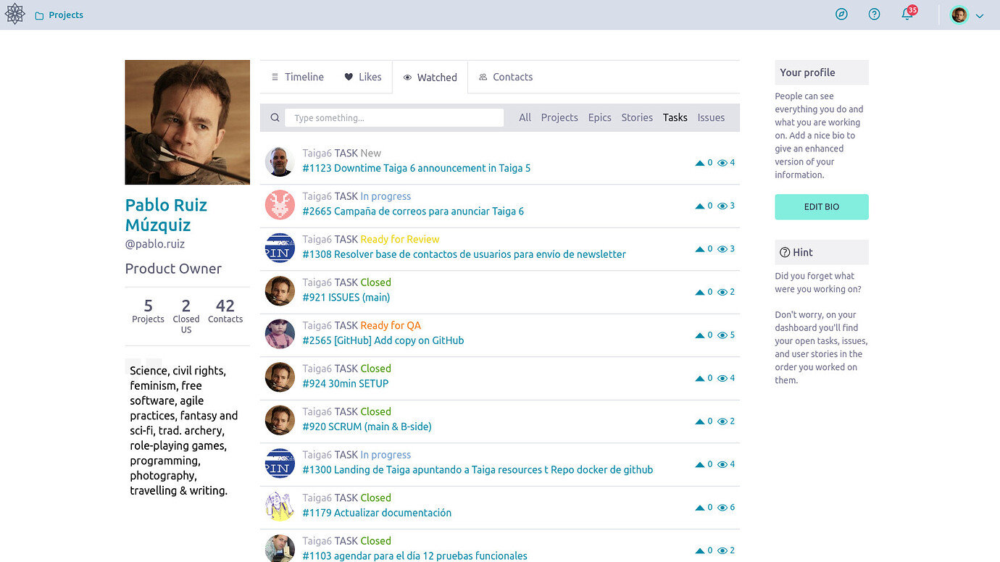

Circle Tool has an additional section to get a multiproject view where you can find and list everything that is accessible to you. Simply click on your avatar and you access your personal profile section where you can check from what your personal bio looks like for people that might have access to it to all sorts of information on your activities and relevant content.

## Projects

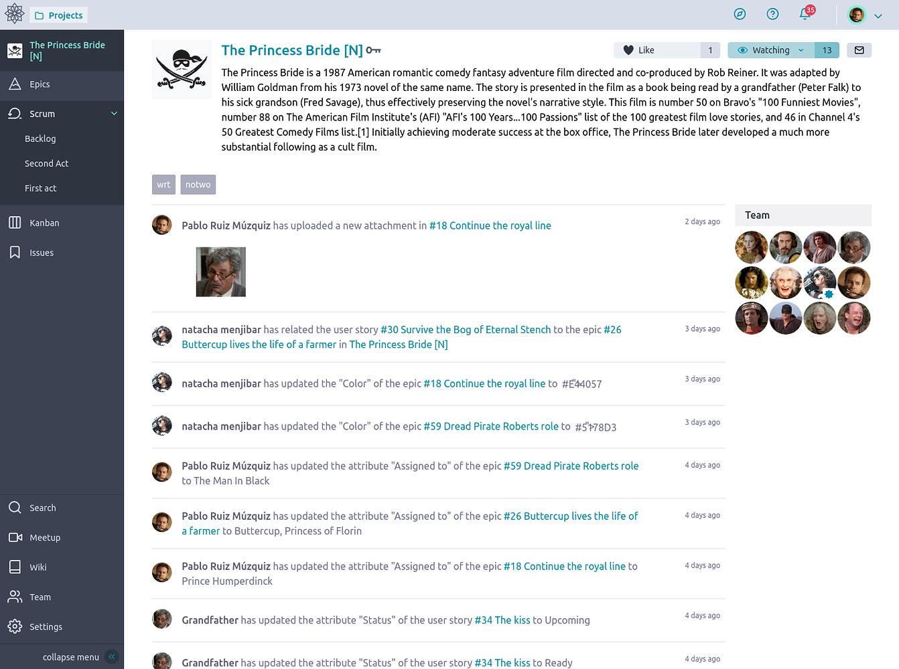

You can access your assigned projects by clicking on Projects link at the top left of your screen. You can hover and get an interactive shortlist or click on the link and go to a dedicated page where you can access them as well as rearrange them. Once you have clicked on a project, you access your default view for that project, which is always the Project’s Timeline if you haven’t changed that.

## Scrum Module on Project

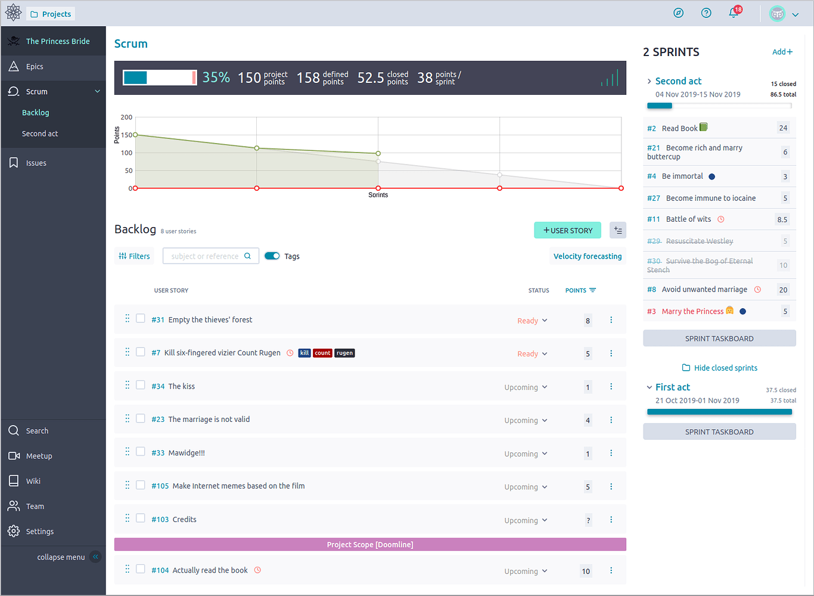

Every circle project can activate the Scrum module. This also happens automatically if you chose the Scrum template upon project creation. You can find the scrum module on the sidebar of your project page. 

Scrum is an agile framework for developing, delivering, and sustaining complex products. Although it had an initial emphasis on software development, it has been used in other fields including research, sales, marketing and advanced technologies. 

### Scrum Backlog

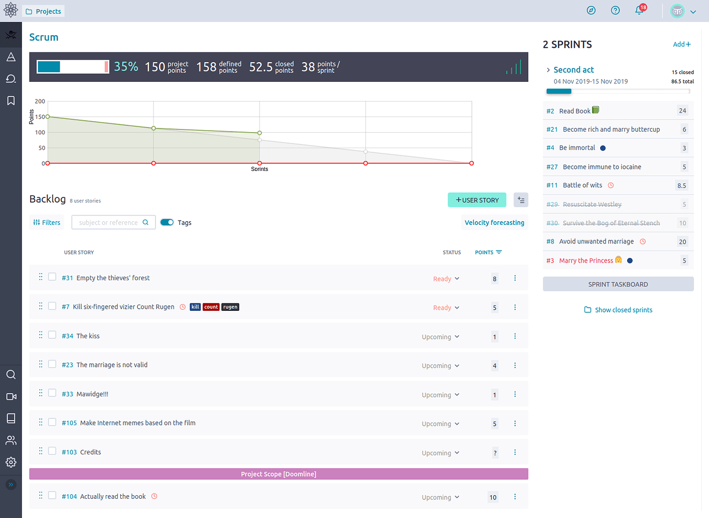

There are various so called artifacts in Scrum. The top three are the Backlog, the User Stories and the Sprints. They respectively represent what is to be done ordered by priority and readyness, the pieces of work themselves and the fixed time periods in which we put selected User Stories to be worked upon and finished.

### Scrum Sprints

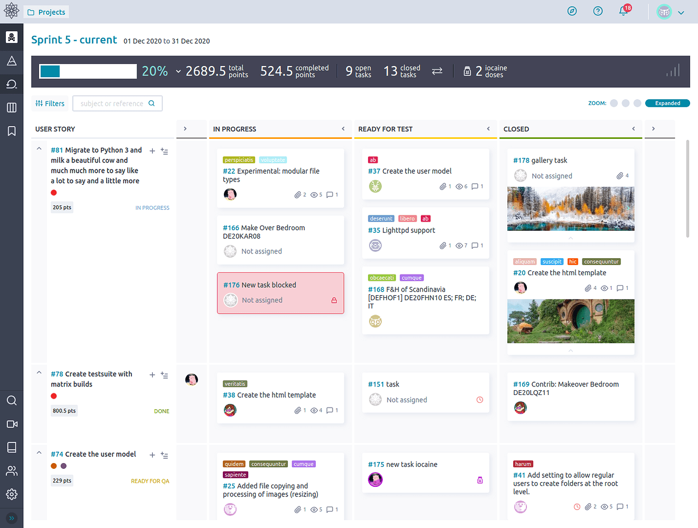

The Scrum Backlog view will always show a summary view of ongoing or closed Sprints but teams generally stick to the Sprint Taskboard view when they are focused on getting things done for that Sprint. Click on either the Sprint name or the “Sprint Taskboard” button so you can access the very important Sprint Taskboard. Open Sprints appear as shortcuts through the left navigation pane’s Scrum icon.

## More Info

You can read more about the Circle Tool (Taiga), scrum, sprints, and other documentations on Taiga's project management features on Taiga's official documentation [here](https://community.taiga.io/). Happy Project Managing!