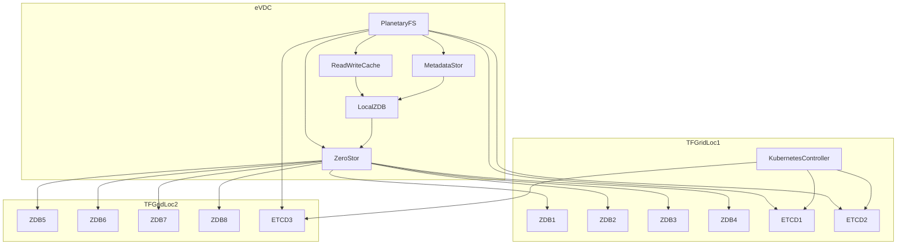

## zstor Architecture

```mermaid
graph TD
    subgraph TFGridLoc2
        ZDB5
        ZDB6
        ZDB7
        ZDB8
        ETCD3
    end
    subgraph TFGridLoc1
        ZDB1
        ZDB2
        ZDB3
        ZDB4
        ETCD1
        ETCD2
        KubernetesController --> ETCD1
        KubernetesController --> ETCD2
        KubernetesController --> ETCD3
    end


    subgraph eVDC
        PlanetaryFS --> ETCD1 & ETCD2 & ETCD3
        PlanetaryFS --> MetadataStor
        PlanetaryFS --> ReadWriteCache
        MetadataStor --> LocalZDB
        ReadWriteCache --> LocalZDB
        LocalZDB & PlanetaryFS --> ZeroStor
        ZeroStor --> ZDB1 & ZDB2 & ZDB3 & ZDB4 & ZDB5 & ZDB6 & ZDB7 & ZDB8
    end    
 

```