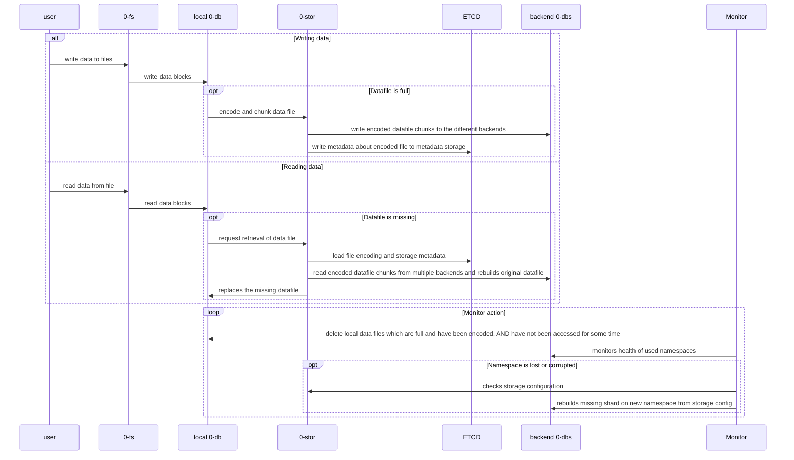

## zstor Sequence Diagram

```mermaid
sequenceDiagram
  participant user as user
  participant fs as 0-fs
  participant lzdb as local 0-db
  participant zstor as 0-stor
  participant etcd as ETCD
  participant zdbs as backend 0-dbs
  participant mon as Monitor

  alt Writing data
    user->>fs: write data to files
    fs->>lzdb: write data blocks
    opt Datafile is full
      lzdb->>zstor: encode and chunk data file
      zstor->>zdbs: write encoded datafile chunks to the different backends
      zstor->>etcd: write metadata about encoded file to metadata storage
    end
  else Reading data
    user->>fs: read data from file
    fs->>lzdb: read data blocks 
    opt Datafile is missing
      lzdb->>zstor: request retrieval of data file
      zstor->>etcd: load file encoding and storage metadata
      zstor->>zdbs: read encoded datafile chunks from multiple backends and rebuilds original datafile
      zstor->>lzdb: replaces the missing datafile
    end
  end

  loop Monitor action
    mon->>lzdb: delete local data files which are full and have been encoded, AND have not been accessed for some time
    mon->>zdbs: monitors health of used namespaces
    opt Namespace is lost or corrupted
      mon->>zstor: checks storage configuration
      mon->>zdbs: rebuilds missing shard on new namespace from storage config
    end
  end
```
