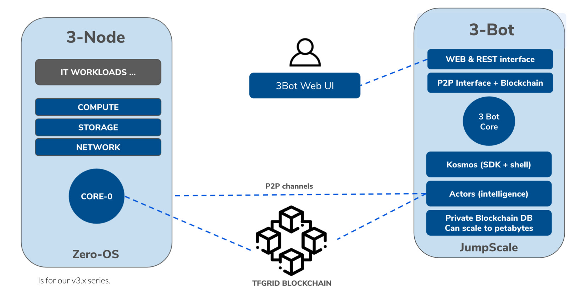

<h1> Smart Contract For IT 3Bot Integration </h1>

<h2>Table of Contents</h2>

- [Introduction](#introduction)
- [Use Cases](#use-cases)
- [Overview](#overview)

***

## Introduction

The Smart Contract for IT allows you, your company or your community to execute the storage and running of your files and applications securely with consensus and automatic billing.

## Use Cases

With the 3Bot integration, you can use smart contracts to define different sets of Internet resources you need for various types of work, such as storing files, running applications, and communicating across the network.

You can use smart contracts to define different sets of Internet resources , such as storing files, running applications, communicate across the network, etc.

You can also define a consensus mechanism and create multi-signatures for smart contract execution or completion to deliver appropriate digital services.

## Overview

