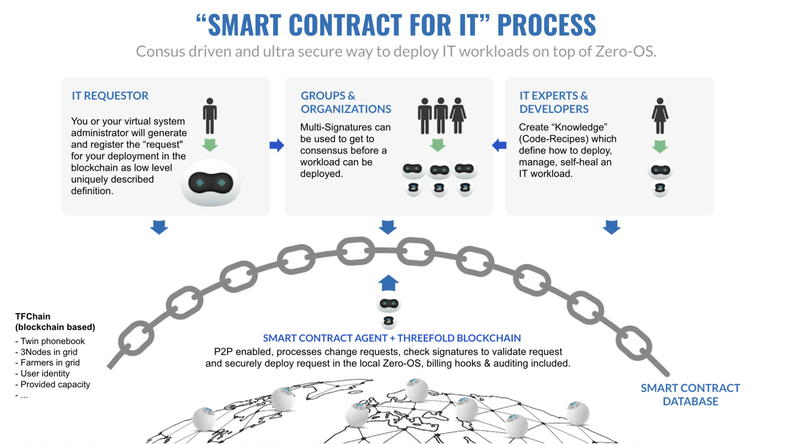
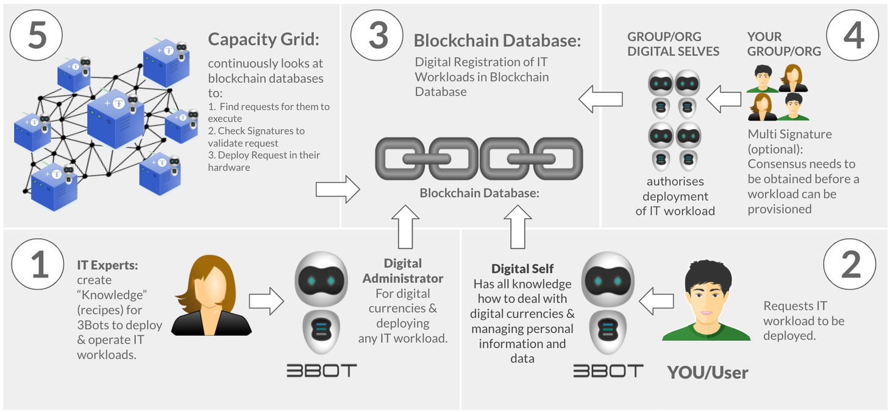

# Smart Contract for IT

Ability for every developer to launch IT workloads on the TFGrid using our TFGrid primitives.

<!--  TODO: need to describe better for 3.x TFGrid -->

## Smart Contract Together with 3bot 

Is for TFGrid 2.0

3Bot is your virtual system administrator and can execute IT tasks on your behalf.

**STEP 1: IT Experts create smart contracts:**

IT experts create smart contracts describing what needs to be done in order to deploy this architecture. The smart contract has to be specific and describe each little detail of the IT architecture.  The experts create knowledge for the 3bots (it's like god defining our DNA of our cells)

**STEP 2: Business and or Enduser customers consume smart contracts**: 

 Users have digital needs and in order to procure services for their digital needs they will find smart contracts describing applications (application setups) meeting their needs.  Consumers will instruct their 3bot to deploy an IT workload following their requirements buy using a smart contract created 

*   e.g. give me an archive of 1 PB in CH, e.g. deploy a CRM for 100 users, …
*   e.g. deploy my new banking app feature X
*   e.g. deploy my artificial intelligence data mining job for …

**STEP 3: The 3bot executes the smart contract:**

Creates & Registers the “IT” smart contract in the BCDB (Blockchain Database). This is a complete end-to-end deployment cycle for all sorts of IT deployments - both simple and complicated, bound to one location of many.  The 3bot will provision all the compute and storage capacity needed to meet the IT architecture’s requirement and do all the commercial trades required to get this.  It will then leave instructions for the nodes in a digital notary system in order for nodes to be able to grab instructions on what they have to do in order to meet smart contract completion.  The 3bot remains the orchestrator for this smart contract execution and will store and secure all intermediate and final state information in the notary service (blockchain database).

**STEP 4: Business IT Workload Stakeholders:**

is optional but when required stakeholder can be defined to give consensus and sign off on the successful execution of the “IT smart contract” delivering the appropriate digital service.  Stakeholders can be defined in a “multi signature” blockchain to provide sign off on regulatory, commercial and other business requirements. Approvals can include IT expert checks the quality of the code, a legal guy checks GDPR, a business person checks budget etc. 

**STEP 5: The capacity layer: 3 Nodes…**

*   thousands of 3 nodes can work together to execute and deliver the “IT Smart Contract” (if required)
*   verify if consensus was reached between the business stakeholders
*   verify the validity of the smart contract and download the “IT workload definition”
*   download the right files to execute the smart contract and each file gets verified (signature)
*   run the required processes and again signatures are checked to make sure the workload is pure.
*   ensures that no person (hacker or IT person) can ever gain access or influence on the execution process.

## Remarks

- in TFGrid 2.x smart contract for IT is implemented using ThreeFold Explorer and multisignature capabilities.
- in TFGrid 3.0 this is being re-implemented on TF-Chain on Parity/Substrate blockchain, to become a fully decentralized process. See [here](smartcontract_tfgrid3).
