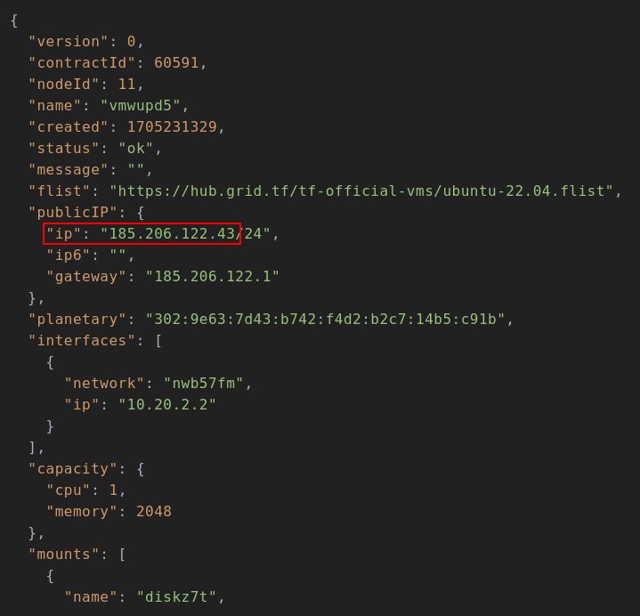
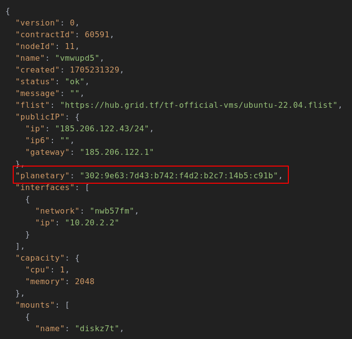

# Access your deployments

inorder to access any of your deployments we need `Public IPv4` or `Planetary Network IP` which can be obtained easily from **deployment details**.

- For _`Public IPV4`_
  

  > Note: We don't incldude leading `/24`

  - Open your **terminal**
  - Make sure you have _ssh_ command
  - Run the following command
    ```bash
      ssh root@<your-public-ipv4>
    ```

- For _`Planetary Network IP`_
  

  - How to install and setup the connection for `Planetary Network IP` ? [Find More](../faq/faq.md#what-is-yggdrasil)
  - Make sure to have the latests up-to-date peers.
  - Run the following command
    ```bash
      ssh root@<your-planetary-network-ip>
    ```
