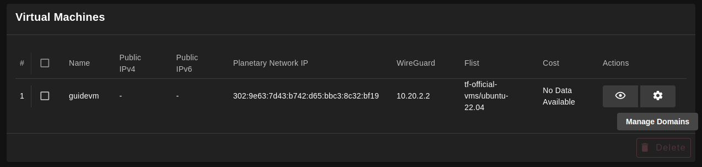
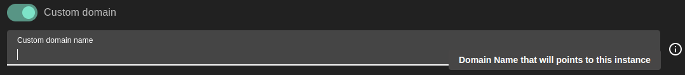
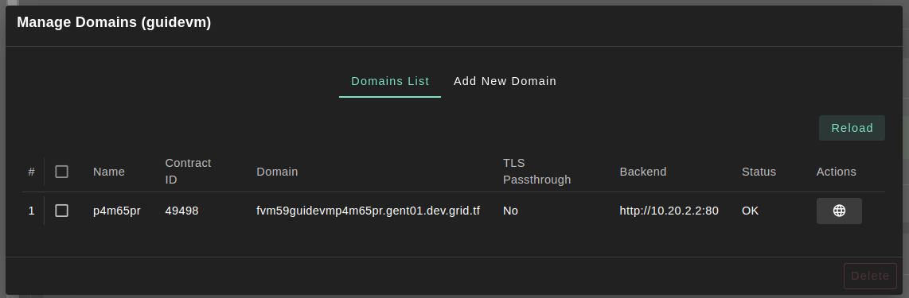
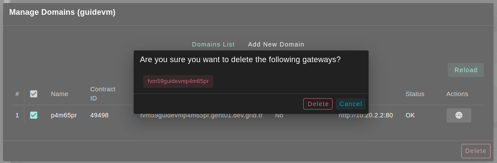

# Add Domain

Add a domain to your **Virtual Machine** on Threefold Grid

- After deploying a **Virtual Machine**
- Scroll down to reach it's listing table

**Process:**

- find `manage domains` button in table's actions and click it

- Go to `Add New Domain` tab

- Fill in the subdomain: it's used to reference to your domain name.

> Notes
>
> - Enable `custom domain` sets subdomain as _gateway name_.
> - _input's prefix(fvm59guidevm)_: **solution name(fvm)**, **twin ID(59)**, and **deployment name(guidevm)**.

- enable custom domain option: require user to insert his own custom domain name which will point to this virtual machine instance.

- select domain dropdown: creates a subdomain for your instance on the selected domain to be able to access your instance from the browser.

- port: The port that exposes your application instance on this virtual machine which the domain will point to.

- TLS Passthrough: When enabled, the backend service will terminate the TLS traffic, otherwise the gateway service will do the TLS traffic termination.

- Network name: The name of wireguard interface network and it's readonly field.

- Wireguard IP Address: ip address of wireguard and it's readonly field.

- After feeling all the above described inputs we are ready to add our first domain by click `Add` button.

- You can visit your domain by clicking `visit` button on table's actions.

- Finally, You can select domains which you want to delete from listing table.

- By clicking `delete` button the deletion will start and the domain will be deleted from this virtual machine.
