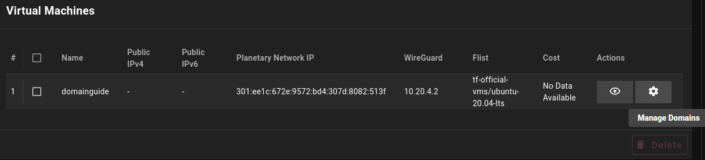
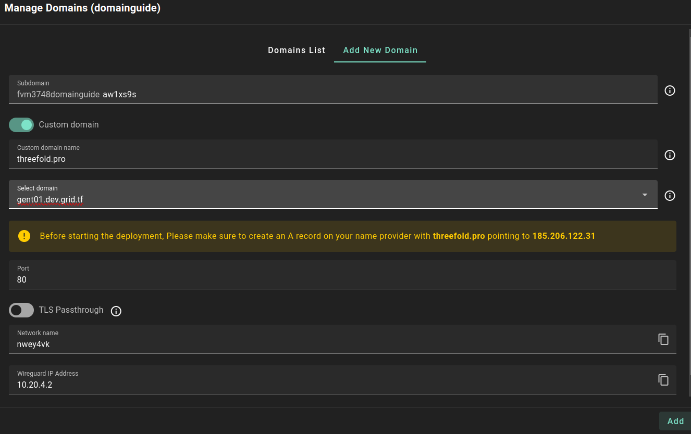
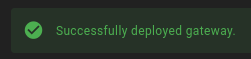
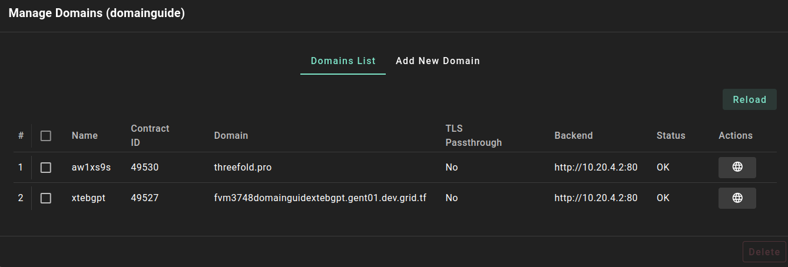
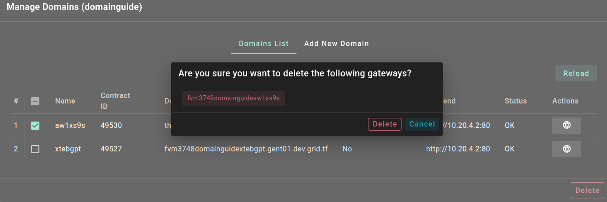

<h1> Add a Domain to a VM</h1>

<h2>Table of Contents</h2>

- [Overall Process](#overall-process)
  - [Preparations](#preparations)
  - [Add New Domain](#add-new-domain)
  - [Domains List](#domains-list)
  - [Delete a Domain](#delete-a-domain)
- [Questions and Feedback](#questions-and-feedback)

***

# Overall Process

We cover the overall process to add a domain to a virtual machine running on the ThreeFold Grid. 

## Preparations

- Deploy a virtual machine
- Click on the button **Manage Domains** under **Actions**

- Open the **Add New Domain** tab

## Add New Domain

We cover the different domain parameters presented in the **Add New Domain** tab.

- **Subdomain**
  - The subdomain is used to reference to the complete domain name. It is randomly generated, but the user can write a specific subdomain name.
    - The subdomain prefix (e.g. **fvm3748domainguide**) is decided as follows:
      - Solution name (e.g. **fvm**)
      - Twin ID (e.g. **3748**)
      - Deployment name (e.g. **domainguide**)
  - The complete subdomain is thus composed of the subdomain prefix and the subdomain you enter in this field.
- **Custom domain name** 
  - You can use a custom domain
    - Instead of having a gateway subdomain and a gateway name as your domain, the custom domain will be the domain for the VM.
  - If you select **Custom domain**, make sure to set a DNS A record pointing to the gateway IP address on your domain name registrar.

- **Select domain**
  - Choose a gateway for your domain.

- **Port**
  - Choose the port that exposes your application instance on the virtual machine which the domain will point to.
  - By default, it is set to **80**.

- **TLS Passthrough**
  - Disabling TLS passthrough will let the gateway terminate the traffic.
  - Enabling TLS passthrough will let your backend service terminate the traffic.

- **Network Name**
  - This is the name of the WireGuard interface network (read-only field).

- **IP Address**
  - This is the WireGuard IP address (read-only field).

Once you've filled the domain parameters, click on the **Add** button. The message **Successfully deployed gateway** will be presented once the domain is properly added.

## Domains List

Once your domain is set, you can access the **Domains List** tab to consult its parameters. To visit the domain, simply click on the **Visit** button under **Actions**.

* **Name**
  * The name is the subdomain (without the prefix)
* **Contract ID**
  * Contract ID of the domain
* **Domain**
  * Without a custom domain
    * The complete domain name (e.g. `fvm3748domainguidextebgpt.gent01.dev.grid.tf`) is composed of the subdomain prefix, the subdomain and the gateway domain.
      - The first part of the subdomain, the subdomain prefix (e.g. `fvm3748domainguide`) is based on the following:
        - Solution name, e.g. **fvm** for a full VM
        - Twin ID, e.g. **3748**
        - Name, the name of the deployment (e.g. `domainguide`)
          - The name is either randomly chosen or it can be chosen by the user when deploying the VM
      - The second part of the subdomain is the subdomain chosen during the domain creation (e.g. `xtebgpt`)
      - The third part is the gateway domain (e.g. `gent01.dev.grid.tf`)
  - With a custom domain
    - The domain will be your custom domain (`e.g. threefold.pro`)
* **TLS Passthrough**
  * The TLS passthrough status (**Yes** or **No**)
* **Backend**
  * The WireGuard IP and the chosen port of the domain (e.g. `http://10.20.4.2:80`)
* **Status**
  * **OK** is displayed when the domain is properly set
* **Actions**
  * Use the **Visit** button to open the domain URL

At all time, you can click on **Reload** to reload the Domains List parameters.

## Delete a Domain

To delete a domain, open the **Manage Domains** window, in the tab **Domains lists** select the domain you wish to delete and click **Delete**.

By clicking **Delete** button the deletion will start and the domain will be deleted from this virtual machine.

# Questions and Feedback

If you have any questions, you can ask the ThreeFold community for help on the [ThreeFold Forum](http://forum.threefold.io/) or on the [ThreeFold Grid Tester Community](https://t.me/threefoldtesting) on Telegram.