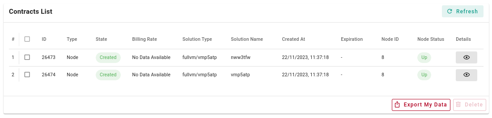

<h1> Contracts List </h1>

<h2> Table of Contents </h2>

- [Overview](#overview)
- [Contracts List Information](#contracts-list-information)
- [Delete a Contract](#delete-a-contract)
  - [Important Note](#important-note)
- [Operation Fees](#operation-fees)

***

## Overview

From the Playground, you can check your contracts by navigating to the `Contracts` tab from the sidebar. On this page, you will see the `Contracts List`.

## Contracts List Information

The **Contracts List** includes the following information about each contract:

- **ID**
  - The contract ID
- **Type**
  - The contract type
- **State**
  - The contract state
  - It can take the following values: `Created`, `Deleted` and `GracePeriod`
- **Billing Rate** 
  - This is shown in TFT/Hour
- **Solution Type**
- **Solution Name**
- **Created At**
  - The moment of creation of the contract
- **Expiration**
  - This only appears if the contract is in `GracePeriod`
- **Node ID**
  - The node ID on which the contract is deployed
- **Node Status**
  - The status of the node (e.g. `Up`, `Down`)
- **Details**
  - This button will display the detailed information of the contract

## Delete a Contract

To delete a contract, use the checkbox on the left to select the contract and then click on the button **Delete**. You can delete more than one contract at once.

### Important Note

Note that if you want to delete a deployment, it is advised to delete it on the deployment page itself and not on the **Contracts** page. This will ensure that you do not delete contracts that are needed for other deployments.

## Operation Fees

Operations on TFChain have a base fee of 0.001 TFT. Creating and destroying deployments usually includes several operations. 

For example, creating a contract can cost 0.003 TFT, deleting a contract can cost 0.002 TFT and creating or updating an SSH key can cost 0.001 TFT.