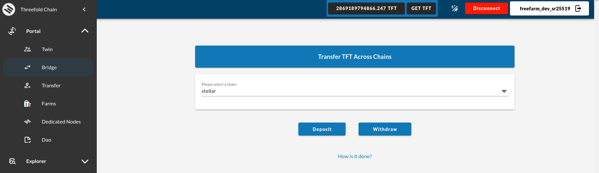

<h1> ThreeFold Dashboard </h2>

<h2> Table of Contents </h2>

- [Introduction](#introduction)
- [Twin](#twin)
- [Bridge](#bridge)
- [Transfer](#transfer)
- [Farms](#farms)
- [Dedicated Nodes](#dedicated-nodes)
- [TFChain DAO](#tfchain-dao)
- [Learn More](#learn-more)

***

## Introduction

This section of the ThreeFold Manual introduces you to **ThreeFold Dashboard** section, a powerful tool designed to empower individuals and organizations with seamless control and management over their ThreeFold Grid resources. The ThreeFold Dashboard provides an intuitive web-based interface that allows users to effortlessly monitor, and scale their workloads on the decentralized and sustainable ThreeFold Grid infrastructure.

The ThreeFold Dashboard is a unified admin interface for everything related to the Threefold Grid. We now give an overview of the different features of the ThreeFold Dashboard.
***

## Twin

The TF Twin management feature of the ThreeFold Dashboard enables users to create, manage, and monitor their individual digital entities known as **Twins**. A Twin can represent a virtual machine (VM) or a container running on the ThreeFold Grid. With the Twin management, users can easily deploy and scale their workloads, allocate resources, and configure networking and storage settings for their Twins.
For more information please visit [Twin](./twin.md)

## Bridge

The TFChain-Stellar Bridge establishes connections between the ThreeFold blockchain (TFChain) and the Stellar blockchain. This bridge enables interoperability and facilitates the exchange or utilization of TFT in a broader ecosystem.

For more information please visit [Bridge](./bridge.md)

## Transfer

Additionally, users can transfer TFT directly to other TFChain users via the ThreeFold Dashboard, expanding the possibilities for peer-to-peer transactions within the ThreeFold network.

For more information please visit [Transfer](./transger.md)

## Farms

The Farms management feature allows users to manage their own infrastructure, referred to as **Farms** on the ThreeFold Grid. Farms consist of servers and storage devices that contribute computing and storage capacity to the grid. Through the Farms management feature, users can add or remove, as well as monitor the health and performance of their farms, all the while efficiently using their resources.

For more information please visit [Farm](./farm.md)

***

## Dedicated Nodes

The Dedicated Nodes section facilitates the reservation of entire nodes exclusively within the TFGrid environment. This feature allows users to secure dedicated resources for their deployments, ensuring reliability and cost-effectiveness. Explore available nodes, review applicable discounts, and effortlessly reserve nodes with detailed resource insights. Additionally, access GPU-equipped nodes for specialized workload requirements. Experience tailored, exclusive resources designed to meet precise computing needs within the TFGrid ecosystem.

## TFChain DAO

The TFChain DAO (i.e. Decentralized Autonomous Organization) feature integrates decentralized governance capabilities into the ThreeFold Dashboard. It enables community members to participate in decision-making processes and to contribute to the evolution of the ThreeFold ecosystem. Through the TFChain DAO, users can propose, vote on, and implement changes to the network protocols, policies, and operations, fostering a collaborative and inclusive environment.

For more information please visit [DAO](./dao_voting.md)

***

<!-- ## TFGrid Explorer

The TFGrid Explorer feature provides a comprehensive view of the ThreeFold Grid infrastructure. Users can explore and analyze information related to ThreeFold nodes, farms, and grid statistics. It also provides insights into the farms contributing to the grid and their respective performance metrics. By utilizing the TFGrid Explorer, users can access detailed information about individual nodes, including their location, capacity, and availability. -->

<!-- ### Exploring Threefold Nodes

### Exploring Farms

### Grid Statistics

 -->

## Learn More

To learn more about the TFGrid Explorer, visit [this section](./explorer/explorer_home.md) of the ThreeFold Manual.
