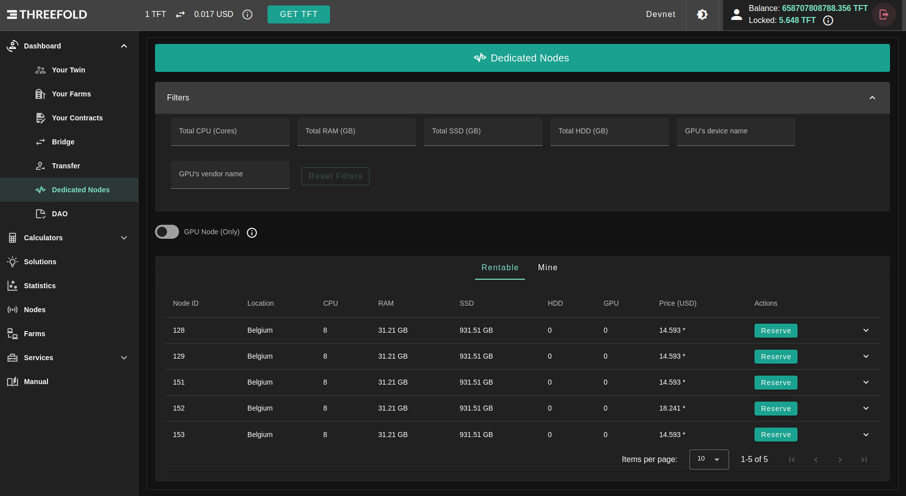
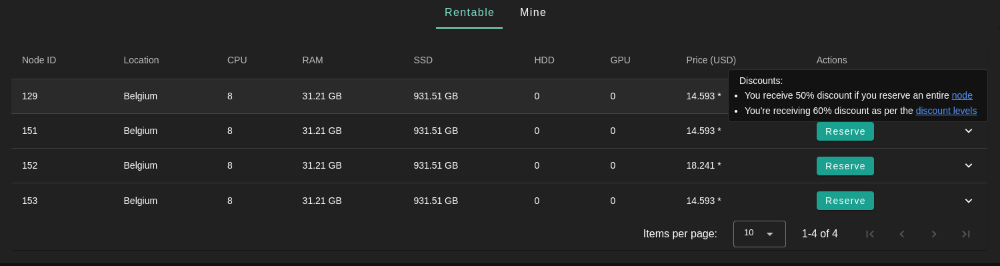

<h1> Dedicated Nodes </h1>

<h2> Table of Contents </h2>

- [What is a Dedicated Node?](#what-is-a-dedicated-node)
- [Description](#description)
- [Billing \& Pricing](#billing--pricing)
- [Usage](#usage)
- [GPU Support](#gpu-support)
  - [Filter and Reserve a GPU Node](#filter-and-reserve-a-gpu-node)
    - [Filter Nodes](#filter-nodes)
    - [Reserve a Node](#reserve-a-node)
  - [GPU Support Links](#gpu-support-links)

***

# What is a Dedicated Node?

Dedicated nodes are 3Nodes that can be reserved and rented entirely by one user. The user can thus reserve an entire node and use it exclusively to deploy solutions. This feature is ideal for users who want to host heavy deployments with the benefits of high reliability and cost effectiveness.

***

# Description

- Node reserved with deploying a `RentContract` on this node. node can has only one rentContract.
- When a user create a RentContract against a node, the grid validate that there are no other active contracts on that node on the creation.
- Once a RentContract is created, the grid can only accept contracts on this node from the tenant.
- Only workloads from the tenant are accepted

***

# Billing & Pricing

- Once a node is rented, there is a fixed charge billed to the tenant regardless of deployed workloads.
- Any subsequent NodeContract deployed on a node where a rentContract is active (and the same user is creating the nodeContracts) can be excluded from billing (apart from public ip and network usage).
- Received Discounts for renting a node on TFGrid internet capacity
  - 50% for dedicated node (TF Pricing policies)
  - a second level discount up to 60% for balance level see [Discount Levels](../../cloud/cloudunits_pricing.md#staking-discount)

***

# Usage

- See list of all dedicated node on `Dedicated Nodes` tab on the portal.

    

  - Hover over the price to see the applied discounts

    

  - Expand row to see more info on the node:
  
    
    - Resources
    - Location
    - Possible Public Ips *this depends on the farm it belongs to*

  - You can see the nodes in 2 states:
    - Free
    - Reserved *Owned by current twin*
- Reserve a node:
  - If node is not rented by another twin you can simply click reserve.

- Unreserve a node:
  - Simply as reserving but another check will be done to check you don't have any active workloads on the node before unreserving.

***

# GPU Support

To use a GPU on the TFGrid, users need to rent a dedicated node. Once they have rented a dedicated node equipped with a GPU, users can deploy workloads on their dedicated GPU node.

## Filter and Reserve a GPU Node

You can filter and reserve a GPU node using the [Dedicated Nodes section](https://dashboard.grid.tf/portal/account-nodes) of the **Dashboard**.

### Filter Nodes

- Filter nodes using the vendor name
  - In **Filters**, select **GPU's vendor name**
    - Write the name of the vendor desired (e.g. **nvidia**, **amd**)
- Filter nodes using the device name
  - In **Filters**, select **GPU's device name**
    - Write the name of the device desired (e.g. **GT218**)

### Reserve a Node

When you have decided which node to reserve, click on **Reserve** under the column named **Actions**. Once you've rented a dedicated node that has a GPU, you can deploy GPU workloads.

## GPU Support Links

The ThreeFold Manual covers many ways to use a GPU node on the TFGrid. A good place to start would be the **Full VM and GPU** documentation.

Feel free to explore the different possibilities!

- [Javascript Client and GPU](../../javascript/grid3_javascript_gpu_support.md)
- Go Client and GPU
  - [GPU Support](../../go/grid3_go_gpu_support.md)
  - [VM with GPU](../../go/grid3_go_vm_with_gpu.md)
- [TFGrid CLI and GPU](../../tfgridcmd/grid3_cli_vm.md#deploy-a-vm-with-gpu)
- [Terraform and GPU](../../terraform/terraform_gpu_support.md)
- [Full VM and GPU](../../playground/solutions/fullVm.md)
- [Zero-OS API and GPU](../../internals/zos/manual/api.md#gpus)
