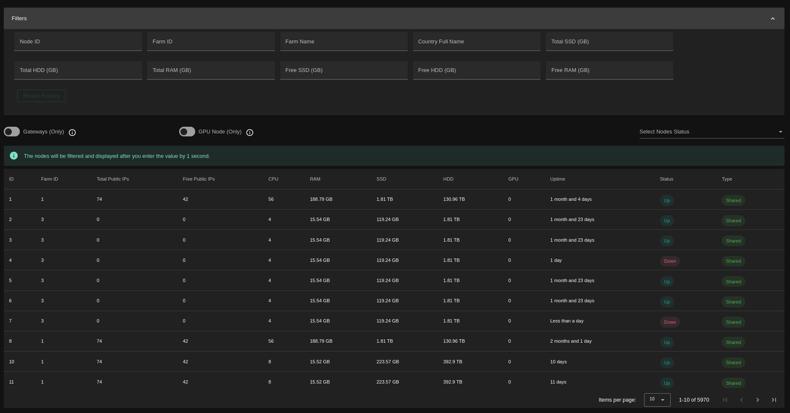
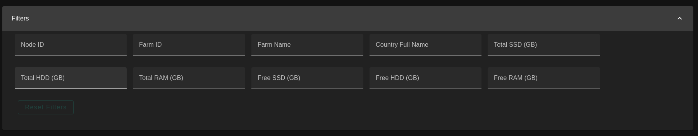

# Nodes

The nodes page provides a more detailed view for the nodes available on the ThreeFold grid With detailed information and statistics about any of the available nodes.

You can get a node with the desired specifications using the filters available in the nodes page.

You can see all of the node details by clicking on a node record.

