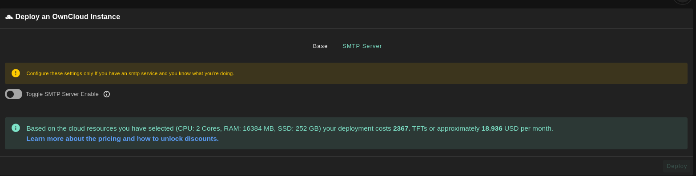
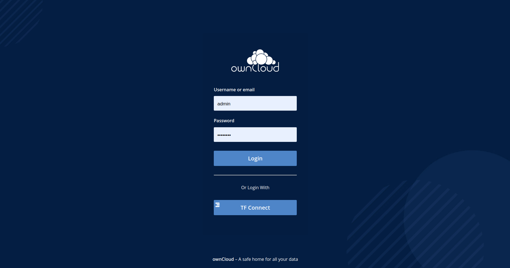

# ownCloud

[ownCloud](https://owncloud.com/) develops and provides open-source software for content collaboration, allowing teams to easily share and work on files seamlessly regardless of device or location.

- Make sure you have a [wallet](./wallet_connector.md)
- Click on the **Owncloud** tab

__Process__ :

- Enter an Application Name. It's used in generating a unique subdomain on one of the gateways on the network alongside your twin ID. Ex. ***oc98newcloud*.gent02.dev.grid.tf**

- Enter administrator information including **Username** and **Password**. This admin user will have full permission on the deployed instance.
- Select a capacity package:
    - **Minimum**: {cpu: 2, memory: 16384, diskSize: 250 }
    - **Standard**: {cpu: 2, memory: 16384, diskSize: 500 }
    - **Recommended**: {cpu: 4, memory: 16384, diskSize: 1000 }
    - Or choose a **Custom** plan
- Choose the network
   - `Public IPv4` flag gives the virtual machine a Public IPv4
- `Dedicated` flag to retrieve only dedeicated nodes 
- `Certified` flag to retrieve only certified nodes 
- Choose the location of the node
   - `Country`
   - `Farm Name`
- Choose the node to deploy on 
- `Custom Domain` flag lets the user to use a custom domain
- Choose a gateway node to deploy your Owncloud instance on.

There's also an optional **SMTP Server** tab if you'd like to have your Owncloud instance configured with an SMTP server.

After that is done you can see a list of all of your deployed instances

Click on ***Visit*** to go to the homepage of your Owncloud instance! If you'd like to be able to use TFConnect to login, you need to login using your admin username and password first and allow TFConnect login from settings.

