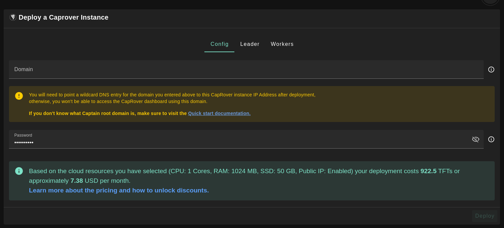
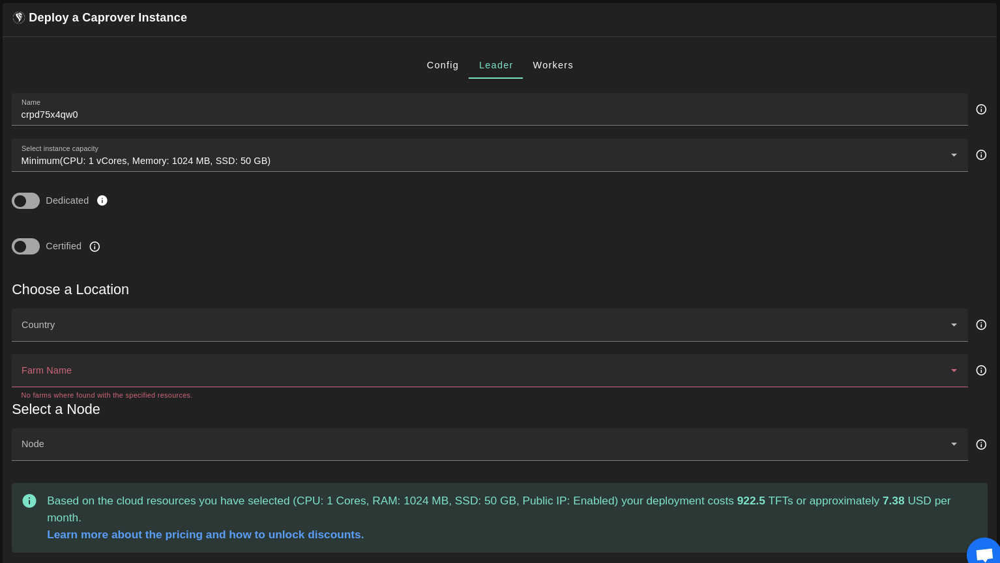
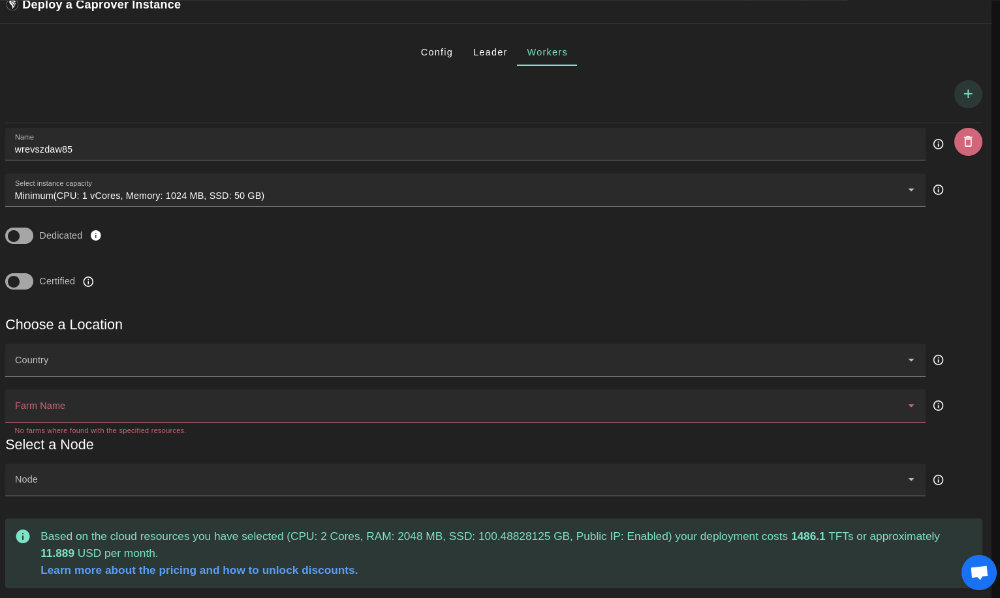
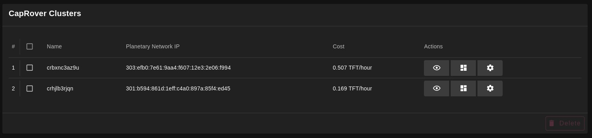

<h1> CapRover </h1>


<h2> Table of Contents </h2>

- [Introduction](#introduction)
- [Requirements](#requirements)
- [Configs Tab](#configs-tab)
- [Admin and Workers Tabs](#admin-and-workers-tabs)
- [The Domain Name](#the-domain-name)
- [How to Know the IP Address](#how-to-know-the-ip-address)
- [How to Access the Admin Interface](#how-to-access-the-admin-interface)
- [How to Work with CapRover](#how-to-work-with-caprover)

***

## Introduction

CapRover is an extremely easy to use app/database deployment & web server manager for your NodeJS, Python, PHP, ASP.NET, Ruby, MySQL, MongoDB, Postgres, WordPress (and etc...) applications!

It's blazingly fast and very robust as it uses Docker, nginx, LetsEncrypt and NetData under the hood behind its simple-to-use interface.

- CLI for automation and scripting
- Web GUI for ease of access and convenience
- No lock-in! Remove CapRover and your apps keep working!
- Docker Swarm under the hood for containerization and clustering
- Nginx (fully customizable template) under the hood for load-balancing
- Let's Encrypt under the hood for free SSL (HTTPS)

Caprover is a very cool management app for containers based on Docker Swarm.

It has following benefits : 

- easy to deploy apps (in seconds)
- easy to create new apps
- super good monitoring
- can be extended over the TFGrid
***
## Requirements

- You need an account on TF-Chain, and there needs to be TFT on the account (see getting started)
- Make sure you have a [wallet](./wallet_connector.md)
- Unlock your profile on profile manager, if already filled in before
***

## Configs Tab



- Enter domain for you Caprover instance, Be very careful about the domain name: it needs to be a wildcard domain name you can configure in your chosen domain name system.
- Enter password for you Caprover instance.
***
## Admin and Workers Tabs




Note: Worker nodes only accept SSH keys of RSA format.


Deployment will take couple of minutes.
***
## The Domain Name

- e.g. I picked ```apps.openly.life``` which is a domain name that will point to the ip address of the CapRover instance (which we only know after deployment).


> Note how the *.apps.openly.life points to the public IPv4 address that has been returned from the deployment.
***
## How to Know the IP Address

Go back to your CapRover weblet and go to the deployment list. Click on `Show Details`.



- The public IPv4 address is visible in here
- Now you can configure the domain name (see above, don't forget to point the wildcard domain to the public IP address)

Click on details if you want to see more details

```json

{
    "version": 0,
    "name": "caprover_leader_cr_156e44f0",
    "created": 1637843368,
    "status": "ok",
    "message": "",
    "flist": "https://hub.grid.tf/samehabouelsaad.3bot/tf-caprover-main-a4f186da8d.flist",
    "publicIP": {
        "ip": "185.206.122.136/24",
        "gateway": "185.206.122.1"
    },
    "planetary": false,
    "yggIP": "",
    "interfaces": [
        {
            "network": "caprover_network_cr_156e44f0",
            "ip": "10.200.4.2"
        }
    ],
    "capacity": {
        "cpu": 4,
        "memory": 8192
    },
    "mounts": [
        {
            "name": "data0",
            "mountPoint": "/var/lib/docker",
            "size": 107374182400,
            "state": "ok",
            "message": ""
        }
    ],
    "env": {
        "SWM_NODE_MODE": "leader",
        "CAPROVER_ROOT_DOMAIN": "apps.openly.life",
        "PUBLIC_KEY": "ssh-rsa AAAAB3NzaC1yc2EAAAADAQABAAABAQC/9RNGKRjHvViunSOXhBF7EumrWvmqAAVJSrfGdLaVasgaYK6tkTRDzpZNplh3Tk1aowneXnZffygzIIZ82FWQYBo04IBWwFDOsCawjVbuAfcd9ZslYEYB3QnxV6ogQ4rvXnJ7IHgm3E3SZvt2l45WIyFn6ZKuFifK1aXhZkxHIPf31q68R2idJ764EsfqXfaf3q8H3u4G0NjfWmdPm9nwf/RJDZO+KYFLQ9wXeqRn6u/mRx+u7UD+Uo0xgjRQk1m8V+KuLAmqAosFdlAq0pBO8lEBpSebYdvRWxpM0QSdNrYQcMLVRX7IehizyTt+5sYYbp6f11WWcxLx0QDsUZ/J"
    },
    "entrypoint": "/sbin/zinit init",
    "metadata": "",
    "description": "caprover leader machine/node"
}
```
***
## How to Access the Admin Interface

- make sure your public IP address (in my case ```185.206.122.136```) is filled in in the domain name record.

> admin url: https://captain.apps.openly.life/   (note prefix captain, and the usage of our wildcard domain).
<br> 
> The password is generated and visible behind the `Show Details` button of your CapRover deployment. 


You should now see


## How to Work with CapRover

* [CapRover Admin Tutorial](./caprover_admin.md)
* [CapRover Worker Tutorial](./caprover_worker.md)
