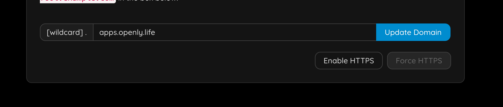
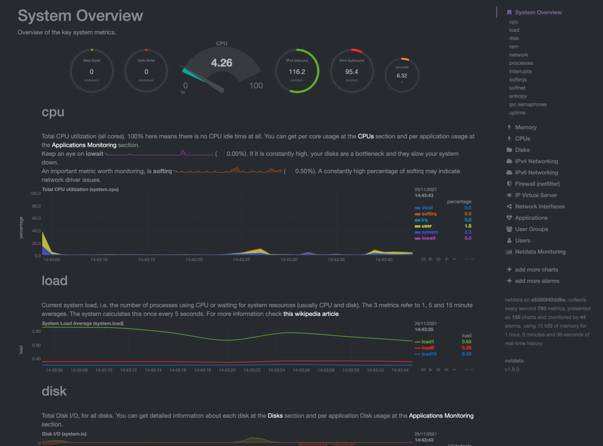
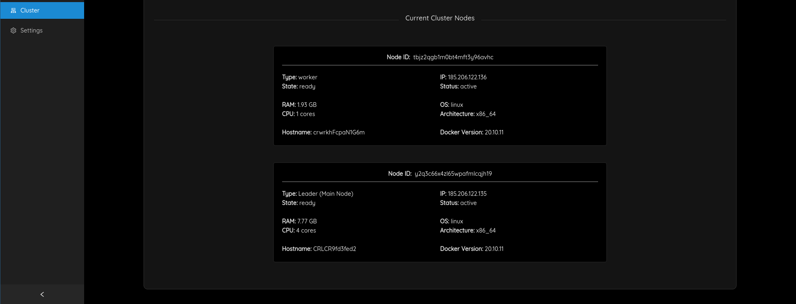

<h1> Admin: Manage CapRover <h1>

<h2> Table of Contents </h2>

- [Step 1: Enable HTTPS](#step-1-enable-https)
- [Step 2: Add a Default Docker Registry](#step-2-add-a-default-docker-registry)
- [Step 3: Deploy an App](#step-3-deploy-an-app)
- [Step 4: Enable Monitoring](#step-4-enable-monitoring)
- [Step 5: Add Nodes to CapRover](#step-5-add-nodes-to-caprover)
- [Step 6: Change Your Password](#step-6-change-your-password)

***

## Step 1: Enable HTTPS

You need to specify your email address.

You will have to login again.

> Now force https.

You will have to login again, and you should notice https is now used.
***
## Step 2: Add a Default Docker Registry

You'll have to add a default docker registry so other CapRover nodes in the cluster can download images from, and it can be self-hosted (managed by CapRover itself), to add it, go to `Cluster` -> `Docker Registry Configuration`.

You can check [official documentation](https://caprover.com/docs/app-scaling-and-cluster.html#setup-docker-registry) to know more about Docker registry options.
***
## Step 3: Deploy an App

just go to apps & follow the instructions, there is much more info on caprover website.
***
## Step 4: Enable Monitoring

You should now see

***
## Step 5: Add Nodes to CapRover

- Go to the settings

- Fill in your mnemonic from TF-Chain, make sure it's the right network you are connected to
- Set your store secret for storing deployment information securely on TF-Chain.
- Add your SSH-key

Now go to `Cluster -> Deploy a new node on Threefold grid`, specify the details of the resources you need and then click **Search resources...** :

If there are enough resources, a new window will appear listing possible nodes to deploy this node to, select one of them and click **Deploy**:

You should then see something like

This should typically take less than 2 minutes.

> Important: the deployment process takes some time before it is known in CapRover.

Go out of the form and back to `Cluster`.

***
## Step 6: Change Your Password

- Go to `Settings` and change your password. This is important for your own security.
